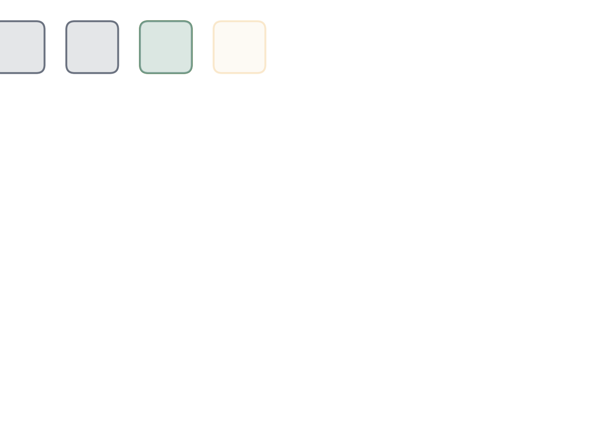
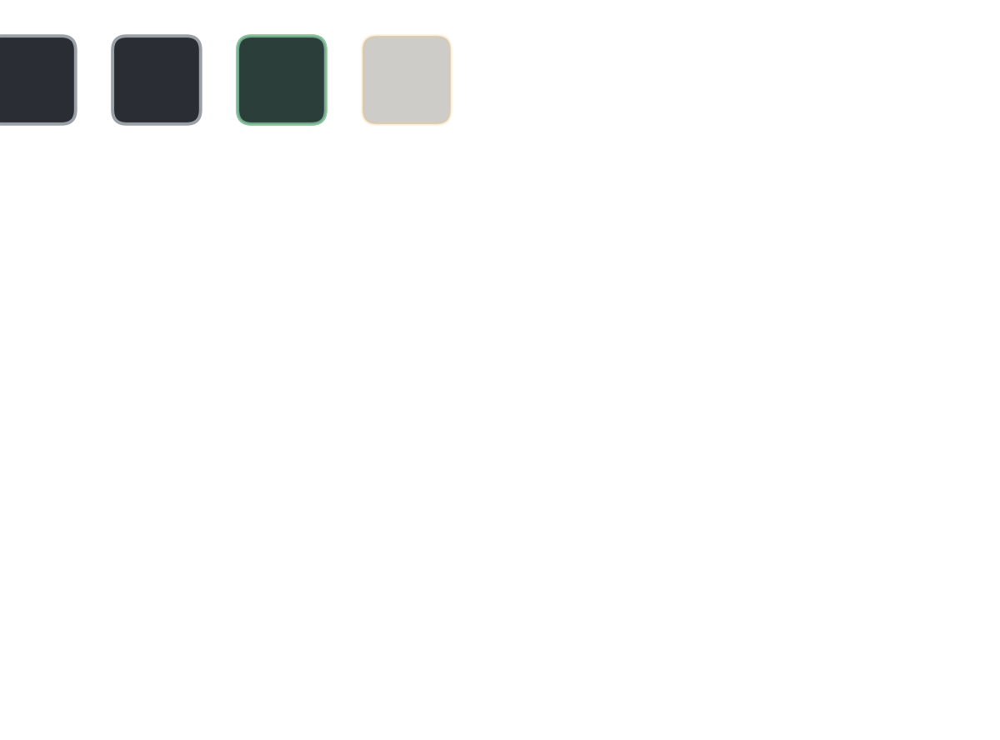
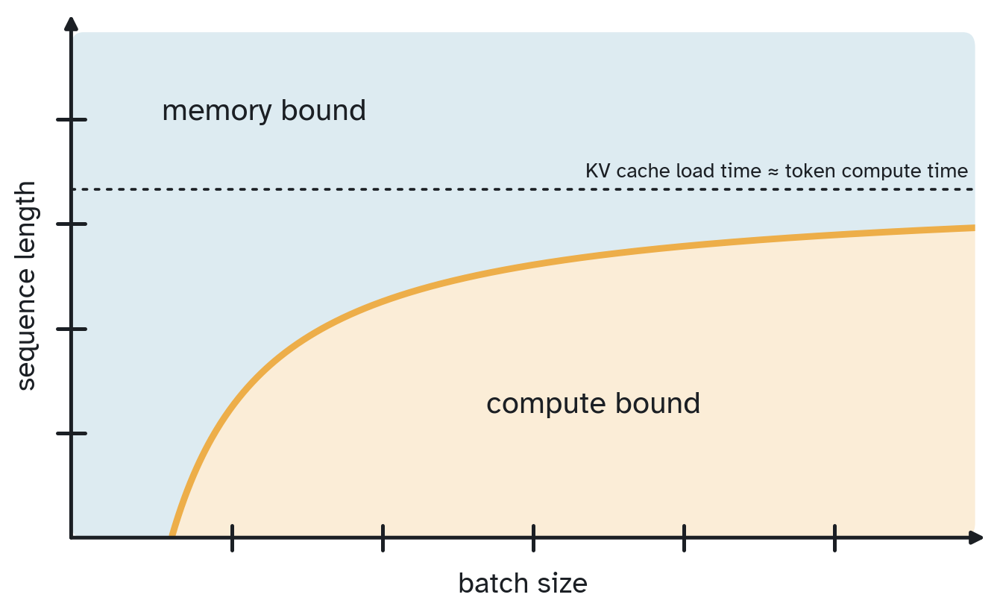
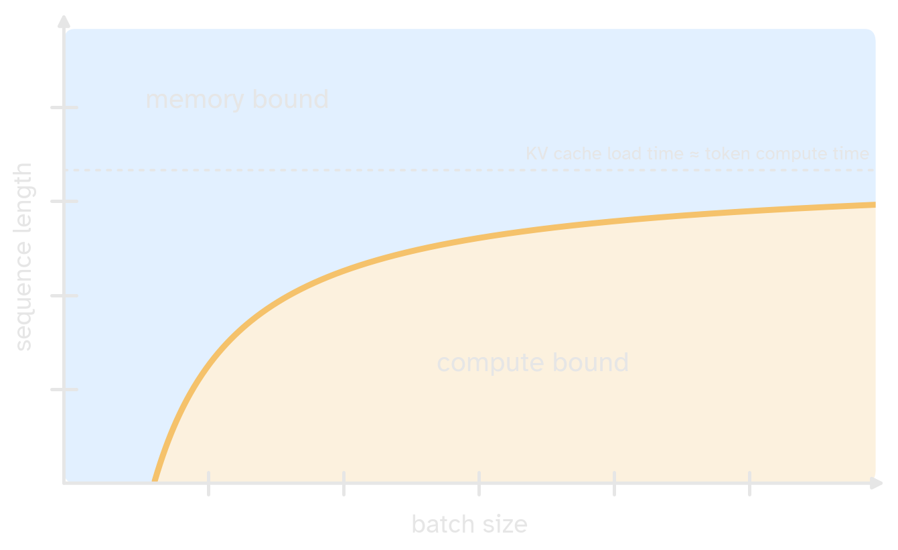
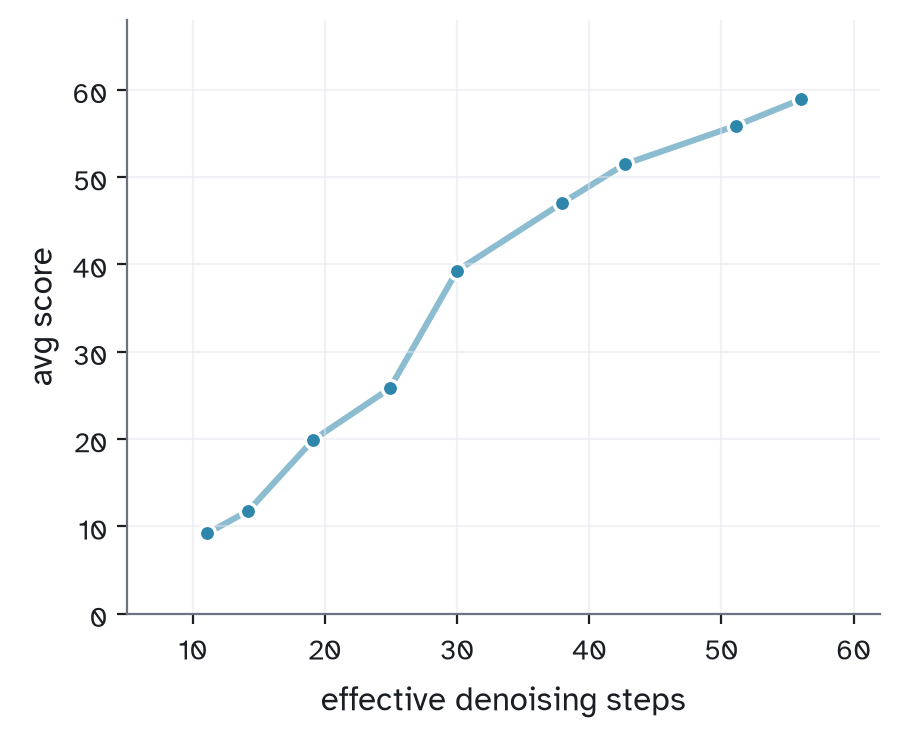
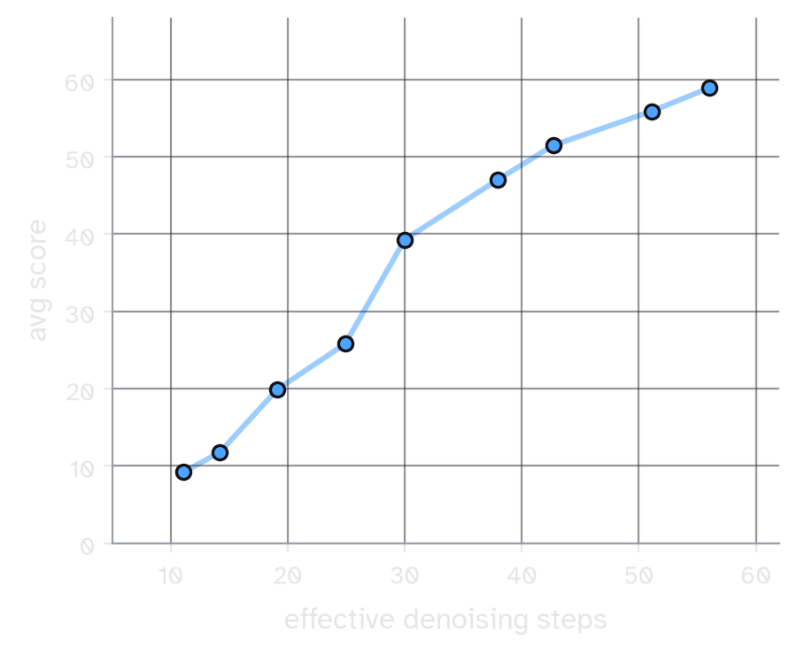

---
aliases:
created: September 27, 2026
modified: September 30, 2026
title: Diffusion will be everywhere
permalink: essays/diffusion
type: technical
---

**Overview:** In this post I'll argue that text diffusion is likely to emerge as a popular class of models across the LLM ecosystem. I'll highlight advantages text diffusion has over autoregressive models for inference, test-time scaling, and RL. Recent work in converting strong autoregressive models into diffusion models shows the process is now cheap, such that any lab with a good AR checkpoint can adopt diffusion.


## What's diffusion?

Text diffusion differs from autoregressive generation in that you predict an entire sequence of tokens at once instead of just one at a time. The sequence begins as a *canvas* of random tokens. Predicting values for the entire canvas in one shot is difficult, so the model gets multiple attempts at it. At each step, it predicts every position and commits the positions it's most confident about. The next step sees a slightly cleaner canvas, and so on until every position is committed.




**Figure 1: Block text diffusion. Each block starts as a canvas of noise. At every denoising step, the model commits the positions it is confident about (green). Once every position is committed, the block joins the clean prefix and a fresh canvas begins.**

This allows us to generate $P$ tokens in only $K$ forward passes, where $K \ll P$. Recent diffusion models use between 16 and 64 forward passes to generate 256 tokens. DiffusionGemma, for example, generates a 256-token canvas in at most 48 denoising steps, and averages about 12 with adaptive stopping.[^gemma] This isn't free, since you have to make predictions for all $P$ tokens every forward pass.

|                | Number passes | Memory reads | Compute FLOPs |
| -------------- | ------------- | ------------ | ------------- |
| Autoregressive | $P$           | $O(P)$       | $O(P)$        |
| Diffusion      | $K$           | $O(K)$       | $O(PK)$       |

On balance this might not seem like a good tradeoff: you spend $K$ times more compute for at most $P/K$ savings in memory reads. But on GPUs, loading a byte from memory onto the compute die is hundreds of times slower than doing math with that byte. When decoding is bound by memory reads, the extra FLOPs are nearly free.


There are several variants of this basic form:
- **Repair:** No tokens are committed until the very end, allowing each step to "overwrite" previously confident positions.
- **Self-conditioning:** The model can use its previous guess to inform its next guess. This requires roughly twice the compute to train, but it is more data-efficient. In the appendix I extend previous works[^analogbits] to train a novel variant that is more efficient and minimizes train/test mismatch.
- **Noise pattern:** Instead of initializing the canvas with random tokens, you can initialize it with `[MASK]` special tokens. Recent work has argued that masking is suboptimal.[^chen26][^duo][^udlm] Latent noise avoids materializing any tokens until the final step, keeping the canvas in latent or logit space throughout denoising. %% TODO: cites for latent noise %%

[^gemma]: [Google DeepMind 2026](https://arxiv.org/abs/2608.00146) *DiffusionGemma Technical Report*
[^analogbits]: [Chen, Zhang, Hinton 2022](https://arxiv.org/abs/2208.04202) *Analog Bits: Generating Discrete Data using Diffusion Models with Self-Conditioning*
[^chen26]: [Chen, Wang 2026](https://arxiv.org/abs/2609.20539) *Parallelism, critical windows, and separations among diffusion language models*
[^duo]: [Sahoo et al 2025](https://arxiv.org/abs/2506.10892) *The Diffusion Duality*
[^udlm]: [Schiff et al 2024](https://arxiv.org/abs/2412.10193) *Simple Guidance Mechanisms for Discrete Diffusion Models*

%% cut notes, parked for later sections:
- repair: claimed big advantage of diffusion but i dont think its a big deal; makes a lot of math really annoying and breaks spec decode .. like a whole separate blog post
- self-conditioning novel bits: the two $t_1, t_2$ flips; self conditioning based on final latent instead of projection of logits
%%

## The case from inference

%%### When is diffusion faster?%%

Diffusion trades extra compute for fewer memory reads. Whether that trade pays off depends on where decoding sits on the roofline:




**Figure 2: Decode regimes over batch size and sequence length. Below the curve, decoding is compute bound; above it, decoding is memory bound, and diffusion's extra FLOPs are nearly free.**

Two things are loaded from memory at every decode step: the model weights, once per batch, and the KV cache, once per sequence. Large batches amortize the weight load and become compute bound. Long sequences push the other way, since every sequence brings its own KV cache. Past a certain length, the KV load alone takes longer than computing a token, and decoding is memory bound at any batch size.[^roofline]

[^roofline]: Back of the envelope equation for this graph: consider a decode step with batch size $B$, KV length $S$, and $N$ parameters, on hardware that does $r$ FLOPs per byte loaded. Up to constants, memory time scales as $N + BS$: the weights load once per batch and the KV cache once per sequence. Compute time scales as $NB/r$. I ignore attention, since its compute is always hidden under its own KV load. Decoding is compute bound when $NB/r > N + BS$, i.e. below the curve $S = \frac{N}{r}\left(1 - \frac{r}{B}\right)$. The curve starts at $B = r$ and saturates at $S = N/r$, where loading one sequence's KV cache takes as long as computing one token. That asymptote may only be reached at absurdly long sequences, but the general shape is right. Linear attention changes the picture entirely, though as long as there is at least one full-context attention layer, the diagram stays broadly accurate.

Low batch size and long context are valuable regimes in and of themselves. At 4,096 input tokens and 1,024 output tokens, DiffusionGemma is faster than its autoregressive counterpart (with MTP) up to a batch size of about 32.[^gemma] Note that this is an incredibly small context length. In thinking mode, DiffusionGemma's own outputs average about 4,000 tokens, and GPQA-Diamond and LiveCodeBench traces run about 5,600–7,500. Longer sequences are more memory bound, which raises the batch size up to which diffusion wins.

MoE pushes in the same direction. Each token activates only a few experts, so compute per token shrinks while the weights loaded per batch stay large. Basically, the more memory bound we are, the more likely diffusion is a straightforward win over autoregressive decoding, even without speculative drafting.

%%### Speculative decoding%%

**Speculative decoding:** One reason to suppose that diffusion will end up everywhere is because diffusion already *is* everywhere in the form of speculative decoding. DFlash and its successors[^dflash], which have been adopted by pretty much everyone [^adoption], use diffusion draft model to predict an entire block of tokens in a single bidirectional pass. The diffusion draft model is *small* distillation of the target model that has fairly similar output probabilities. 

The main limitation is that verification is constrained to prefixes. The target is still a next-token predictor, so once it rejects a token, it must reject every token after it. DSpark[^dspark] and DFlash2[^dflash2] are largely a series of hacks to boost acceptance despite this constraint. 

[^dflash]: [Chen, Liang, Liu 2026](https://arxiv.org/abs/2602.06036) *DFlash: Block Diffusion for Flash Speculative Decoding*
[^dspark]: [DeepSeek, Cheng et al 2026](https://arxiv.org/abs/2607.05147) *DSpark: Confidence-Scheduled Speculative Decoding with Semi-Autoregressive Generation*. Adds a lightweight autoregressive pass that takes into account the transition between tokens, alongside many other effective tricks.
[^dflash2]: [Inco AI 2026](https://inco.ai/blog/dflash2/) *DFlash 2.*
[^adoption]: DFlash runs in SGLang, vLLM, TensorRT-LLM, and llama.cpp. Meta, Poolside, Xiaomi, and NVIDIA ship official DFlash drafters with their own models, and Modal "use[s] it with every compatible model." The evidence is so overwhelming that no one even talks about it anymore. See the [DFlash 2 announcement](https://inco.ai/blog/dflash2/) for a fuller list.

%%Concretely, with a draft of length $\gamma$, the expected number of accepted tokens is a sum of prefix products:%%

%%$$\large \mathbb{E}[\text{accepted}] = \sum_{k=1}^{\gamma} \prod_{i=1}^{k} \Big(1 - \mathrm{TV}\big(p^{\text{draft}}_i,\, p^{\text{target}}_i\big)\Big) \tag{1}$$%%

%%A single early disagreement zeroes out every later term, which is why so much of DSpark's machinery is spent protecting the prefix. If we could instead choose the order, sorting the per-position disagreements in ascending order, $\mathrm{TV}_{(1)} \le \mathrm{TV}_{(2)} \le \dots$, can only increase this sum:%%

$$\large \sum_{k=1}^{\gamma}\prod_{i=1}^{k}\big(1-\mathrm{TV}_i\big) \;\le\; \sum_{k=1}^{\gamma}\prod_{i=1}^{k}\big(1-\mathrm{TV}_{(i)}\big) \tag{2}$$

%%Each prefix product is largest when it holds the $k$ smallest disagreements, and sorting achieves this for every $k$ at once.%%

%%The benefits of a diffusion-based drafter fight against the target being an autoregressive verifier. A diffusion model does this natively. It commits many tokens per forward pass, in whatever order it is most confident about, with no prefix constraint. %%In this sense, DFlash-style speculative decoding is approximating what a diffusion model naturally does without needing to go through the bottleneck of an autoregressive verifier.

%%
Things change when the target is itself a diffusion model. We can completely reinterpret speculative decoding: the draft model fills in a large fraction of the canvas, and the target diffusion model fills in the gaps. For an autoregressive target, we factor the generation based on each successive token. For a diffusion target, we can factor it by each successive denoising step. Rather than deciding which positions to accept, we decide how many of the drafter's denoising steps to accept.

-- prose draft (goes after "Things change when the target..." paragraph) --

With an autoregressive target, each token is accepted with some probability $\alpha$, and a rejection cascades down the rest of the draft. The number of accepted tokens per verification is geometric, so it saturates at $1/(1-\alpha)$ no matter how long the draft is.[^leviathan] A longer draft really doesn't help much; the yield is capped by drafter quality.

With a diffusion target, the acceptance criterion is over consecutive denoising steps rather than over tokens. Rejections still cascade, but they cascade through future denoising steps rather than future tokens. What changes is that the drafter chooses the order.

Consider how the disagreement between the drafter and the target is allocated. If any disagreement is concentrated in the prefix, left-to-right decoding is unable to make any progress. The tricks in DSpark and DFlash2 roughly correspond to allocating this divergence budget away from the prefix. When the target is non-causal, the drafter can greedily commit tokens where it is confident and delay unconfident positions to later denoising steps.

$$\underbrace{\sum_{k=1}^{\gamma}\prod_{i=1}^{k}\big(1-\mathrm{TV}_i\big)}_{\text{left-to-right}} \;\le\; \underbrace{\sum_{k=1}^{\gamma}\prod_{i=1}^{k}\big(1-\mathrm{TV}_{(i)}\big)}_{\text{easy-first}}$$
(TV_(i) = per-position disagreements sorted ascending. Each prefix product is maximized by holding the k smallest; sorting does this for all k at once. Caveat: "to first order" — treats per-position TV as fixed, but conditionals shift with order.)

[^leviathan]: [Leviathan, Kalman, Matias 2023](https://arxiv.org/abs/2211.17192) *Fast Inference from Transformers via Speculative Decoding*

-- "be careful" draft (replaces raw notes below) --

We *do* have to be careful here. To verify the drafter's denoising steps, the target has to score every intermediate canvas the drafter produced. That's an entire batch of states, so verification compute scales as canvas size × number of drafter denoising steps. For a 256-token canvas and 48 denoising steps, that's about 12k tokens per sequence, roughly the size of a prefill chunk.

Self-conditioning adds a second wrinkle. At each denoising step the target conditions on its own guess from the previous step, so verification takes *two* passes. The first pass generates the self-conditioning logits for every state. The second pass scores the draft tokens.

```python
def verify(target_model, x, states, draft_probs, commit_mask):
    # single block. states: [S+1, P] canvases z_0..z_S from the drafter
    # commit_mask: [S, P], True where position i is committed at denoising step s
    g = target_model(x, states[:-1])                              # pass 1: self-cond guesses, all steps at once
    p = target_model(x, states[:-1], self_cond=shift_right(g))    # pass 2
    y = states[1:].unsqueeze(-1)
    ratio = p.gather(-1, y).squeeze(-1) / draft_probs.gather(-1, y).squeeze(-1)   # [S, P]
    accept = (torch.rand_like(ratio) < ratio) | ~commit_mask
    step_ok = accept.all(dim=-1)                                  # a step is accepted only if all its tokens are
    n_accepted = step_ok.long().cumprod(0).sum()                  # first rejected denoising step
    # rejected positions at step n_accepted resample from the residual; later steps are discarded
    return n_accepted
```

-- open questions --
- memory: all states share one prefix KV cache, so extra cost ≈ activations for P×S tokens (≈ one prefill). Varun to confirm.
- pass 1 runs without self-conditioning → mismatch vs target's own generation. Link to t_1, t_2 trick in appendix?
- which target distribution? If the drafter picks the order / A_s, verification is lossless w.r.t. target conditionals *along the drafter's order*. Varun's unfinished answer: "we dont need to know exactly whether the target would have agreed on the same accept set. We just have to know whether..."
- diffusion models aren't guaranteed consistent joints, so "total KL is order-invariant" is a heuristic.

-- new idea (Varun, high level) --
The drafter runs $k$ fine steps to get $\hat x$.
Jacobi iteration finds the target's path through $\hat x$ in a few batched target passes.
A block-verification test over that path, using the extended target, picks the accepted prefix $J$.
Keep $K_J$, renoise $R\setminus K_J$, and redraft from the new state.
Questions to pin down: "fine steps" = lower threshold / smaller commits? $\hat x$ = final draft canvas, path = target's intermediate states ending at $\hat x$? what is "extended" in extended target? $K_J$ = kept positions after prefix $J$, $R$ = remaining positions?
===== END PARKED DRAFT ===== %%


**Beyond drafting:** Diffusion models allow for number of techniques besides drafting to decrease the number of forward passes required for generation. The technique of *pyramid sampling* uses smaller models, often distilled from the target, in order to handle the first few denoising steps. Unlike in the autoregressive case, the confident positions don't have to be biased toward the prefix, and can instead be spread throughout the canvas. Each model in the pyramid can even use its own decoding threshold.

Pyramid sampling is not lossless, since the output won't match the target exactly. The same trade is well established in image diffusion, where a small model handles the noisy early part of the trajectory.[^tstitch] It is also closely related to step distillation, where a student compresses several teacher denoising steps into a single transition.[^salimans][^lu][^dopsd] Such a distillation is essentially the same process as training a drafter eg via DFlash. 

Lossless speculative decoding with a diffusion target is possible too, but drafting strategies built for autoregressive models need rethinking. One recent work uses samples of the next denoising step as speculations for several future steps, organizing these drafts as a calibrated graph.[^spiffy] This is self-speculative (no separate draft model is needed) and cuts forward passes by up to 8.6× while preserving the output distribution. Related work extends speculative sampling to continuous diffusion[^debortoli] and to whole denoising trajectories.[^pan]

[^tstitch]: [Pan et al 2024](https://arxiv.org/abs/2402.14167) *T-Stitch: Accelerating Sampling in Pre-Trained Diffusion Models with Trajectory Stitching*
[^salimans]: [Salimans, Ho 2022](https://arxiv.org/abs/2202.00512) *Progressive Distillation for Fast Sampling of Diffusion Models*
[^lu]: [Lu et al 2026](https://arxiv.org/abs/2608.02942) *On Policy Transition Distillation for Diffusion Language Models*
[^dopsd]: [Dat, Li, Wang 2026](https://arxiv.org/abs/2607.04428) *dOPSD: On-Policy Self-Distillation for Diffusion Language Models*
[^spiffy]: [Agrawal et al 2025](https://arxiv.org/abs/2509.18085) *Structuring the Future: Diffusion LLM Speculative Decoding via Calibrated Draft Graphs*
[^debortoli]: [De Bortoli et al 2025](https://arxiv.org/abs/2501.05370) *Accelerated Diffusion Models via Speculative Sampling*
[^pan]: [Pan et al 2026](https://arxiv.org/abs/2608.27514) *Trajectory-Level Speculative Decoding for Diffusion Language Models*. Allows the target to deviate from the draft trajectory, at the cost of introducing bias.

%% cut from hierarchy section (Sep 30), pending decision:
- Diffusion drafting also gives us a new knob. With the number of draft tokens fixed, we can trade draft quality for speed by changing how many denoising steps the drafter takes. {TODO: contrast with AR drafters?}
- A distilled student is, in effect, a drafter whose steps the teacher could verify. dOPSD is another instance of this: the teacher is simply the same model further along its own sampling trajectory.
%%

## Test-time scaling 
Adaptive computation is natural with diffusion models. At inference time, an entropy threshold $\tau$ can be chosen based on the task. Lowering $\tau$ corresponds to committing fewer tokens per step, leading to more total steps for the whole canvas. By lowering $\tau$ we can spend arbitrarily amounts of computation per canvas.[^knob]

We can compare diffusion to the increasingly popular architecture of *looped* or *universal transformers*. These loops seem to help with train time scaling[^qlabs][^parcae] , but are unable to provide distribution test-time scaling.[^ut] [^geiping] [^saunshi][^trm] Parcae, for example, sweeps the mean training loop count from 2 to 12 and finds that test-time gains saturate near that mean every time.[^parcae] Looping buys a compute knob over the range you trained on, not beyond it.


[^knob]: E.g. via repair, or with samplers that don't require committing any tokens per denoising step.
[^qlabs]: [Chen, Vegesna, Dahal, Wilson 2026](https://arxiv.org/abs/2609.19107) *How Model Growth, Recursion, and Boundary Operators Influence Scaling Exponents*
[^parcae]: [Prairie et al 2026](https://arxiv.org/abs/2604.12946) *Parcae: Scaling Laws For Stable Looped Language Models*


[^ut]: [Dehghani et al 2018](https://arxiv.org/abs/1807.03819) *Universal Transformers*
[^geiping]: [Geiping et al 2025](https://arxiv.org/abs/2502.05171) *Scaling up Test-Time Compute with Latent Reasoning: A Recurrent Depth Approach*
[^saunshi]: [Saunshi et al 2025](https://arxiv.org/abs/2502.17416) *Reasoning with Latent Thoughts: On the Power of Looped Transformers*
[^trm]: [Jolicoeur-Martineau 2025](https://arxiv.org/abs/2510.04871) *Less is More: Recursive Reasoning with Tiny Networks*

Why is this? First, consider KV caches. When you loop a transformer, every loop produces a new set of keys and values for every attention head. During training, each head learns to read the KV caches produced at the loop counts it sees. At test time, extra loops produce KV caches the head has never seen, and it can't make sense of them. They're totally out of distribution.

Secondly, you can consider the convergence of the residual stream. Iterations in a transformer need to converge in order to predict the next token. An attention head may be contractive, pulling the residual stream toward a fixed point, or it may be expansive, adding new context to the residual stream every loop. If the entire looped portion is contractive, the state converges to a fixed point where extra loops cannot be useful. If the loop is expansive, the state changes with every loop and the prediction diverges.

%% parked: "Concretely, the residual stream at each position has two jobs. It has to predict the current token, and it has to supply context, through keys and values, to every future token. Extra loops may refine the prediction, but they also shift the keys and values that later positions attend to into a distribution no attention head was trained on." — maybe reuse in the CoT contrast %%

Chain of Thought, on the other hand, *is* a way to get arbitrary test-time scaling. For difficult problems, the model may learn (or can be prompted) to think for longer—that is, to emit more tokens—in a way that makes generating the correct answer more likely. CoT is an extremely elegant test-time mechanism. It appends to the prefix of the model such that the desired output is more likely when conditioned on this prefix than on the original prompt. Progress lives in a separate state and is attended to in the KV cache. Each attention head is already very good at digesting a prefix of any length, so CoT can be trained without mismatch between training and at inference.

The situation is even more elegant with text diffusion. The KV cache is *identical* during training and generation: a clean prefix and a noisy canvas. During training, the noise level of the canvas is sampled across its whole range, so every state the model reaches at inference is one it could have seen in training. Finer sampling gives denser coverage, but even coarse sampling spans a massive range of states. Looping has no such guarantee, since extra loops produce states that training never covers. No attention head's job changes from train time to test time. And unlike looping, what contracts across denoising steps is the canvas itself, so we can keep adding denoising steps and expect the canvas to cohere.

%% The argument I'll proopse here is that this makes sense from the perspective of KV caches. With parameter looping, you're adding *new kv caches* per every attention head. The attention head weight may be able to specialize on all the different kv caches it sees during trainign, buit it's unable to make any sense of arbitrarily new kv caches it sees at inference. It's totally out of distribiton. Concretely,t eh residual stream has the job of learning prefix context *and* predicting future meaning. {idk continue argument here} %%

In practice, diffusion shows test-time scaling out of the box. As DiffusionGemma takes more denoising steps, its score climbs from about 9 to 59:




**Figure 3: Average score on GPQA-Diamond and LiveCodeBench-v6 of DiffusionGemma after SFT (but prior to SD·RL), versus effective denoising steps. Data reproduced from the technical report.[^gemma]**

This is true test-time scaling. During training, the model never sees more than one or two denoising iterations at a time, so every additional step at inference is, to some extent, "new." Yet the model makes use of it immediately.

**Correction:** One of the major reasons Chain of Thought works is self-correction. The model can propose an answer, notice that it's wrong, and correct it.[^weng][^score] *Repair* plays a similar role in diffusion. When committed tokens can be overwritten, a later denoising step can reject an earlier proposal.[^remdm] Self-conditioning helps in the same way, since each denoising step sees the model's previous guess for every position. In the appendix I describe a self-conditioning recipe efficient enough to make this extremely useful.

[^weng]: [Lilian Weng 2025](https://lilianweng.github.io/posts/2025-05-01-thinking/) *Why We Think*
[^score]: [Kumar et al 2024](https://arxiv.org/abs/2409.12917) *Training Language Models to Self-Correct via Reinforcement Learning*
[^remdm]: [Wang et al 2025](https://arxiv.org/abs/2503.00307) *Remasking Discrete Diffusion Models with Inference-Time Scaling*

Diffusion also scales with parallel compute. Sequential Monte Carlo (SMC) runs many drafts side by side and resamples toward the promising ones at every denoising step, without waiting for the final answer.[^nsmc] Self-rewarding SMC does this with no reward model at all, using the model's own confidence along each trajectory as the weight.[^srsmc]

[^nsmc]: [Yadala Chanchu, Abdulsamad, Naesseth 2026](https://arxiv.org/abs/2608.20123) *Discrete Diffusion Inference-Time Control with Nested Sequential Monte Carlo*
[^srsmc]: [Luo et al 2026](https://arxiv.org/abs/2602.01849) *Self-Rewarding Sequential Monte Carlo for Masked Diffusion Language Models*

Diffusion's test-time compute has a natural advantage over CoT, in that the KV cache doesn't grow with additional computational steps. With diffusion, once the thinking is paid for and the tokens are committed, you do not need to continue paying for (or attending to) that effort in future blocks. That said, the two methods are totally orthogonal, and diffusion pairs with reasoning as a separate axis for scaling test-time compute.

## RL for diffusion
**Thinking with trajectories:** Early attempts at RL on diffusion models had a lot of problems to work out. Depending on how you parameterize the diffusion model, it's not immediately clear that you can even estimate the logprobs of a trajectory, or whether conditioning on the noise biases the estimate. Some prior literature estimates sequence likelihoods with the ELBO,[^elbo] which gives noisy importance ratios, and then works to reduce that noise or keep training from collapsing.[^vrpo][^gdpo][^espo][^zhong] Other work uses a one-step mean-field proxy, which is cheap but biased.[^d1][^wd1] As I'll summarize here, these problems have been largely worked out. The difference from autoregressive is that you have to factor the sampling probabilities in terms of trajectory states.

Consider estimating the probability of a generation conditioned on a set of initial noise $\varepsilon$. (If you renoise between every step, you can imagine $\varepsilon$ is a frozen tape that you read off after each round). 

[^elbo]: The ELBO (evidence lower bound) is a lower bound on the marginal likelihood $\log p(y \mid x)$, the probability of $y$ summed over every initial noise pattern and denoising trajectory. That marginal is intractable, which is why these methods have to estimate it. As I'll argue below, RL never needs it, since the likelihood of the trajectory the sampler actually took is enough.
[^vrpo]: [Zhu et al 2025](https://arxiv.org/abs/2505.19223) *LLaDA 1.5: Variance-Reduced Preference Optimization for Large Language Diffusion Models*
[^gdpo]: [Rojas et al 2025](https://arxiv.org/abs/2510.08554) *Improving Reasoning for Diffusion Language Models via Group Diffusion Policy Optimization*
[^espo]: [Ou et al 2025](https://arxiv.org/abs/2512.03759) *Principled RL for Diffusion LLMs Emerges from a Sequence-Level Perspective*
[^zhong]: [Zhong et al 2026](https://arxiv.org/abs/2603.06743) *Stabilizing Reinforcement Learning for Diffusion Language Models*
[^d1]: [Zhao et al 2025](https://arxiv.org/abs/2504.12216) *d1: Scaling Reasoning in Diffusion Large Language Models via Reinforcement Learning*
[^wd1]: [Tang et al 2025](https://arxiv.org/abs/2507.08838) *wd1: Weighted Policy Optimization for Reasoning in Diffusion Language Models*

$$\large \pi_\theta(y \mid x, \varepsilon) = \prod_s \prod_{i \in A_s} \pi_\theta(y_i \mid x, z_s) \tag{3}$$

You can estimate $\nabla J$ in an unbiased way as an expectation over both $y$ and $\varepsilon$:

$$\large \nabla J = \mathbb{E}_{y \sim \pi_\theta(x, \varepsilon),\, \varepsilon} \Big[ R(y) \sum_s \sum_{i \in A_s} \nabla \log \pi_\theta(y_i \mid x, z_s) \Big] \tag{4}$$

To compute this, we need the model's prediction at every committed position, at the step where it was committed. So per block we generate, we have to save all the intermediate canvases $z_s$ from the rollout. Each $z_s$ is a separate forward pass over the canvas, so a block with $S$ denoising steps costs $S$ forward and backward passes. 

**Subsampling:** The innovation that makes this efficient is subsampling. Instead of computing a backprop for each denoising state, we can pick a random subset $M$ of $m$ steps and rescale by $S/m$, and the estimate stays unbiased:

$$\large \nabla J \sim \frac{S}{m}\, R(y) \sum_{s \in M} \sum_{i \in A_s} \nabla \log \pi_\theta(y_i \mid x, z_s) \tag{5}$$

The analogue for autoregressive policy optimization would be only sampling some of the token gradients. While this is also unbiased, it's not an efficient tradeoff, since we still have to do basically the same number of calculations.

There are a couple cases where this breaks. In diffusion-with-repair, committed tokens can be overwritten, the committed set is no longer monotonic, and the factorization breaks, since many different trajectories can end at the same $y$. The easiest solution is just to ignore the factorization and score the whole trajectory instead. The reward only depends on $y$, which is a function of the trajectory, so REINFORCE over the trajectory is still unbiased, just noisier.

The other case is self-conditioning. Each prediction $\pi_\theta(y_i \mid x, z_s)$ now depends on the model's own guess from step $s-1$, which depends on the guess from step $s-2$, and so on back to the start of the block. To account for this correctly you'd need to  backprop through the whole chain, which is not efficiently batchable. One fix is to freeze the recurrent depth at 1 or 2, saving each guess alongside its canvas during the rollout, and backprop only through one or two steps. This is still fairly efficient, especially with subsampling, but the gradient is now slightly biased. 

Outside of these cases, the importance ratios can be calculated exactly, computed per token at the step it was committed, just like in the autoregressive case.

%%DiffusionGemma proved that at scale you can RL a diffusion model to get better better quality than an equivaenlty sized ar model (at some metrics).%%

%%

- better sub
Early attempts at RL on diffusion models had a lot of problems to work out. It's not immediately clear, for example, depending on how you paraemrerize the diffusion model, that you can estimate the logprobs of a trajectory. There are a series of concerns you might immediately have
- how do you estimate the probability of a given generation?
- does conditioning on noise bias it at all?
- can you factor over conditioanl generations

As I'll argue here these problems have been largely worked out. 
The differnce from autoregressive is you have to factor the sampling probabilities  in terms of trajectory states.
As long as your diffusion method's method of *picking which positions to commit* at each step .. factors easily

Then the genius move: **subsampling**

A few cases this breaks
- repair
	- if you allow repair, so you dont have monotonic committed set, then the factorization breaks
	- are there solns? easiest is just to ignore factorization lmfao 
- self-conditioning
	- you cant efficiently have full backprop thru self conditioning 
	- soln: freeze recurrent depth at 1 or 2, still fairly efficient esp with sampling
	- argue that the error here decreases exponentially with depth 

Depending on your exact diffusion recipe, you may end up with slightly different forms of eg REINFORCE or GRPO 
but the estimation and efficient backprop thru sample probabilities (exact trajectory likelihoods ) can be solved 
%%

**On-policy:** Diffusion should also make rollouts faster. If we want more on-policy steps, we have to pay for this with lower batch sizes, since every rollout has to come from the current policy. This is exactly the regime where we should expect diffusion to be faster than AR. Rollouts also tend to be long, where reasoning traces run to thousands of tokens, which pushes decoding even further into the memory-bound regime. 

%%

as stated in infereence section earlier we might be able to do very fast rollouts
- esp bc rollouts tend to be low batch size regime 
- -> fewer off policy steps 
%%

**Guidance & beyond:** Denoising is likely better to decompose rewards along trajectory than in AR. In AR we're constrained to consecutive token prefixes for reward assignment,  but diffusion allows us to score entire ntermediate states. The change in reward between consecutive drafts is concretely interpretable as *when* the answer was generated, and therefore how to more correctly allocate credit.[^shaping] Early drafts may be reward-sparse, especially when there is an ultimate verifiable reward, like with checked final answers or unit tests. On-policy self-distillation (OPSD) is one way to densify this signal, and it's much more natural with diffusion—in AR it's hard to avoid having the teacher leak causality, while a diffusion teacher already sees the entire draft at once.

[^shaping]: Writing $\hat{y}_s$ for the model's full guess at step $s$, rewarding the difference $R(\hat{y}_s) - R(\hat{y}_{s-1})$ is potential-based reward shaping. The per-step rewards telescope to the final reward, so the optimal policy is unchanged. [Ng, Harada, Russell 1999](https://people.eecs.berkeley.edu/~pabbeel/cs287-fa09/readings/NgHaradaRussell-shaping-ICML1999.pdf) *Policy Invariance Under Reward Transformations*

%% raw notes, now covered above:
AR per-token rewards aresuck
but diffusion, per-state rewards might be really nice; you can reward drafts
%%

%% raw notes, now covered (OPSD in the rewards paragraph, SMC in test-time scaling):
New and alien forms of RL
- opsd is fairly interesting for AR but its very limited 
- RL allows us to do whole-draft guidance, 
	- this is really interesting!! get excited!
	- this is reward to go but better? 
- non-causal OPSD and smc
- 
%%

## Why now?

In this post I've summarized some advantages of diffusion over auto-regressive models, but many of these points are not fundamentally new. Why should we expect diffusion to suddenly become popular? As mentioned earlier in the post, distilled diffusion models already are everywhere, in the form of draft models. This technique saw widespread adoption this year because well-written papers contained simple recipes. I believe the release and report of DiffusionGemma will plays a similar role but for the technique of converting entire fully-trained models into diffusion variants. 

**DiffusionGemma is a blueprint:** Converting an autoregressive model into a diffusion model goes back nearly to the start of text diffusion.[^diffullama][^dream][^sdar][^rnd1][^llada2] What's impressive about DiffusionGemma is how cheap the conversion has become. It skips pretraining entirely and warm-starts from the final post-trained Gemma 4 checkpoint. After a short SFT stage on comparatively little data, the RL stage runs for only about 1,400 steps.[^rlsteps] The whole recipe uses under 10% of the AR model's training tokens.[^gemma] The result pays a moderate quality cost relative to its AR initialization in exchange for a 5–7× speedup. It also vets a series of modern diffusion tricks, including block-wise canvases, self-conditioning, and entropy-bounded sampling.

[^rlsteps]: Estimated,  based on the x-axis of the SD·RL training curves, which are plotted in buckets of 200 steps.
[^diffullama]: [Gong et al 2024](https://arxiv.org/abs/2410.17891) *Scaling Diffusion Language Models via Adaptation from Autoregressive Models*
[^dream]: [Ye et al 2025](https://arxiv.org/abs/2508.15487) *Dream 7B: Diffusion Large Language Models*
[^sdar]: [Cheng et al 2025](https://arxiv.org/abs/2510.06303) *SDAR: A Synergistic Diffusion-AutoRegression Paradigm for Scalable Sequence Generation*
[^rnd1]: [Radical Numerics 2025](https://www.radicalnumerics.ai/assets/rnd1_report.pdf) *RND1: Simple, Scalable AR-to-Diffusion Conversion*
[^llada2]: [Bie et al 2025](https://arxiv.org/abs/2512.15745) *LLaDA2.0: Scaling Up Diffusion Language Models to 100B*

**Live research threads.** Diffusion also sits at the intersection of many of the most interesting research threads right now. In this post I've tried to motivate diffusion's advantages for inference optimization, test-time compute, and value-based RL. Structured generation, as seen in Jev[^jev] and OpenAI's recent Decisions API,[^decisions] is another major thread. A recent vLLM PR makes minor changes to instantly turn DiffusionGemma into a structured decision engine.[^vllm] Data-sparse regimes, another popular thread, seems to benefit from diffusion-based pretraining, since seeing every example under many noise patterns acts as a strong form of data augmentation.[^prabhudesai]

[^jev]: TypeSafe AI's Jev returns typed decisions, such as a choice from a fixed answer set, with calibrated confidence. See this [writeup](https://explainx.ai/blog/diffusiongemma-jev-vllm-open-source-2026).
[^decisions]: [OpenAI 2026](https://openai.com/index/devday-2026-recap/) *DevDay 2026 recap*. See also this [practical guide](https://huggingface.co/blog/sora-2/what-is-openai-decisions-api-a-practical-guide).
[^vllm]: [Mastracci 2026](https://github.com/vllm-project/vllm/pull/57250) *"We have Jev at home"*. Uses canvas infilling to automatically turn DiffusionGemma into a structured decision engine.

[^prabhudesai]: [Prabhudesai et al 2025](https://arxiv.org/abs/2507.15857) *Diffusion Beats Autoregressive in Data-Constrained Settings*

**The future frontier.** What does the future of discrete diffusion look like? Much faster self-hosted models, real-time compute, arbitrary-length canvases, and easy structured generation seem to be in the near future. I predict that diffusion models will become *anti-modal*, neither constrained to text nor audio, image, or video. As inference becomes cheaper, byte-level diffusion may even become attractive. Many of the greedy choices baked into today's tokenizers were made for autoregressive models, and they may carry different tradeoffs for a world of diffusion.

## Appendix: self-conditioning

Self-conditioning lets the model see its own previous guess.[^analogbits] Text diffusion models commonly feed back the predicted token distribution instead, often as the probability-weighted average of the token embeddings, $\sum_a p(a)\, e_a$.[^cdcd][^sed] 

[^cdcd]: [Dieleman et al 2022](https://arxiv.org/abs/2211.15089) *Continuous diffusion for categorical data*
[^sed]: [Strudel et al 2022](https://arxiv.org/abs/2211.04236) *Self-conditioned Embedding Diffusion for Text Generation*


Instead of the distribution, I propose feedin back the final hidden state. Let $h = \mathrm{RMSNorm}(x_L)$ be the last layer's output at a noised position. On the next pass, add a learned projection of $h$ to the token embedding at the same position:

$$\mathrm{input}_i = \mathrm{RMSNorm}\big(W_{\text{emb}}[z_i] + W_{\text{sc}}\, \mathrm{RMSNorm}(h^{\text{prev}}_i)\big)$$

Te latent, the logits, and the probabilities carry the same information about the prediction (barring some details about temperature), but the latent is the simplest and cheapest form. The temperature can be added as an extra input if needed.

The recipe in *Analog Bits*[^analogbits] runs both passes on the same noisy canvas. At sampling time, though, the self-conditioning input always comes from the previous denoising step, which saw a noisier canvas. In between, the sampler committed some tokens. So training and sampling use self-conditioning in different situations.

*Reveal training* matches the sampler. For each block:
1. Draw $t_2 \sim U(0,1)$, then $t_1 \sim U(t_2, 1)$, so $t_1 \ge t_2$.
2. Draw one uniform $u_i$ per position. Pass 1 (no gradient) sees $z_1$, where position $i$ is noised if $u_i < t_1$.
3. Pass 2 (trained) sees $z_2$, where position $i$ is noised if $u_i < t_2$, with fresh noise tokens. Since $t_2 \le t_1$, the noised positions of $z_2$ are a subset of those of $z_1$; the rest are *revealed*, set back to the truth. Marginally, each position of $z_2$ is noised with probability $t_2$, the same as in single-pass training.
4. A fraction $q = 0.75$ of blocks receive pass 1's latent as self-conditioning. The original Analog Bits paper proposes $q=0.5$; I find $q=0.75$ to be more optimal though this hyperparameter is fairly insensitive.

Each position goes through one of four transitions between the two passes. Pass 1 stands in for the previous denoising step, and pass 2 for the current one:

$$\large \begin{array}{cc} & \qquad \text{pass 1} \\[0.3em] \raisebox{-0.6em}{pass 2} \!\! & \begin{array}{r|cc} & \text{clean} & \text{noise} \\ \hline \text{clean} & 1 - t_1 & t_1 - t_2 \\ \text{noise} & 0 & t_2 \end{array} \end{array}$$

* *Already committed* ($1 - t_1$): the token stays, and the feedback was computed with the token present.
* *Newly committed* ($t_1 - t_2$): a token now sits in the slot, and the feedback is from when it was noise.
* *Still uncommitted* ($t_2$): the slot gets fresh noise, and the feedback is from a different noise token.
* *Un-committed* ($0$): only happens with repair.

The recipe from Chen et al. only trains the diagonal, producing cases at generation time that were never seen during training. Revealing and renoising between the two passes covers the off-diagonal case, which is exactly the prediction–canvas mismatch that shows up during generation.

```python hidden
def forward(prefix, canvas, h_prev=None):
    x = embed(canvas)
    if h_prev is not None:
        x = x + W_sc(rmsnorm(h_prev))         # latent self-conditioning, W_sc is zero-initialized
    h = rmsnorm(transformer(rmsnorm(x), context=prefix))   # canvas attends to the clean prefix and itself
    return lm_head(h), h

def train_step(prefix, x0, q=0.75):           # x0: the clean block, K tokens
    t2 = uniform(0, 1)
    t1 = uniform(t2, 1)                       # t1 >= t2
    u = uniform(0, 1, size=K)                 # one draw per position
    z1 = where(u < t1, random_tokens(K), x0)  # pass 1 canvas (noisier)
    z2 = where(u < t2, random_tokens(K), x0)  # pass 2 canvas, noise is a subset of z1's, fresh tokens
    with no_grad():
        _, h_prev = forward(prefix, z1)
    if uniform(0, 1) > q:
        h_prev = zeros_like(h_prev)           # some blocks train without self-conditioning
    logits, _ = forward(prefix, z2, h_prev)
    return cross_entropy(logits, x0)

def entropy_bound(H, available, tau):
    # lowest entropy first; keep taking positions while the sum of the earlier ones stays <= tau,
    # so every step commits at least one token
    order = argsort(where(available, H, inf))
    H_sorted = H[order]
    take = (cumsum(H_sorted) - H_sorted <= tau) & available[order]
    return scatter(order, take)

def sample_block(prefix, tau):
    canvas = random_tokens(K)
    committed = zeros(K, dtype=bool)
    h_prev = None
    while not committed.all():
        logits, h_prev = forward(prefix, canvas, h_prev)
        accept = entropy_bound(entropy(logits), available=~committed, tau=tau)
        canvas = where(accept, sample(logits), canvas)
        committed |= accept
        canvas = where(committed, canvas, random_tokens(K))   # renoise everything uncommitted
    return canvas
```

**Algorithm 1: Latent self-conditioning with reveal training, and the matching entropy-bounded sampler (one block, no repair).**

%% remaining appendix notes, parked:
explain some of the theory; or quite a lot of it
explain the arch recipe
- block causality
- entropy acceptance
then include training code + loss curves
Need to explain ELBO plots
Basically argue that ELBO is sort of the bound on best case decoding, so its like if we took the max number of steps to some extent
%%

---

If this post was useful to you, you may cite

```
@misc{
      srivastava2026,
      author = {Varun Srivastava},
      title = {Diffusion will be everywhere},
      year = {2026},
      url = {https://varunneal.github.io/essays/diffusion}
}
```