**Overview:** In this post I explore two criteria for MoE routers—load balancing and geometric conditioning—and propose two new methods. The first uses Manifold Muon to keep the router perfectly conditioned throughout training. The second goes further, training the router using only load-balancing updates and geometric constraints, removing the cross-entropy loss gradient entirely. Both train stably, stay well balanced and perfectly conditioned, and suggest a broader family of loss-free router optimizers.

## What's in a router?
### (1) Load Balancing
A standard transformer has one MLP per layer. A mixture-of-experts (MoE) model has many, each called an expert, but routes each token to only a few of them. The routing decision is controlled by an $E \times D$ weight matrix (the router), where each row is a single expert's selection vector.

Each expert owns a single row in the router matrix, which is just a point in activation space. Tokens arrive with their own activations, and routing scores are decided based on the similarity between experts' vectors and token activations. In a simplified model where all these vectors are unit-normalized, dot-product similarity is monotonic with Euclidean distance, so each token routes to its nearest expert. 


**Figure 1:** A simplified setup with 3 experts. (Left) unbalanced routing. (Right) we expand the radius of the green expert and achieve balance.

A router balancer modifies the effective catchment radius around each expert so that each receives a near-equal number of tokens. 

Without balancing you will end up in a vicious feedback loop of dead experts. If an expert receives fewer tokens, it will become undertrained, which will encourage the router to continue diverting tokens away from this expert. 

To promote balance, GShard[^gshard] added an auxiliary loss that measures how imbalanced the experts are. This is simple to implement, since the autograd framework handles the complexities of how each expert should become balanced. The problem is that your model now has two objectives that can conflict with each other:

> Existing methods commonly employ an auxiliary loss to encourage load balance, but a large auxiliary loss will introduce non-negligible interference gradients into training and thus impair the model performance. 
> Although the auxiliary loss can alleviate load imbalance during training, it also introduces undesired gradients that conflict with the language modeling objective.

The above quote is from DeepSeek[^deepseek], who chose to drop the auxiliary loss entirely. Instead of optimizing a second objective, they adjust the radius around each expert using a learnable scalar bias. Subsequent work like SMEBU[^trinity3] and Quantile Balancing[^suquantile] modify the dynamics by which these biases are learned.


[^sinkhorn]: [Sinkhorn and Knopp 1967](https://en.wikipedia.org/wiki/Sinkhorn%27s_theorem#Sinkhorn%E2%80%93Knopp_algorithm) *Sinkhorn–Knopp algorithm* — the iterative matrix-scaling procedure quantile balancing uses to solve for optimal biases.
[^deepseek]: [DeepSeek, Wang et al 2024](https://arxiv.org/abs/2408.15664) *Auxiliary-Loss-Free Load Balancing Strategy for Mixture-of-Experts*
[^trinity3]: [Arcee, Singh et al 2026](https://arxiv.org/abs/2602.17004) *Trinity 3 Training Report*. Introduces and uses SMEBU.
[^suquantile]: [Jianlin Su 2026](https://kexue.fm/archives/11619) *Quantile Load Balancing* — Part 6 of Su's MoE series; the full series appears in translation on my blog: [[essays/MoE|MoE Odyssey]].
[^openathena]: [Open Athena, Dial 2026](https://openathena.ai/blog/quantile-balancing/) *Quantile Balancing* — the Marin team's validation of QB on a 32B-A5B model over 326B tokens.


Each approach confers different dynamics over the course of training, though all are effective:


**Figure 2:** Load balancing throughout the duration of training as measured by *MaxVio*: how much the most overloaded expert's token share is above its balanced allocation. All load-balancing techniques result in zero dead experts by the end of training.


 **Figure 3:** Validation loss trajectories for each load balancing method.


[^fedus]: [Fedus, Zoph, Dean 2022](https://arxiv.org/abs/2209.01667) *A Review of Sparse Expert Models in Deep Learning*
[^gshard]: [Lepikhin et al 2020](https://arxiv.org/abs/2006.16668) *GShard: Scaling Giant Models with Conditional Computation and Automatic Sharding*


### (2) Stability and Conditioning
For the results in Part 1, I used Adam on the routers. At first glance, Muon seems like a poor fit for the MoE Router.

Unlike a regular linear layer, the MoE router's rows are structurally independent: when a token is routed into $k$ experts, the gradient can only flow backward into those $k$ rows. Optimizers like Shampoo and Muon violate this by mixing gradients from distinct rows, blending learning signals that belong to totally different experts. This is apparent when considering the Shampoo update rule:

```python
def shampoo_update(G, L, R, W, lr):
	L = L + G @ G.mT
	R = R + G.mT @ G
	return W - lr * (L^{-1/4} @ G @ R^{-1/4})
```

**Algorithm 1:** Simplified shampoo update. Barring details on accumulation and approximation, the above is identical to Muon.[^oldnorm][^anil] The `L` factor blends gradient signals across rows. Expert $j$'s update is contaminated by expert $i$'s gradient, even though the two never share tokens.

[^anil]: [Rohan Anil 2026](https://x.com/_arohan_/status/2064631528806908134). The equivalence between Shampoo and Muon (up to accumulation details) is now broadly agreed upon; see also [Bernstein and Newhouse 2024](https://arxiv.org/abs/2409.20325).
[^oldnorm]: [Bernstein and Newhouse 2024](https://arxiv.org/abs/2409.20325) *Old Optimizer, New Norm*


Empirically, Muon is not much worse than Adam on the router:

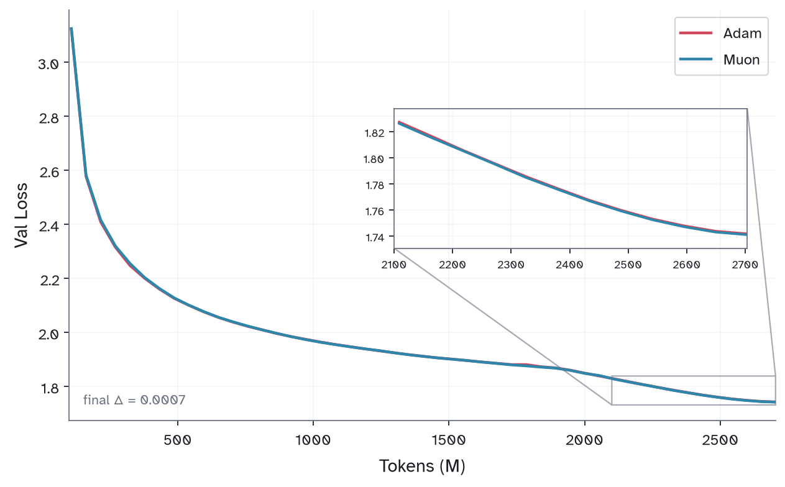
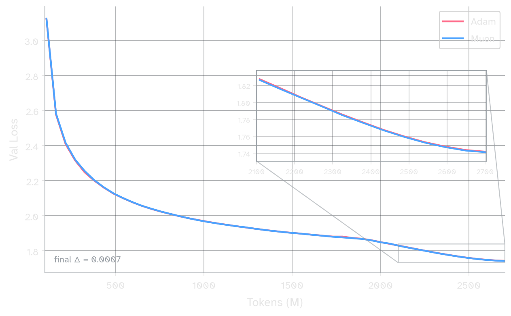

**Figure 4:** Validation loss of Adam vs Muon used on the MoE router. Muon is nearly identical throughout training. 

If validation loss is no better, why bother with Muon? The Moonshot AI team used Muon on the MoE router in the training of Kimi K2[^kimi][^xidulu] (and perhaps later models). They motivate this decision by showing that Muon produces a router with consistently lower *SVD Entropy* than Adam. Agreeing with prior literature[^orthogonality], I found Muon greatly improves the conditioning of the router weights:


[^xidulu]: [Xidulu 2026](https://x.com/xidulu/status/2065543207950152016) helpfully pointed this fact out to me.
[^kimi]: [Moonshot AI, Liu et al 2025](https://arxiv.org/abs/2502.16982) *Muon is Scalable for LLM Training*

[^orthogonality]: Muon's tendency to produce well-conditioned weights is documented empirically in [Davis and Drusvyatskiy 2025](https://github.com/damek/specgd/blob/main/stable_rank.pdf) and [Boreiko et al 2025](https://openreview.net/challenge?redirect=%2Fforum%3Fid%3DppmyFtr9EW). I discuss this property in the context of standard linear layers in my [[essays/muon|earlier post on Muon]].


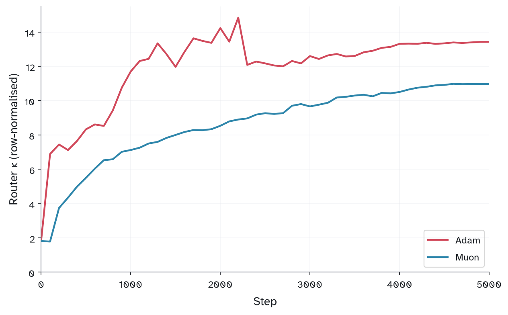
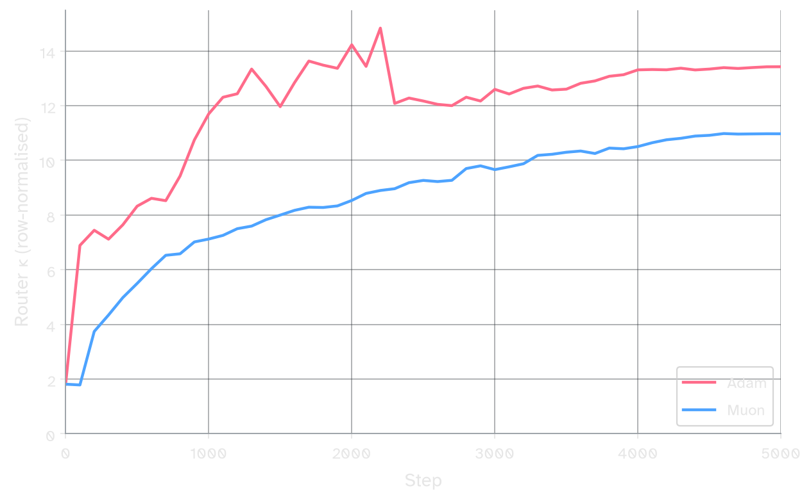
 **Figure 5:** Router condition number ($\sigma_{\max}/\sigma_{\min}$) over training. Muon produces a better-conditioned router than Adam throughout.

So Muon is roughly net even on loss but improves conditioning. 

For small-scale experiments, especially for extremely sparse models, conditioning may be a more useful measure than val loss. In the above experiments, the model above has roughly 1.5B total parameters trained on 2.7B tokens — about 1.8 tokens per parameter. At this budget, expert specialization is probably not truly meaningful since the underlying data may not be diverse enough to reflect genuinely useful distinctions.

## Two new methods
### (3) Manifold Optimization 

In the previous section, we found that Muon achieves better geometric conditioning of the routers than Adam. Here, I want to explore what happens when we target perfect conditioning. 

Condition number is especially useful for probing the quality of the router because it is discontinuous under top-$k$: small drifts in the weight matrix cause discrete jumps in token assignment. 

For any wide matrix (rows < columns, as in our router), the conditioning is perfect if and only if all rows are orthogonal with equal norm. This property, *rowwise orthogonality*, has a useful interpretation for the router specifically.  When two routing vectors have high cosine similarity, there exists a subspace where tokens are indistinguishable to those experts, and any token in that subspace gets assigned between them essentially at random. Rowwise orthogonality ensures no two routing vectors are redundant, and that small perturbations to the router weight do not severely change routing dynamics. Better orthogonality, which corresponds to better conditioning, may end up producing a much healthier model on a variety of downstream metrics when fully trained.


**Figure 6:** Mean pairwise cosine similarity between router rows over training. Adam (left) vs Muon (right) across all three balancing methods. Muon produces strictly more orthogonal routers.

Two recent works[^ernie][^guo] have defined an aux loss for the MoE router that explicitly encourages rowwise orthogonalization:

[^ernie]: [ERNIE Team, Baidu 2025](https://ernie.baidu.com/blog/publication/ERNIE_Technical_Report.pdf) *ERNIE 4.5 Technical Report* — introduces an orthogonalization aux loss on the router.
[^guo]: [Guo et al 2025](https://arxiv.org/abs/2505.22323) *Advancing Expert Specialization for Better MoE*


**Figure 7:** Mean pairwise cosine similarity under Muon without (left) and with (right) an orthogonalization auxiliary loss. The orth loss drives similarities lower, though they remain nonzero and growing.


Rather than *encouraging* orthogonality, we can enforce it directly. In 2025, Jeremy Bernstein[^manifold-muon] proposed Manifold Muon, in which weights are constrained to the Stiefel Manifold. For router weights, where the number of experts is less than the hidden dimension, this gives us exact rowwise orthogonality. 

[^manifold-muon]: [Jeremy Bernstein 2025](https://thinkingmachines.ai/blog/modular-manifolds/) *Modular Manifolds*

```python
 def sym(X: Tensor) -> Tensor:
    return 0.5 * (X + X.mT)
    
def manifold_muon_update(
    W: Tensor, G: Tensor, lr: float,
    dual_lr: float = 0.01, dual_steps: int = 100,
) -> Tensor:
    G = G / (G.norm() + 1e-8)
    # init Lambda so first iterate ≈ tangent_project(G, W)
    Lambda = -0.5 * sym(G @ W.mT)
    # dual ascent
    for i in range(dual_steps):
        Z = msign(G + 2 * sym(Lambda) @ W)
        Lambda -= dual_lr * (1 - i / dual_steps) * sym(Z @ W.mT)
    # update, retract
    vel = msign(G + 2 * sym(Lambda) @ W)
    return msign(W - lr * vel)
```

**Algorithm 2:** Manifold Muon. `msign` is the matrix sign function (Newton-Schulz / Polar Express). This code assumes W is wide (`W.shape[0] <= W.shape[1]`). For full implementation details see the Appendix.


As desired, the routers are perfectly orthogonal throughout training:


 **Figure 8:** Mean pairwise cosine similarity under Manifold Muon. Rows remain exactly orthogonal throughout training.


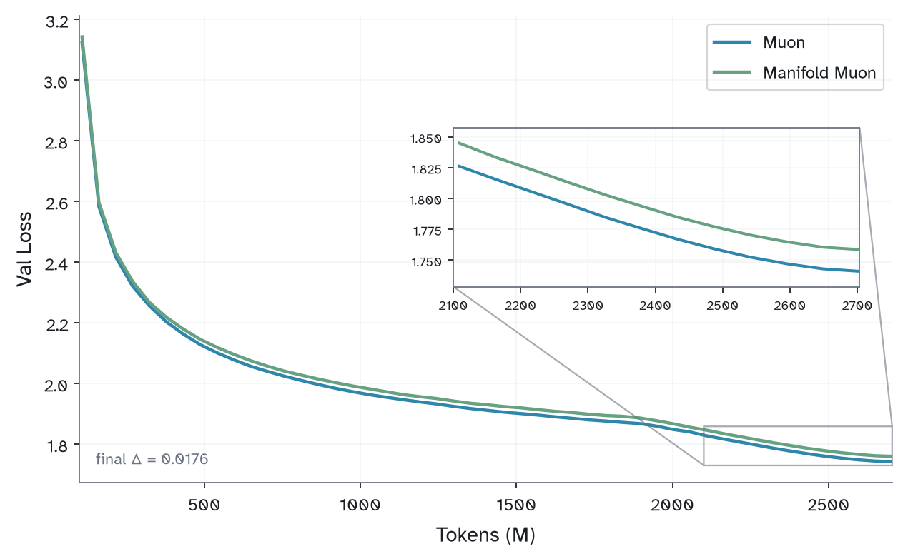
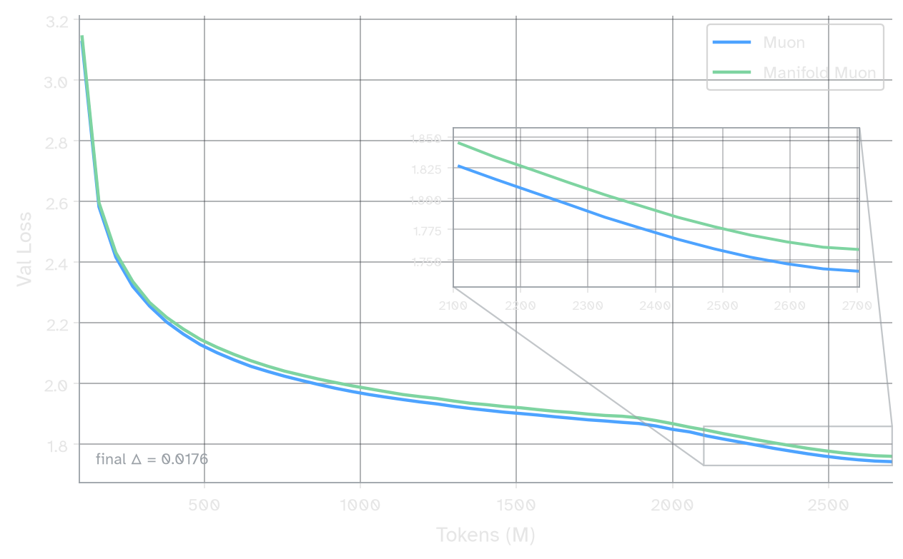

**Figure 9:** Validation loss of Muon vs Manifold Muon on the router. Perfect orthogonality costs a bit of val loss.

Orthogonality can be understood as a data-agnostic approximation to *capacity*: a measure of how much of the incoming token distribution we cover. Recalling the nearest-neighbors formulation from Part 1, we'd like for the majority of incoming tokens to be contained within the span of the routing vectors. Pairwise similarity is a special case of capacity: a routing vector adds nothing whenever it lies in the span of the others. Consider two experts with identical routing vectors — they receive statistically indistinguishable sets of tokens, train on the same inputs, and likely converge toward the same function. On the other hand, a router that is *not* in the span of any other routers adds a novel axis of discrimination, which points toward a potential feature on which an expert can specialize. 

%% Load balancing ensures experts receive roughly equal tokens, but we also care that these distributions tokens. A uniformly random router is balanced but useless. By Hadamard's Inequality, the simplex formed by the routing vectors is maximized exactly when they're mutually orthogonal. %%

If token activations were uniformly distributed on the sphere (in $\mathbb{R}^d$), orthogonal routing vectors would maximize capacity exactly. They aren't uniform (if they were, load balancing would also be trivial), so maximizing the routing simplex isn't the same as maximizing capacity. Orthogonality is a naive but principled starting point, as the max-volume geometry when you ignore incoming token distribution. Load balancing and orthogonality can be thought of as complementary aspects toward capacity maximization. 

### (4) Loss-Free Routing
One of the surprising results from the previous two sections is that Muon's gradient row-mixing doesn't hurt val loss too much. This suggests that respecting the cross-entropy gradient isn't crucial toward training our router. 

The implicit assumption so far has been that each routing row learns to select tokens whose features its expert is good at processing. I'd like to reverse this assumption by training a router that knows nothing about its downstream experts, and instead allowing the experts to learn to process whatever tokens they receive.

Recall that the primary motivation of aux-loss-free load balancing was the conflict between two objectives' distinct gradients. DeepSeek's loss-free balancing dropped the auxiliary loss and kept the LM gradient; this is the opposite move.

We can design an optimizer where structural orthogonality and load-balancing are the only tools we have to maximize capacity. First, we calculate the exact update needed to balance the experts based on the incoming token stream. Then, we feed this update into manifold muon before applying it to the router. 

```python
def loss_free_router_step(W, x, logits, lr):
    # 1. balancing gradient (see Appendix for derivation)
    rho = torch.sigmoid(logits)
    F = rho.mean(dim=0)
    s = rho * (1 - rho)
    scale = (2.0 / x.shape[0]) * (F - F.mean())
    G = scale.unsqueeze(1) * (s.T @ x)
    # 2. manifold muon update
    return manifold_muon_update(W, G, lr)
```

%% So far, we've outlined that the desired properties of a router are that it
- equally balances tokens to experts
- keeps the router weight well-conditioned

If both are satisfied, each expert receives a distinct, equally-sized slice of the token distribution. The bare-minimum algorithm for this would be to: %%

%% In Section 2 we found that it's okay if the gradients that update a given row blend don't actually correspond to just the loss coming from the row. In this section, I want to explore the thought that the router is totally agnostic to the gradient flow. %%

The routers receive *no* other updates, neither from the typical backprop update nor from any additional load balancer. Full details + code are in the Appendix, but here are the results:

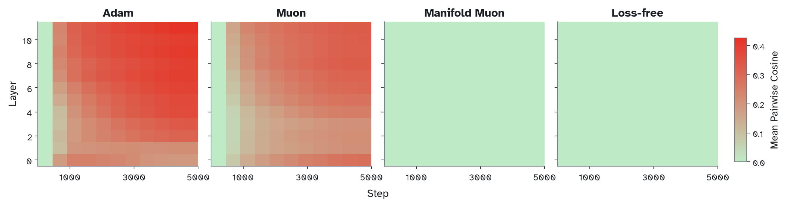
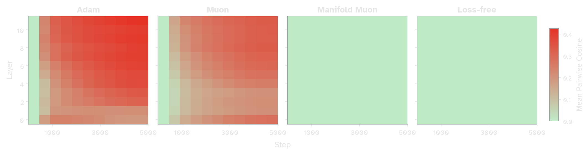

**Figure 10:** Mean pairwise cosine similarity by layer over training for all four router optimizers. Adam and Muon accumulate similarity in later layers; Manifold Muon and the loss-free router maintain near-zero similarity throughout.


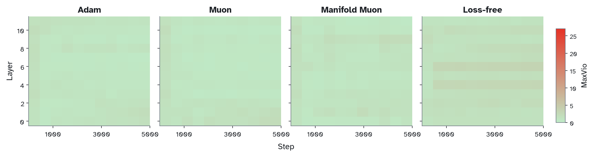
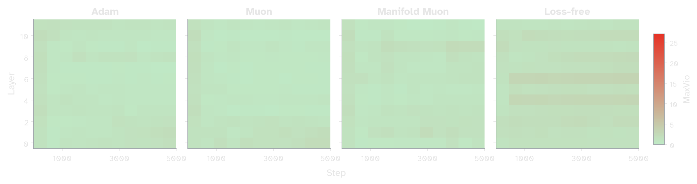

**Figure 11:** MaxVio by layer over training for the Loss-free router (rightmost) versus previous methods (Adam, Muon, Manifold Muon with Quantile Load Balancer). Even with no external balancer, MaxVio is low throughout training. 


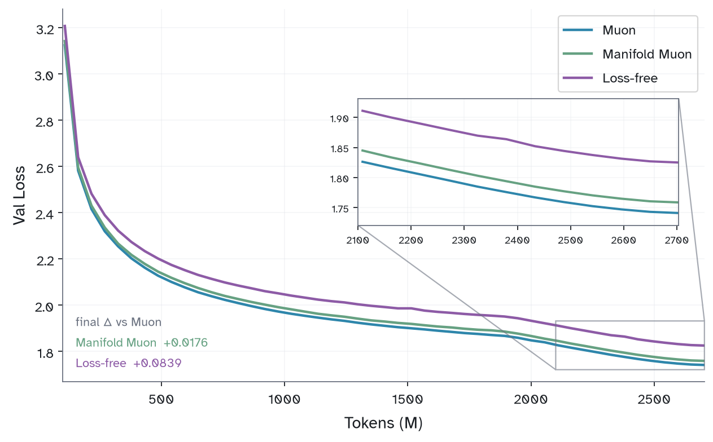
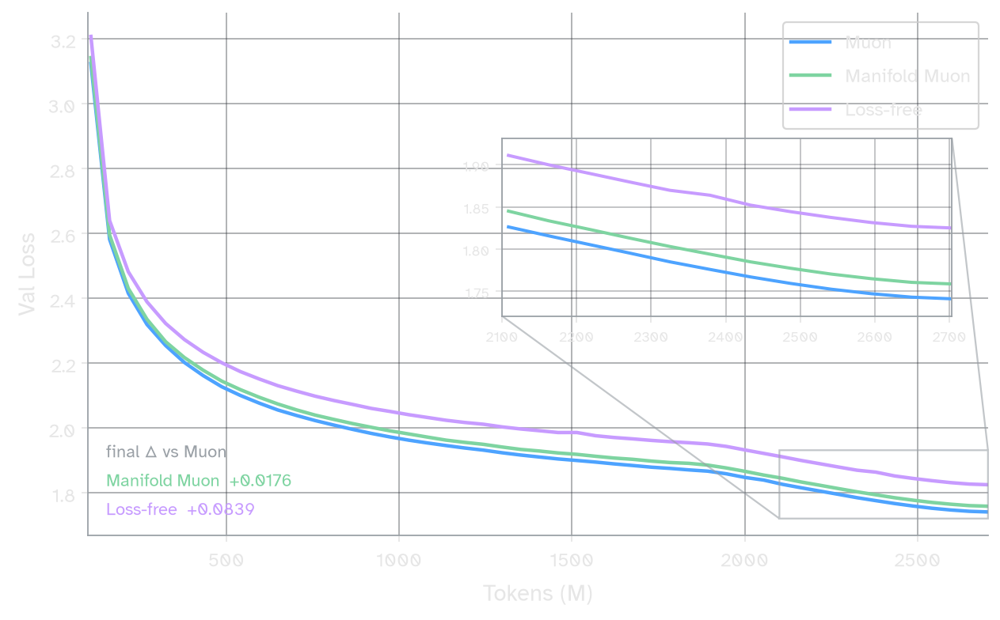

**Figure 12:** Validation loss under loss-free routing compared to previous methods. Training is stable and monotonic, though val loss lags behind.

The router achieves perfect orthogonality and balance with no gradient from the LM head. The validation loss lags behind the previous implementations, but training still appears to be monotonic and stable. %% 

The manifold muon udpate is a bit expensive, requiring ... calls to the `msign` operation. We can get away with doing it every $n$ steps. 

{im not sure where to put below paragraph but i feel its informative}
Recall that the primary motivation of aux-loss-free load balancing was due to "conflict" between the two loss functions' distinct gradients. While DeepSeek and later work solved this by getting rid of the load balancing loss term, I'm proposing doing the opposite: getting rid of the gradient from cross-entropy loss.

Note that the validation loss lags noticably behind the previous approaches in this blog. It's worth asking why bother with this idea at all? 

The loss-free router is composed of two distinct elements: structural orthogonality, and a balancing update rule. I'm complaining that combined, these form a rough approximation to *capacity*. %%

I'd like to propose that this loss-free router is just the simplest possible instantiation of a family of loss-free learnable routers[^frozen]. The proposed framework has just one geometric constraint and one update rule, both decoupled from the cross-entropy gradient. The balancing update could be replaced by any objective we can write a gradient for: capacity-maximization, expert specialization, dead-expert-minimization, sequence-level balance. etc. The geometric constraint can also be relaxed from strict orthogonality to any manifold constrained optimizer.[^tilde]

[^tilde]: [Keigwin, Pai, Chen (Tilde Research) 2025](https://blog.tilderesearch.com/vignettes/gram-space) *Gram-Space Manifold Muon*

[^frozen]: The truly simplest loss-free routers are entirely frozen. In DeepSeek V4[^dsv4], a fixed lookup table maps token IDs directly to experts. A static table works well in early layers where incoming activations follow natural language statistics, but cannot adapt in middle/later layers whose distributions shift throughout training. The loss-free router proposed here is learnable and adapts as distributions change. See also Su's discussion in Part 8 of his MoE series.[^su8]

[^dsv4]: [DeepSeek, Guo et al 2026](https://arxiv.org/abs/2606.19348) *DeepSeek-V4: Towards Highly Efficient Million-Token Context Intelligence*
[^su8]: [Jianlin Su 2026](https://kexue.fm/archives/11750) *MoE Odyssey Part 8: Where Does DeepSeek V4's tid2eid Come From?* — translated on my blog: [[essays/MoE|MoE Odyssey]].


%%   *Capacity* is a measure of how much we cover the incoming token distribution. Recalling the nearest-neighbors visual from Part 1, our goal is for the set of token activations to be fully contained within the convex combination of routing vectors. Pairwise similarity is a special case of capacity: a routing vector adds nothing whenever it lies in the convex combination of the others.  Recalling the nearest-neighbors formulation from part 1, we'd like for the majority of incoming tokens to be contained within the linear combination of the routing vectors.  By Hadamard's Inequality, the simplex formed by the routing vectors is maximized exactly when they're mutually orthogonal. The underlying data, however, is not equally distributed about the origin, so maximizing just the routing simplex won't be the same as maximizing capacity.    %%

%%Pairwise similarity is a special case of capacity: a routing vector adds nothing whenever it lies in the convex combination of the others.  Recalling the nearest-neighbors formulation from part 1, we'd like for the majority of incoming tokens to be contained within the linear combination of the routing vectors.  In order for a given routing vector to have discriminative power, we want to ensure it is not in the convex combination of any other router.  %%

%% 
Consider two experts with identical routing vectors. Both experts will receive indistinguishable sets of tokens 
These experts lack the capacity to specialize whatsoever

 Since each token will be receiving a subset of tokens regardless 

Load balancing ensures experts receive roughly equal tokens, but we also care about the distribution of these tokens. A uniformly random router is balanced but useless. When routing vectors are similar, their corresponding experts receive statistically indistinguishable sets of tokens, train on the same inputs, and likely converge toward the same function. This risks redundancy across experts. 

In general, a routing vector avoids 

 %%


--


## Appendix 


### Derivation and Code

```python
def sym(X: Tensor) -> Tensor:
    return 0.5 * (X + X.mT)

def manifold_muon_update(
    W: Tensor, G: Tensor, lr: float,
    vel_ema: Tensor | None = None, beta: float = 0.9,
    mu: float = 1.0, admm_steps: int = 20, preserve_mag: bool = False,
) -> Tensor:
    # step-size gate: preserves balance signal
    mag = torch.tanh(G.norm()) if preserve_mag else 1.0
    G = G / (G.norm() + 1e-8)
    # init Lambda so first iterate ≈ tangent_project(G, W)
    Lambda = -0.5 * sym(G @ W.mT)
    Z = G + 2 * Lambda @ W
    Omega = torch.zeros_like(Z)
    eye = torch.eye(W.shape[0], device=W.device, dtype=W.dtype)
    # ADMM
    for _ in range(admm_steps):
        Lambda = 0.5 * sym((Z + Omega / mu - G) @ W.mT)
        B = G + 2 * Lambda @ W - Omega / mu
        P_pos = 0.5 * (eye + msign(B @ B.mT - eye / mu**2))
        Z = P_pos @ (B - msign(B) / mu)
        Omega += mu * (Z - G - 2 * Lambda @ W)
    # tangent velocity
    vel = msign(G + 2 * sym(Lambda) @ W)
    vel = tangent_project(-lr * mag * vel, W)
    # momentum
    if vel_ema is not None:
        vel_ema.lerp_(vel, 1 - beta)
        vel = tangent_project(vel_ema, W)
    # retract to Stiefel manifold
    return streaming_msign(W + vel)
```
**Algorithm 3: Manifold Muon update with a few tricks**

Useful details:
- The inner loop uses ADMM to solve the constrained optimization over the Stiefel manifold.[^admm] This reformulation by Buchanan drops the required inner-loop iterations by an order of magnitude compared to Bernstein's original dual-ascent solver.
- I found convergence is better (especially for the Loss Free method) when the input gradient is considered (which would typically be discarded under Manifold Muon). I gate the step size as $\tanh(|G|)$ and use it to scale the update. This simple heuristic is not needed but helpful for convergence.
- `msign` uses Polar Express in `fp16` (more numerically stable than `bf16`)
- `streaming_msign` uses Jianlin Su's Streaming SVD[^su] algorithm. The reason for this is to encourage the final `msign` to have the same order of singular vectors from step-to-step. Newton-Schulz (and similar algorithms) may noisily shuffle rows in early training, which is dangerous for routing weights. 
- I've included logic that allows for momentumization to the retraction vector to the Stiefel Manifold (`vel -> vel_ema`). As far as I know, this addition is novel to the Manifold Muon literature. In my testing, this far outperforms momentumization of the incoming gradient signal.
- The router is initialized on the Stiefel manifold via `torch.nn.init.orthogonal_.`
- Routers of the same shape are batched into a single ADMM/msign call.

[^su]: [Su 2026](https://spaces.ac.cn/archives/11654) *A Muon implementation based on streaming exponential iteration*

For the Loss Free optimizer, we use a classic balancing loss criteria, but compute its gradient explicitly rather than through autograd.

Let $W \in \mathbb{R}^{E \times D}$ be the router weight, with rows $W_j$ corresponding to each expert's routing vector. Given token activations $x_1, \dots, x_T \in \mathbb{R}^D$, the routing score for token $i$ to expert $j$ is $\rho_{i,j} := \sigma(x_i \cdot W_j)$, where $\sigma$ is the sigmoid.[^sigmoid] The mean routing score per expert is $F_j := \frac{1}{T} \sum_{i=1}^T \rho_{i,j}$, and $F = [F_1, \dots, F_E] \in \mathbb{R}^E$ is the vector of all expert loads.

[^sigmoid]: The routing score could just be the raw dot product $x_i \cdot W_j$, but sigmoid keeps scores in $(0, 1)$ and gives a clean derivative $\sigma'(z) = \sigma(z)(1-\sigma(z))$. Any monotonic function of dot-product similarity works here though the resulting gradient will differ slightly.

%% If we want to ask how balanced the routing scores are, we can ask for the cosine similarity between %%
Since $F$ is just a vector, we can understand its properties by comparing it against a target vector. If we we want to ask how balanced $F$ is, we should compare it to $U = [\bar{F}, \bar{F}, \dots \bar{F}]$ where $\bar{F}$ is the mean value of $F$. This motivates a simple loss function like $\mathcal{L}(F) = ||F - U||^2$. 

We want $\frac{\partial \mathcal{L}}{\partial W_j}$. By the chain rule:

$$
\frac{\partial \mathcal{L}}{\partial W_j} = \frac{\partial \mathcal{L}}{\partial F_j} \cdot \frac{\partial F_j}{\partial W_j}
$$

For the first term, since $\mathcal{L} = |F - U|^2 = \sum_k (F_k - \bar{F})^2$ and $\sum_k(F_k - \bar{F}) = 0$:

$$
\frac{\partial \mathcal{L}}{\partial F_j} = 2(F_j - \bar{F})
$$

For the second term, since $F_j = \frac{1}{T}\sum_i \sigma(x_i \cdot W_j)$ and $\sigma' = \sigma(1-\sigma)$:

$$
\frac{\partial F_j}{\partial W_j} = \frac{1}{T}\sum_{i=1}^T \rho_{i,j}(1 - \rho_{i,j})\, x_i
$$

Combining:

$$\boxed{\frac{\partial \mathcal{L}}{\partial W_j} = 2(F_j - \bar{F}) \cdot \frac{1}{T}\sum_{i=1}^T \rho_{i,j}(1-\rho_{i,j})\, x_i \;\in \mathbb{R}^{D}}$$

The full gradient $\nabla_W \mathcal{L} \in \mathbb{R}^{E \times D}$ stacks these rows. In matrix form, let $S = \rho \odot (1 - \rho) \in \mathbb{R}^{T \times E}$:

$$
\nabla_W \mathcal{L} = \frac{2}{T}\, \text{diag}(F - \bar{F})\; S^\top X
$$


This gives the Loss Free update from earlier.

```python
def loss_free_router_step(W, x, logits, lr):
    # 1. balancing gradient 
    rho = torch.sigmoid(logits)
    F = rho.mean(dim=0)
    s = rho * (1 - rho)
    scale = (2.0 / x.shape[0]) * (F - F.mean())
    G = scale.unsqueeze(1) * (s.T @ x)
    # 2. manifold muon update
    return manifold_muon_update(W, G, lr, preserve_mag=True)
```

This update rule converges rapidly as load balancing is achieved. As such, only updating every $k$ steps is probably sufficient. 


%% The implementaiton of `msign` is somewhat numerically sensitive. I havent done rigorous ablation testing to the number of inner lop interations needed in manifold nor `msign` steps needed. I choose to use `polar_express` over newton-schulz as well as `fp16` instead of `bf16` in the msign code.  %%


%% {maybe move this to footnote} As far as I know, this implementation of accumulation in Manifold Muon has not yet been described elsewhere.  %%


%% Instead of using an "auxiliary loss" to promote load balance, following the earliest impls of MoE (GShard), we're going to use *only* the auxiliary loss to update our weights.  %%


[^admm]: [Sam D. Buchanan 2025](https://sdbuchanan.com/blog/manifold-muon/) *A Faster Manifold Muon with ADMM*
### Extensions
The loss-free method here used just one update rule (balance) and one geometric constraint (Stiefel). Both can be swapped:

Alternative update rules. The balancing gradient can be replaced or augmented with any objective we can differentiate through the router:
1. Capacity-maximization (see the note on capacity in Section 3)
2. Sequence-level load balancing
3. Domain specialization loss

Relaxed geometry: Strict orthogonality may be too aggressive when the number of experts is large. A natural relaxation is to target low coherence — a measure of how orthogonal a set of unit vectors is.[^coherence] Progressive relaxations of the Stiefel constraint are explored in Gram-Space Manifold Muon.[^tilde]

[^coherence]: See e.g. Mixon et al 2018 Low coherence tight frames

PSGD connection: The manifold retraction constraint resembles a PSGD preconditioner criterion. It may be possible to reframe both the row-independence constraint and the balancing update as a single PSGD criterion — giving load balancing + orthogonality in one optimizer whose objective is unrelated to the CE gradient.

Practical notes: The manifold update doesn't need to run every step — skipping every $n$ steps is sufficient (see results above). Additional optimizations: batching manifold Muon across layers, computing the balancing gradient during routing (no extra forward pass), and using the normal gradient accumulation + all-reduce pipeline by writing the result to .grad.

Scaling: The experiments here are at small scale (12-layer, 64 experts). Open questions: behavior at different sparsities, with fixed/shared experts, and whether the framework holds at frontier scale.

### Experiment details

All experiments use a 12-layer, 768-dimensional NanoGPT-style transformer. Every layer's MLP is replaced by a 64-expert SwiGLU MoE with expert intermediate width 768 (1,771,776 parameters per expert) and top-2 routing. The model has 1,465,228,800 total parameters, 92.9% of which sit in the experts; top-2 routing activates 147,027,456 per token (71,480,832 excluding the embedding table and LM head) — a ~10× total-to-active ratio. Routing uses sigmoid gating renormalized to sum to one.

Training data is a three-domain blend drawn from Dolma v1.7 — code (StarCoder), math (proof-pile-2), and literature (books + Wikipedia) — tokenized with SmolLM2 (49,152 vocab). Each optimizer step sees all three domains in equal proportion. Runs are 5,000 steps at ~540K tokens/step (≈2.7B tokens total). The LR Schedule follows WSD, with a linear decay over the final 30% of training. 

AdamW (lr 3e-3) is used on embeddings, the LM head, norms, and biases. Muon (lr 1.5e-2) is used on all attention and expert matrices. The router is the only component that varies between arms: Muon-family routers (plain Muon, Manifold Muon, loss-free) all use lr 0.02; the Adam-router baseline uses 3e-3.


---

Thank you to Prime Intellect who sponsored this work. If this post was useful to you, you may cite

```
@misc{
      srivastava2026,
      author = {Varun Srivastava},
      title = {Loss-Free MoE Routing},
      year = {2026},
      url = {https://varunneal.github.io/essays/loss-free-moe}
}
```