**Overview:** I posit claim the the two essential constraints on the MoE router are load balancing and rowwise orthogonality. Following this theory, I propose two optimizers for routers that {maximally satisfy these constraints}.
%% enforces these constraints without using the cross-entropy gradient. %%

%% suggest and test two new optimizers for the router. The first constrains the router weights to the Stiefel manifold. The second extends this by replacing the cross-entropy gradient entirely, achieving both load balancing and orthogonality in a single update rule with no auxiliary balancer.
 %%
%% I constrain the MoE router to the Stiefel manifold in order to increase expert capacity. I then propose a completely loss-free router update that achieves both load balancing and maximum capacity. %%

## What's in a router?
### (1) Load Balancing
A standard transformer has one MLP per layer. A mixture-of-experts (MoE) model has many, each called an expert, but routes each token to only a few of them. The routing decision is controlled by an $E \times D$ weight matrix (the router), where each row is a single expert's selection vector.

Each expert owns a single row in the router matrix, which is just a point in activation space. Tokens arrive with their own activations, and routing scores are decided based on the similarity between expert's vectors and token activations. In a simplified model where all these vectors are unit-normalized, dot-product similarity is monotonic with Euclidean Distance, so each token routes to its nearest expert. 

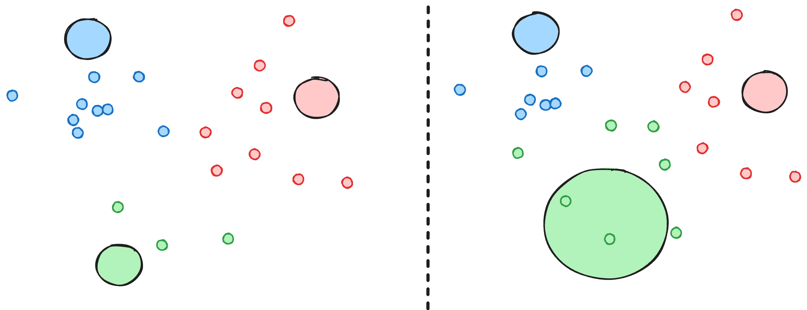
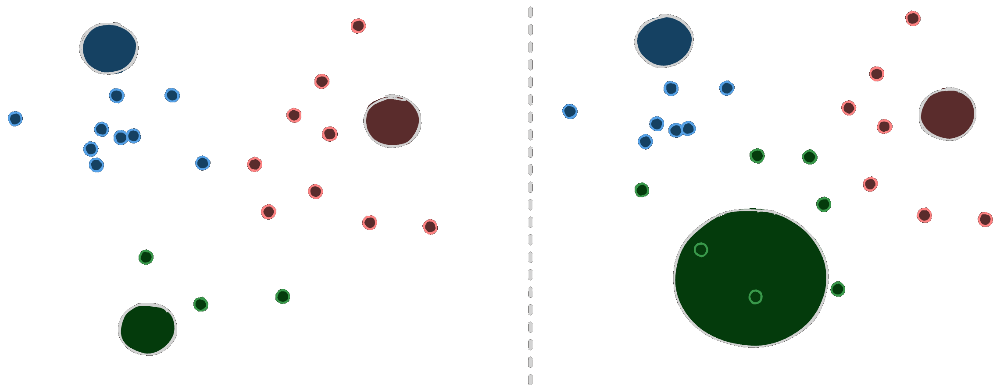

**Figure 1:** A simplified setup with 3 experts. (Left) unbalanced routing. (Right) we expand the radius of the green expert and achieve balance.

A router balancer modifies the effective catchment radius around each expert so that each receives a near-equal number of tokens. 

Without balancing you will end up in a vicious feedback loop of dead experts. If an expert receives fewer tokens, it will become undertrained, which will encourage the router to continue diverting tokens away from this expert. 

To promote balance, GShard[^gshard] added an auxiliary loss that measures how imbalanced the experts are. This is simple to implement, since the autograd framework handles the complexities of how each expert should become balanced. The problem is that your model now has two objectives that can conflict with each other:

> Existing methods commonly employ an auxiliary loss to encourage load balance, but a large auxiliary loss will introduce non-negligible interference gradients into training and thus impair the model performance. 
> Although the auxiliary loss can alleviate load imbalance during training, it also introduces undesired gradients that conflict with the language modeling objective.

The above quote is from DeepSeek[^deepseek], who chose to drop the auxiliary loss entirely. Instead of optimizing a second objective, they adjust the radius around each expert using a learnable scalar bias. Subsequent work like SMEBU[^trinity3] and Quantile Balancing[^suquantile] modify the dynamics by which these biases are learned.

%% Beginning with DeepSeek, a wave of bias-based aux-loss-free load balancesr has become popular.  Instead of adding a new loss function, these approaches 

concisely summarizes why aux-loss methods fell out of favor:

The three load balancers I'll use in this post — DeepSeek's aux-loss-free bias[^deepseek], SMEBU[^trinity3], and quantile load balancing[^suquantile][^openathena] — are each different flavors of the "radius adjustment" concept. 

DeepSeek nudges scalar biases a little each step.  SMEBU does the same but with gated steps and momentum.  Quantile balancing "snaps" to the optimal bias at each step by using iterative fitting  [^sinkhorn].  %%

[^sinkhorn]: [Sinkhorn and Knopp 1967](https://en.wikipedia.org/wiki/Sinkhorn%27s_theorem#Sinkhorn%E2%80%93Knopp_algorithm) *Sinkhorn–Knopp algorithm* — the iterative matrix-scaling procedure quantile balancing uses to solve for optimal biases.
[^deepseek]: [DeepSeek, Wang et al 2024](https://arxiv.org/abs/2408.15664) *Auxiliary-Loss-Free Load Balancing Strategy for Mixture-of-Experts*
[^trinity3]: [Arcee, Singh et al 2026](https://arxiv.org/abs/2602.17004) *Trinity 3 Training Report*. Introduces and uses SMEBU.
[^suquantile]: [Jianlin Su 2026](https://kexue.fm/archives/11619) *Quantile Load Balancing* — part 6 of Su's MoE series; the full series appears in translation on my blog: [[moe]].
[^openathena]: [Open Athena, Dial 2026](https://openathena.ai/blog/quantile-balancing/) *Quantile Balancing* — the Marin team's validation of QB on a 32B-A5B model over 326B tokens.


Each approach confers different dynamics over the course of training, though all are effective:

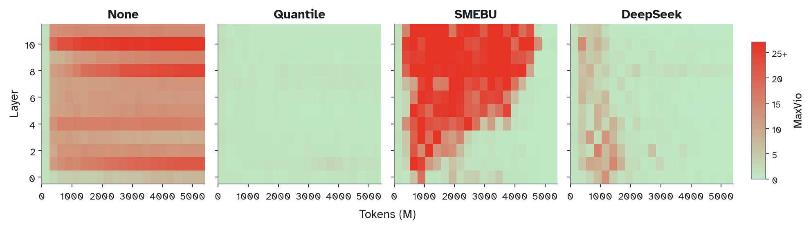
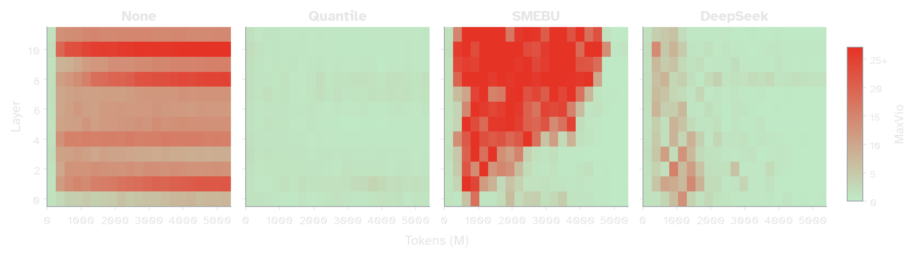

**Figure 2:** Load balancing throughout the duration of training as measured by *MaxVio*: how much the most overloaded expert's token share is above its balanced allocation. All load-balancing techniques result in zero dead experts by the end of training.

<!-- Dead-experts figure — parked, can be reinstated later.
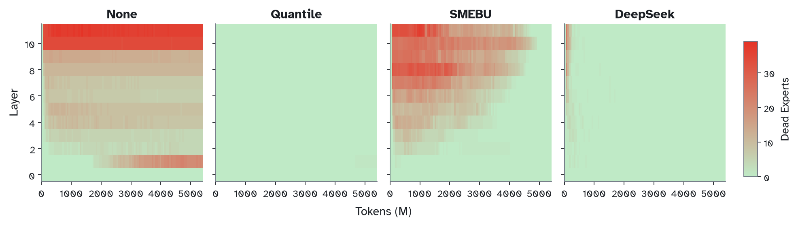
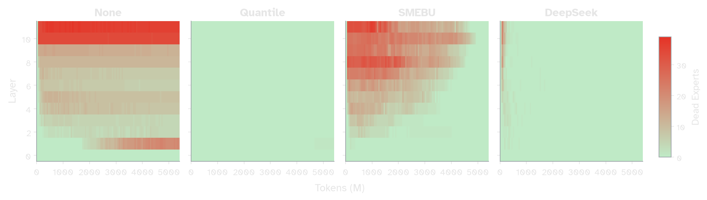

**Figure 2:** Dead experts by Layer over the course of training for each load balancing method. Trained with 64 experts and top-2 routing on a 12 layer, 768 dim model.  All techniques result in zero dead experts by the end of training.
-->


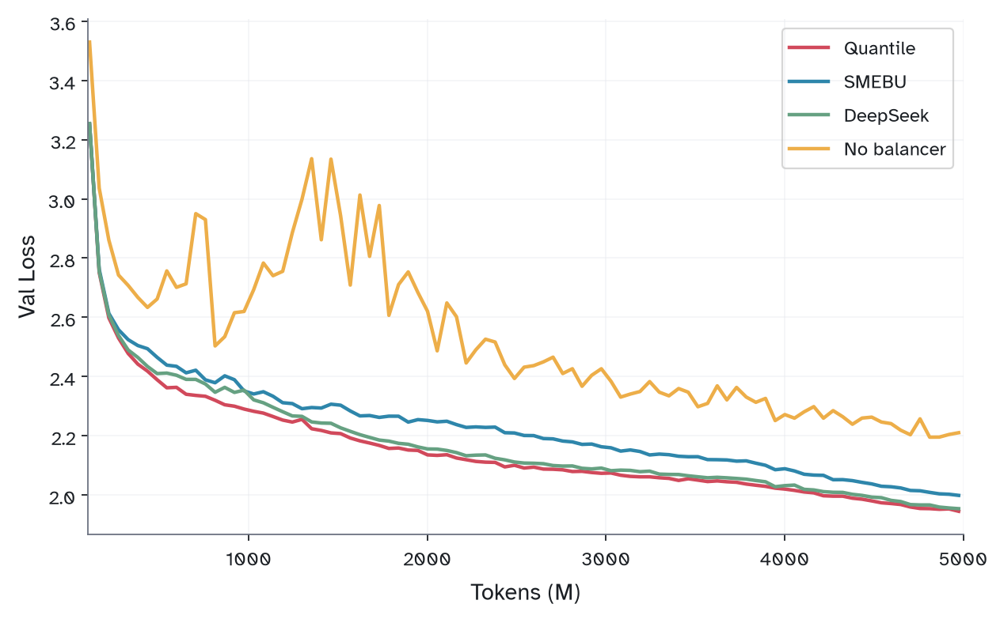
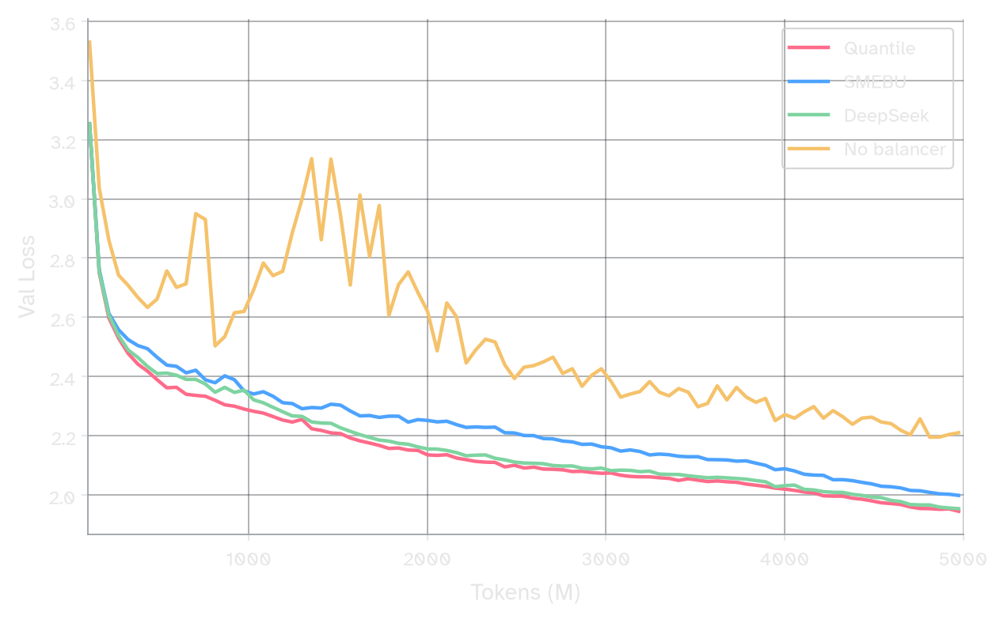

**Figure 3:** Val Loss trajectories for each of the load balancing methods.

%% All of these methods are "aux-loss-free", in contrast to older methods like GShard[^gshard] that used an auxiliary loss function to promote load balancing. %%


[^fedus]: [Fedus, Zoph, Dean 2022](https://arxiv.org/abs/2209.01667) *A Review of Sparse Expert Models in Deep Learning*
[^gshard]: [Lepikhin et al 2020](https://arxiv.org/abs/2006.16668) *GShard: Scaling Giant Models with Conditional Computation and Automatic Sharding*


### (2) Capacity
For the results in Part 1, I used Adam on the routers. At first glance, Muon seems like a poor fit for the MoE Router.

Unlike a regular linear layer, the MoE router's rows are structurally independent: when a token is routed into $k$ experts, the gradient can only flow backward into those $k$ rows. Optimizers like Shampoo and Muon violate this by mixing gradients from distinct rows, blending learning signals that belong to totally different experts.[^preconditioners] This is apparent when considering the Shampoo update rule:

```python
def shampoo_update(G, left_precond, right_precond, W, lr):
	left_precond = left_precond + G @ G^T
	right_precond = right_precond + G^T @ G
	return W - lr * (L^{-1/4} @ G @ R^{-1/4})
```

**Algorithm 1:** Simplified shampoo update. Barring details on accumulation and approximation, the above is identical to Muon. The `left_precond` factor blends gradient signals across rows. [^oldnorm][^anil]

[^anil]: lots of recent shampoo discourse on twitter between rohan anil and keller jordan and  everyone should now agree that this is basically true. [Rohan Anil 2026](https://x.com/_arohan_/status/2064631528806908134).
[^oldnorm]: [Bernstein and Newhouse 2024](https://arxiv.org/abs/2409.20325) *Old Optimizer, New Norm*

[^preconditioners]: The general issue is that shampoo-style optimizers use cross-term pre-conditioners, whereas Adam has only a diagonal preconditioner. Under the shampoo/psgd framework, you could imagine solving this problem via a kronecker-factored preconditioner, where the input factor uses cross-terms but the output factor is diagonal. I think this approach could be fruitful for the design of another optimizer for routers. 

Despite this, Muon turns out to work well on the router:

{todo: include val loss charts of my own? not sure}
{Muon was used on the MoE router for the training of Kimi K2[^kimi][^xidulu].}


[^xidulu]: [Xidulu 2026](https://x.com/xidulu/status/2065543207950152016) helpfully pointed this fact out to me.
[^kimi]: [Moonshot AI, Liu et al 2025](https://arxiv.org/abs/2502.16982) *Muon is Scalable for LLM Training*

My primary hypothesis for why Muon performs better than Adam has to do with *capacity*. 
%%  To understand why Muon might perform even better than Adam on the router, I want to investigate *capacity*.   %%

-- need to figure out how I want to argue this section --

Consider two experts with identical routing vectors. Both experts will receive indistinguishable sets of tokens 
These experts lack the capacity to specialize whatsoever

When two routing vectors have similarity, there exists a subspace where tokens  are indistinguishable; any token in that subspace gets routed between experts at random. 

Since balance is enforced externally, the router's only job is to create discriminative power between tokens. Since each token will be receiving a subset of tokens regardless 

Load balancing ensures experts receive roughly equal tokens, but we also care about the distribution of these tokens. A uniformly random router is balanced but useless. When routing vectors are similar, their corresponding experts receive statistically indistinguishable sets of tokens, train on the same inputs, and likely converge toward the same function. This risks redundancy across experts. 

In general, a routing vector avoids 
In order for each routing vector to be useful, we want to ensure it is not in the convex combination of the others. 

*Capacity* is a measure of how much we cover the incoming token distribution. Recalling the nearest-neighbors visual from Part 1, our goal is for the set of token activations to be fully contained within the convex combination of routing vectors. Pairwise similarity is a special case of capacity: a routing vector adds nothing whenever it lies in the convex combination of the others. %% Recalling the nearest-neighbors formulation from part 1, we'd like for the majority of incoming tokens to be contained within the linear combination of the routing vectors. %% By Hadamard's Inequality, the simplex formed by the routing vectors is maximized exactly when they're mutually orthogonal.

--

[^orthogonality]: Muon's tendency to produce well-conditioned weights is documented empirically in [Damek and Deusvyatskiy 2025](https://github.com/damek/specgd/blob/main/stable_rank.pdf) and [Boreiko et al 2025](https://openreview.net/challenge?redirect=%2Fforum%3Fid%3DppmyFtr9EW). I discuss this property in the context of standard linear layers in my [[essays/muon|earlier post on Muon]].

We find that Muon greatly increases the capacity of the router weights[^orthogonality]:

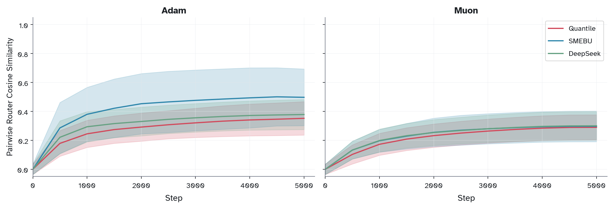
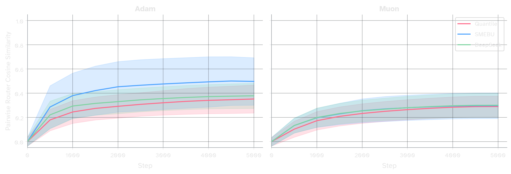

**Figure 4:** Variance and mean of pairwise cosine similarity between router rows over training. Adam (left) vs Muon (right) across all three balancing methods. Lower means more orthogonal, corresponding to experts that are pointing in more distinct directions. Muon has strictly higher orthogonality over training for all three load balancers.

Two recent works[^ernie][^guo] have defined an aux loss for the MoE router that explicitly encourages rowwise orthogonalization:

[^ernie]: [ERNIE Team, Baidu 2025](https://ernie.baidu.com/blog/publication/ERNIE_Technical_Report.pdf) *ERNIE 4.5 Technical Report* — introduces an orthogonalization aux loss on the router.
[^guo]: [Guo et al 2025](https://arxiv.org/abs/2505.22323) *Advancing Expert Specialization for Better MoE*

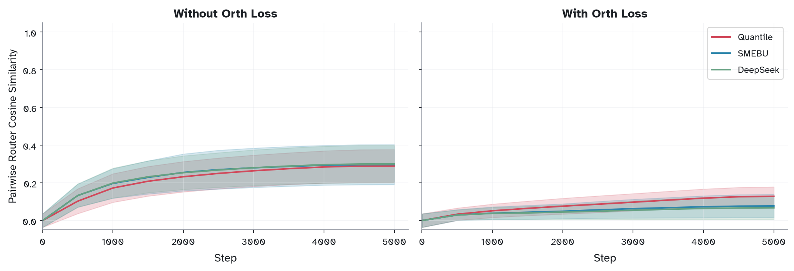
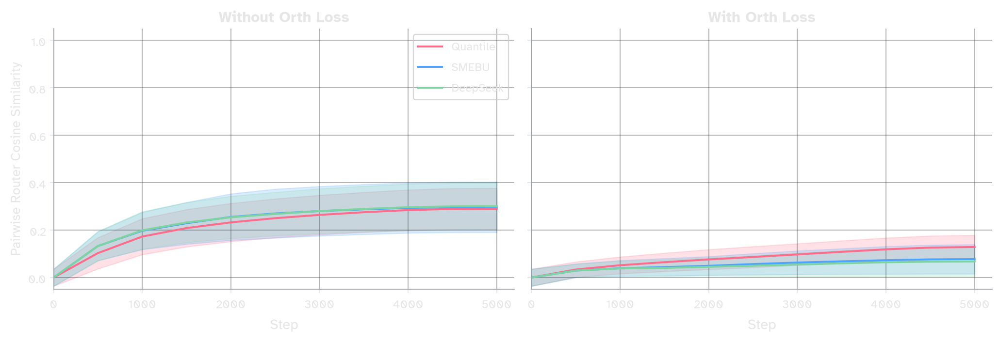

**Figure 5:** Mean pairwise cosine similarity under Muon with (Left) and without (Right) an orthogonalization auxiliary loss term. The orth loss drives similarities lower.

This is effective at lowering mean cosine similarities, though they are still nonzero and continue to grow throughout training.

%% ## Two new methods %%
## Two new methods
### (3) Manifold Optimization 
Rather than *encouraging* orthogonality, we can enforce it directly. In 2025, Jeremy Bernstein[^manifold-muon] proposed Manifold Muon, in which weights are constrained to the Stiefel Manifold. For router weights, where the number of experts is less than the hidden dimension, this gives us exact rowwise orthogonality. 
%% Buchanan later reformulated the inner loop using ADMM, dropping the required iterations by an order of magnitude: %%


%% The above code turns out to be disastrous. %%

[^manifold-muon]: [Jeremy Bernstein 2025](https://thinkingmachines.ai/blog/modular-manifolds/) *Modular Manifolds*

%% ok first lets probably not do the bernstein code but the sam buchanan code[^admm] instead which he gives as %%
```python
 def sym(X: Tensor) -> Tensor:
    return 0.5 * (X + X.mT)
    
def manifold_muon_admm_update(
    W: Tensor, G: Tensor, eta: float,
    rho: float = 1.0, admm_steps: int = 20,
) -> Tensor:
    # init Lambda so first iterate ≈ tangent_project(G, W)
    Lambda = -0.5 * sym(G @ W.mT)
    X = G + 2 * Lambda @ W
    Omega = torch.zeros_like(X)
    eye = torch.eye(W.shape[0], device=W.device, dtype=W.dtype)
    # ADMM
    for _ in range(admm_steps):
        # Lambda: least-squares solve
        Lambda = 0.5 * sym((X + Omega / rho - G) @ W.mT)
        # X: singular value thresholding
        B = G + 2 * Lambda @ W - Omega / rho
        P_pos = 0.5 * (eye + msign(B @ B.mT - eye / rho**2))
        X = P_pos @ (B - msign(B) / rho)
        # Omega: dual ascent
        Omega += rho * (X - G - 2 * Lambda @ W)
    # update, retract
    vel = msign(G + 2 * sym(Lambda) @ W)
    return msign(W - eta * vel)
```

**Algorithm 3:** Manifold Muon via ADMM[^admm] . `msign` is the matrix sign function like Newton-Schulz / Polar-Express. This code assumes W is wide (`W.shape[0] <= W.shape[1]`).

Naively applying this to the MoE router diverges:

{include spikey val loss garph}

The manifold retraction can cause large discrete jumps in a given row between steps. Since every row corresponds to a totally distinct expert, the router is more sensitive to these jumps than a typical linear weight. %% For example, a given row may completely swap The router is more sensitive to these jumps than a typical linear weight: since rows correspond to independent experts, and there is a discrete top-$k$ operation, discrete retractions can cause experts to receive entirely different subspaces of tokens.  %%

%% note: this is my transcription of his code using my preferrred var name conventions + dropping 
some details. might need to define `msign` %%


[^admm]: [Sam D. Buchanan 2025](https://sdbuchanan.com/blog/manifold-muon/) *A Faster Manifold Muon with ADMM*

%% we need to ensure we cite buchanan reference and say we use it over original bernstein code bc admm solver drops the needed of inner loop steps by an order of magnitude  %%


%% FIG 7 · manifold_muon_divergent_val_loss — NOT GENERATED yet (rough version: Pasted image 20260630000731.png): oscillatory / divergent val-loss curves from naive manifold-Muon on the router %%
<!--


**Figure 7: {caption}**
-->

%% ok lets make some fixes... %%
%% Manifold Muon suffers from two instabilities. The first is that its operating on the raw gradient, so the update isn't smooth. The second is that the manifold retraction can cause large, discrete changes per step. The MoE router is particular sensitive to the latter — remember, rows are discrete — and manifold retractions can cause rows to swap wildly.  %%

To fix this, we can't just add accumulation onto `G` (i.e. gradient momentum). {why: explain in prose one sentence}
{ok actually it may be complicated. its sort of twofold
first, accumulating G changes the dynamics of the dual ascnet. how so? need to be rigorous about this
the other problem is that accumulating onto G still makes the retraction change discretely per step
}
Instead, I propose accumulation onto `vel`, which is the direction of update in the tangent space. The diff is small:

```python {17-18}
def manifold_muon_ema_admm_update(
    W: Tensor, vel_ema: Tensor, G: Tensor,
    eta: float, beta: float,
    rho: float = 1.0, admm_steps: int = 15,
) -> Tensor:
    # init Lambda so first iterate ≈ tangent_project(G, W)
    Lambda = -0.5 * sym(G @ W.mT)
    X = G + 2 * Lambda @ W
    Omega = torch.zeros_like(X)
    eye = torch.eye(W.shape[0], device=W.device, dtype=W.dtype)
    # ADMM
    for _ in range(admm_steps):
        ...   # Same as above
    # update
    vel = msign(G + 2 * sym(Lambda) @ W)
    # accumulate velocity, project to tangent
    vel_ema.lerp_(vel, 1 - beta)
    vel_ema.sub_(sym(vel_ema @ W.mT) @ W)
    # update weight with retraction
    return msign(W - eta * vel_ema)
```
**Algorithm 4** Manifold Muon with tangent-space momentum (difference from Algorithm 3 highlighted).

Accumulating the update loses the guarantee it remains in the tangent space of the current weight, so we have to add a single-step reprojection.

%% {maybe move this to footnote} As far as I know, this implementation of accumulation in Manifold Muon has not yet been described elsewhere.  %%


Results/upshot here
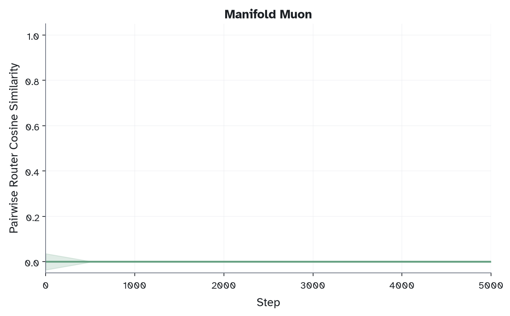
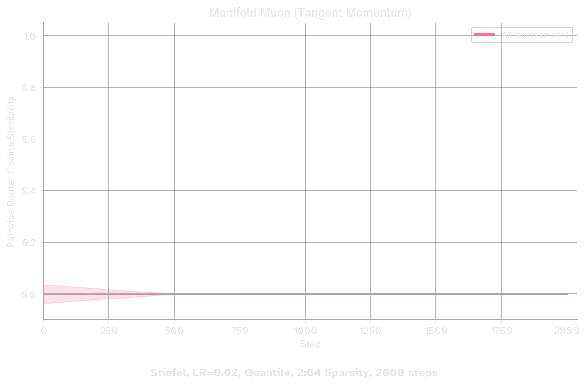
**Figure 6:** Mean pairwise cosine similarity under manifold Muon with tangent momentum. Rows stay perfectly orthogonal throughout training.

To add: show charts that demonstrate val loss is decent. show any additional benefits (somewhat tbd but num experts specialized, specialization by domain)

 %% ## Part 2: Specialization and Diversity 
Now that load balancing is solved, i;d like an excuse to show off this pretty diagram 

These are plots of domain specialization. The top three rows represent three distinct datasets I used while training. Each graph is a heatmap of the activations of the experts in a given model. These are 12 layer models with E=64 experts per layer, so there are 768 cells in total. This tells us which experts light up by domain. 

The fourth row has the above three rows superimposed on each other in a way that the they cancel each other when combined. What that means is that the bottom row's cell is only bright when there is an expert that is specialized for a single domain only. 

Once you learn how to read this chart, you're able to see quite a bit. For example, we can immediately learn experts are more specialized in later layers than in earlier layers. We also see that SMEBU seems to be quite good for expert specialization.  %% 

%% {perhaps the domain specializaiton abpve} %%
%% Why does this work?  %%

%% Upon further reflection, I realized that $L$ may be providing a subtle benefit. As mentioned in part 1, the MoE router is unable to learn information about any experts besides the ones that it routed to {dangling particple}. Therefore, even if $L$ doesn't correspond to any 
Despite not being a true estimate of gradient distribution, $L$ may be providing natural load-balancing.  %%

%% From here there are two reasonable directions. The first, which I think is straightforward and easy to test, is to experiment with a shampoo/muon variant on the moe router where L is forced to be a digonal matrix from the beginning. Or even more simply, try adam with per-row normalization.  %%

%% The second, which I'll be exploring here, is trying to lean into the potential benefits of Muon.  %%

%% prior work shows that muon gives us more orthogonalish columnns. I've written about this a bit in a previous blog post on Muon. The handwavey proof is that since each update has orthogonal rows, it turns out that the weight itself is a little bit more orthogonal. Cmpared to adam, the condition is a bit better, the . . . %%

**

%% As desired, we find that Muon, indeed, helps  %%

%% There have been a couple major works on apply a special form of auxiliary loss on the MoE router called orth loss. The strategy here is to try to encourage the rows of the router to be orthogonal to one another so they're all pointing in unique directions in activation space.  %%

### (4) Loss-Free Routing
One of the surprising results from Part 2 is that it doesn't matter if we respect the independence of gradients coming from upstream experts. In this section, I propose that the gradients from the upstream experts don't matter whatsoever.

%% In Section 2 we found that it's okay if the gradients that update a given row blend don't actually correspond to just the loss coming from the row. In this section, I want to explore the thought that the router is totally agnostic to the gradient flow. %%

So far, we've outlined that the desired properties of a router are that it
- equally balances token to experts 
- keeps rows pairwise orthogonal

{idk if include here but there are other selection pressures that may be useful; sequence wise loss , etc. actually lets include this later}

The implicit assumption so far is that each routing row is learning to select tokens with features that its expert is good at processing. If we reverse this assumption, we can consider a world where the router knows *absolutely nothing* about the expert that its routing to, and the expert has to do the job of learning to process the tokens it receives. 

The proposed algorithm is:
1) calculate the exact updated needed to balance the experts based on the incoming token stream 
2) feed this update into manifold muon before applying it to the router. 

The routers receive *no* other updates, neither from the typical backprop update nor from any additional load balancer. The details + code for the above are in the appendix, but in this section I want to include the results to show that this minimalistic update rule is sufficient. 

{result 1: comparing val loss curves}

{result 2: load balancing}

The manifold muon udpate is a bit expensive, requiring ... calls to the `msign` operation. We can get away with doing it every $n$ steps. 

{im not sure where to put below paragraph but i feel its informative}
Recall that the primary motivation of aux-loss-free load balancing was due to "conflict" between the two loss functions' distinct gradients. While DeepSeek and later work solved this by getting rid of the load balancing loss term, I'm proposing doing the opposite: getting rid of the gradient from cross-entropy loss.

--


## Appendix 


### Derivation and Code

In order to calculate the gradient for the router weight, we can use the same loss function as GShard. Instead of adding it to the entire loss 


%% Instead of using an "auxiliary loss" to promote load balance, following the earliest impls of MoE (GShard), we're going to use *only* the auxiliary loss to update our weights.  %%


Problem setup. Let $R \in \mathbb{R}^{E \times D}$  be the router block, where each row $R_j$ corresponds to the routing vector for expert $j$, and let $x_1, \dots, x_T \in \mathbb{R}^d$ be the token activations, so there are $T$ tokens in total.
The routing score from a token $x_i$ to expert $j$ can be expressed as $\rho_{i,j} := \sigma(x_i \cdot  R_j)$  where $\sigma$ is the sigmoid function .[^sigmoid] The mean of routing scores an expert $j$ gets is $F_j := \frac{1}{T} \sum_i^T \rho_{i,j}$. The set of all routing scores $F = [F_1, F_2, \dots, F_E] \in \mathbb{R}^E$ is just a vector. 
{syntax/prose above sucks}
[^sigmoid]: why use the sigmoid function. We can actually let the routing score be "just" the dot product $x_i \cdot R_j$, but we risk weird behavior with negative values. The sigmoid function is nicely differentiable and familiar as the common pattern for cross-entropy loss. Any other monotonic function of dot similiarity is also reasonable, though will produce slightly different gradient.s  

If we want to ask how balanced the routing scores are, we can ask for the cosine similarity between
Since $F$ just a vector, we can understand its properties by comparing it against a target vector. If we we want to ask how balanced $F$ is, we should compare it to $U = [\bar{F}, \bar{F}, \dots \bar{F}]$ where $\bar{F}$ is the mean value of $F$. This motivates a simple loss function like $\mathcal{L}(F) = ||F - U||^2$. The chain rule tells us

{below math should actually show the chain rule form
ideally uses nice \align math blocks 
write it all out should be easy to derive}
 $$\boxed{\frac{\partial \mathcal{L}}{\partial R_j} = 2(F_j - \bar{F}) \cdot \frac{1}{T}\sum_{i=1}^T \rho_{i,j}(1-\rho_{i,j})x_i \in \mathbb{R}^{E}}$$

The gradient of the loss at the router $\nabla_{R} \mathcal{L} \in \mathbb{R}^{E \times D}$ has rows formed by stacking the vectors $\partial \mathcal{L} / \partial R_j$. The above turns out to be more elegant in matrix form, and we can write down the pytorch code succinctly: 


todo double check this
```python
def router_gradient(weight, x, y):
	# x is shape .. ,y  is shape .. 
	# input and output to a given router `weight`
	rho = torch.sigmoid(y) 
	F = rho.mean(dim=0)
	w = rho * (1 - rho)  
	scale = (2.0 / T) * (F - F.mean())  # todo; may need reshape 
	gradient = (w.T @ x) @ scale   # wait this matmul is prob wrong shape
	return gradient
```

**Algorithm ?:** Calculating the gradient of the load balancing loss explicitly per router.

The above gradient can be fed directly into the `manifold_muon_ema_update` function from earlier. The full end-to-end code is below:


There are a few details i've included in the above that are relevant footguns/implementation details. The most important is that `router_gradient` loses its scale when passed into manifold muon, but this scale is quite desirable. As such, I apply a gate (tanh) to the gradient scale before applying the update. As far as I know, this is a novel addition to manifold muon {todo: investigate if this is also useful in part 3 manifold muon}. This is rather important also because the gradient rapidly decreases throughout training since load-balancing is achieved rapidly. 

The second is that the implementaiton of `msign` is somewaht numerically sensitive. I havent done rigorous ablation testing to the number of inner lop interations needed in manifold nor `msign` steps needed. I choose to use `polar_express` over newton-schulz as well as `fp16` instead of `bf16` in the msign code. 

what else
- batched manifold muon 
- skipping update ever $n$ steps or so on, whatever logic is designed 
- in terms of implementation, the way I've done it is 
	- when routing calculate the grads (easy to do it at the same time as routing)
	- then {describe correctly the order of} set it to that weights' .grad, 
	- so that it can follow the normal loop of accum and all reduce 


### Extensions
I think the Loss-Free method proposed here is more powerful than it may appear. Even though we used the original GShard loss function, the literature has an incredibly diverse number of loss functions that are all equally viable. A short review includes 
{phi loss? seq balancing terms? domain specicialization? etc} 
The ,ain claim of this post is that the routers can focus on balance while disregarding any learning pressure from the next-token-pred loss. 

The point here is we are now free to add as many aux losses as we want, as long as we write out the backprop rule. Some desirable ones may include
1. sequence-level load balancing
2. domain specialization loss

A: As discussed in the earlier section, we dont need to do the manifold muon update every step. There are quite a lot of other natural optimizations. 

B: notice that the manifold muon retraction constraint looks an awful like a psgd criteria
can we reframe this whole problem as a psgd criteria? both the desired row independence as well as load balancing based on input activation statistics? both seem like incredibly reasonable psgd criteria. If solved, we could get load balancing + orthogonality in a single optimizer, whose loss function is totally unrelated to the gradients flowing through it. 

C: how much do we want to relax orthogonality? in practice it may be  too aggressive to get *all* orthogonal routing vectors. what can we do instead? we can study the *coherence* of the route matrix which is bhasically a measruement of how orthogonal a group of unit vectors is.
{not sure which paper to cite for abv idk its in the literatureeg https://arxiv.org/abs/1803.05531 (low coherence tight frames) there might be way more canonical sources}
would be nice to study the family of unit forms and get progressive relaxsions. 
tilde manifold muon post explores some relaxations ,but i dont think any are particular useful in our case
title: Gram-Space Manifold Muon
authors: Ben Keigwin, Dhruv Pai, Nathan Chen (Tilde Research)
date: October 2025
link: https://blog.tilderesearch.com/vignettes/gram-space


D: Further testing to this proposed routers. Observe behavior at different sparsities, w fixed expert(s). test that this actually works at scale. ETc


### Experiment details

all above experiments were done on a 12 layer nanogpt style model with a hidden dim of 768. 64 experts with top-2 routing unless otherwise noted. Expert selection via normalized sigmoid, which was empiritcally found to be a bit better than alternatives. 
Data come from the dolma blend datasets {} w {} tokenizer. 
how were learning rates chosen? adam lr fixed, muon lr fixed. Router used same lr


### Related work 


There's some precedent for decoupling the router from the gradient update. In early layers, the distribution of the token residuals is very close to the distribution of natural language statistics. In the recent DeepSeek V4 model, a fixed lookup table was used to map token IDs directly to experts. 
{cite deepseek v4 + include koanlin su moe series part 8 -- which  i have translation for as well!)

In later layers we need to update based on the feature space looks like at a given layer so we can't rely on a frozen lookup table. 


--

Thank you to Prime Intellect who sponsored this work. If this post was useful to you, you may cite

```
@misc{
	srivastava2026,
	author = {Varun Srivastava},
	title = {...},
	year = {2026},
	url = {https://varunneal.github.io/essays/...}
}
```