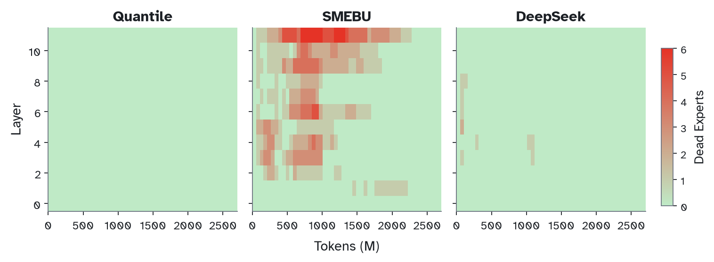
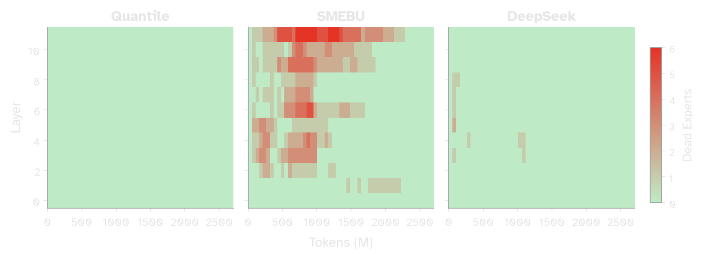

**Overview:** I show that Manifold Muon is a desirable optimizer for the MoE Router. A also produce a variant in which the router is only updated by a balance objective, with no loss gradients flowing through it at all.
## Part 1: routers
A standard transformer has one MLP per layer. A mixture-of-experts (MoE) model has many, each called an expert, but routes each token to only a few of them. The routing decision is controlled by an $E \times D$ weight matrix (the router), where each row is a single expert's selection vector.

Each expert owns a single row in the router matrix. This is just a point in activation space. Tokens arrive with their own activations, and routing scores are decided based on the dot product. In a simplified model where all these vectors are unit-normalized, the dot product is monotonic with Euclidean Distance, so this is basically a nearest-neighbor problem.


**Figure 1: A simplified setup with 3 experts. (Left) unbalanced routing. (Right) Expand the radius of the green expert and achieve balance.**

A router balancer modifies the effective catchment radius around each experts so that each expert receives a near-equal number of tokens. 

Without balancing you will end up a vicious feedback loop of dead experts. If an expert receives fewer tokens, its corresponding expert will become undertrained, which will encourage the router to continue diverting tokens from this expert. 

The three methods I'll use in this post — DeepSeek's aux-loss-free bias[^deepseek], SMEBU[^trinity3], and quantile load balancing[^suquantile][^openathena] — are each different flavors of the "radius adjustment" concept. DeepSeek nudges scalar biases a little each step.  SMEBU does the same but with gated steps and momentum.  Quantile balancing "snaps" to the optimal bias at each step by using iterative fitting  [^sinkhorn]. 

[^sinkhorn]: [Sinkhorn and Knopp 1967](https://en.wikipedia.org/wiki/Sinkhorn%27s_theorem#Sinkhorn%E2%80%93Knopp_algorithm) *Sinkhorn–Knopp algorithm* — the iterative matrix-scaling procedure quantile balancing uses to solve for optimal biases.
[^deepseek]: [DeepSeek, Wang et al 2024](https://arxiv.org/abs/2408.15664) *Auxiliary-Loss-Free Load Balancing Strategy for Mixture-of-Experts*
[^trinity3]: [Arcee, Singh et al 2026](https://arxiv.org/abs/2602.17004) *Trinity 3 Training Report*. Introduces and uses SMEBU.
[^suquantile]: [Jianlin Su 2026](https://kexue.fm/archives/11619) *Quantile Load Balancing* — part 6 of Su's MoE series; the full series appears in translation on my blog: [[moe]].
[^openathena]: [Open Athena, Dial 2026](https://openathena.ai/blog/quantile-balancing/) *Quantile Balancing* — the Marin team's validation of QB on a 32B-A5B model over 326B tokens.
[^fedus]: [Fedus, Zoph, Dean 2022](https://arxiv.org/abs/2209.01667) *A Review of Sparse Expert Models in Deep Learning*

While all effective, each of these approaches has different dynamics over the course of training:


**Figure 2: Dead experts by Layer over the course of training. Trained with 64 experts and top-2 routing on a 12 layer, 768 dim model. All of these techniques result in zero dead experts by the end of training.**


## Part 2: optimizers
For the results in part 1, I used the Adam optimizer. While I initially believed Muon would not be a good fit for the MoE router, Xidulu on twitter pointed out[^xidulu] that Kimi showed Muon performs quite well.[^kimi]
[^xidulu]: [Xidulu 2026](https://x.com/xidulu/status/2065543207950152016) — noting that Kimi found Muon performs well on the router.
[^kimi]: [Moonshot AI, Liu et al 2025](https://arxiv.org/abs/2502.16982) *Muon is Scalable for LLM Training*


To motivate why I believed Muon would be a bad fit on the router, it's worth staring at the shampoo update rule, which I've written like this
```python
def shampoo_update(G, left_precond, right_precond, W, lr):
	left_precond = left_precond + G @ G^T
	right_precond = right_precond + G^T @ G
	return W - lr * (L^{-1/4} @ G @ R^{-1/4})
```
barring some details on accumulation and approximation error, the above shampoo update is identical to muon (see recent discussion...). [^anil][^oldnorm]

[^anil]: lots of recent shampoo discourse on twitter between rohananil and keller jordan and now everyone can agree theyre identical. [Rohan Anil 2026](https://x.com/_arohan_/status/2064631528806908134).
[^oldnorm]: [Bernstein and Newhouse 2024](https://arxiv.org/abs/2409.20325) *Old Optimizer, New Norm*

When optimizing the MoE router, the left preconditioner takes on shape $E \times E$, where $E$ is the number of experts. Unlike a regular linear layer, the MoE router's rows are structurally independent. When a token is routed into $k$ experts, the gradient can only flow backward into those $k$ rows. 

Despite this, the left preconditioning factor mixes gradients from distinct rows. This kills the natural rowwise independence that the router weight should be preserving. Put simply, the routers are learning signals that belong to totally different experts!

%% Though perplexed, I did validate that Muon is quite viable on the MoE Router.  %%

%% FIG 3 · muon_vs_adam_router_val_loss — NOT GENERATED yet: val-loss curves comparing Adam vs Muon on the MoE router %%
<!--


**Figure 3: {caption}**
-->
%% {maybe instead of the below commented out metric we do the dead experts by layer heatmap} %%



**Figure 4: Load Balancing trajectory with Muon on router—still good!**

{TODO: include val loss graphs comparing muon and adam}

## Part 3: specialization and capacity  
%% To investigate why Muon performed a bit better on Adam ... {need more expositional worsd here} %%
To understand why Muon might perform even better than Adam on the router, we should investigate *capacity*. 

Load balance ensures each expert receives roughly equal tokens. But we also want routing vectors to be distinct from one another. When two router rows are similar, their experts receive identical token distributions and converge to the same function. Mutual orthogonality increases the effective capacity, or expressiveness, of our model.

[^orthogonality]: Muon's tendency to produce well-conditioned weights is documented empirically in [Damek and Deusvyatskiy 2025](https://github.com/damek/specgd/blob/main/stable_rank.pdf) and [Boreiko et al 2025](https://openreview.net/challenge?redirect=%2Fforum%3Fid%3DppmyFtr9EW). I discuss this property in the context of standard linear layers in my [[essays/muon|earlier post on Muon]].

We can investigate capacity by examining the router weights:


**Figure 5: Mean pairwise cosine similarity between router rows over training. Adam (left) vs Muon (right) across all three balancing methods. Lower means more orthogonal, corresponding to experts that are pointing in more distinct directions.**


%% The ribbon plots above give us the mean cosine similarity between routing rows throughout training (as well as variance). 
A mean closer to 0 is good, since it corresponds to the routing vectors being far apart from each other/ 
orthogonal routing vectors are nice for the same reason that its nice not to have dead experts. If you're paying for a bunch of experts, you want them to be genuinely distinct from one another in function. If any two routers are fairly similar to each other, routing can only be ~uniformly random and the experts will converge to the same function. Mutual-orthogonality is what buys you capacity.


The above graphs plot the mean cosine similarity between routing weights throughout training. 

Expert specialization is also nice for interpretability, since routing vectors correspond to nicely separated parts of activation space. 
 %%
We have our answer: Muon is good on the MoE router because it produces more orthogonal rows, which gives us greater expert diversity, which increases expressiveness and effective capacity. 

Two recent works[^ernie][^guo] in the literature have defined an aux loss for the MoE router that explicitly encourages rowwise orthogonalization. 

[^ernie]: [ERNIE Team, Baidu 2025](https://ernie.baidu.com/blog/publication/ERNIE_Technical_Report.pdf) *ERNIE 4.5 Technical Report* — introduces an orthogonalization aux loss on the router.
[^guo]: [Guo et al 2025](https://arxiv.org/abs/2505.22323) *Advancing Expert Specialization for Better MoE*


**Figure 6: Mean pairwise cosine similarity under Muon, with and without an orthogonalization auxiliary loss. The orth loss drives similarities lower.**

This turns out to work well. Mean cosine similarities are now quite low; yet, I claim we can do much better. 

## Part 4: manifold-constrained 
Rather than encouraging orthogonality with an auxiliary loss, we can enforce it directly. In 2025, Jeremy Bernstein[^manifold-muon] figured out how to constrain Muon's weights to the Stiefel manifold, so that each update keeps the rows exactly orthogonal. Buchanan[^admm] later reformulated the inner loop using ADMM, dropping the required iterations by an order of magnitude:


%% The above code turns out to be disastrous. %%

[^manifold-muon]: [Jeremy Bernstein 2025](https://thinkingmachines.ai/blog/modular-manifolds/) *Modular Manifolds*

ok first lets probably not do the bernstein code but the sam buchanan code[^admm] instead which he gives as
```python
 def manifold_muon_admm_update(
    W: Tensor, G: Tensor, eta: float,
    rho: float = 1.0, admm_steps: int = 20,
) -> Tensor:
    # init Lambda so first iterate ≈ tangent_project(G, W)
    Lambda = -0.5 * sym(W.mT @ G)
    X = G + 2 * W @ Lambda
    Omega = torch.zeros_like(X)
    eye = torch.eye(W.shape[1], device=W.device, dtype=W.dtype)
    # ADMM
    for _ in range(admm_steps):
        # Lambda: least-squares solve
        Lambda = 0.5 * sym(W.mT @ (X + Omega / rho - G))
        # X: singular value thresholding
        B = G + 2 * W @ Lambda - Omega / rho
        P_pos = 0.5 * (eye + msign(B.mT @ B - eye / rho**2))
        X = (B - msign(B) / rho) @ P_pos
        # Omega: dual ascent
        Omega += rho * (X - G - 2 * W @ Lambda)
    # update, retract
    U = msign(G + 2 * W @ sym(Lambda))
    return msign(W - eta * U)
```
note: this is my transcription of his code using my preferrred var name conventions + dropping some details. might need to define `msign`


[^admm]: [Sam D. Buchanan 2025](https://sdbuchanan.com/blog/manifold-muon/) *A Faster Manifold Muon with ADMM*

%% we need to ensure we cite buchanan reference and say we use it over original bernstein code bc admm solver drops the needed of inner loop steps by an order of magnitude  %%


%% FIG 7 · manifold_muon_divergent_val_loss — NOT GENERATED yet (rough version: Pasted image 20260630000731.png): oscillatory / divergent val-loss curves from naive manifold-Muon on the router %%
<!--


**Figure 7: {caption}**
-->

%% ok lets make some fixes... %%
Manifold Muon suffers from two instabilities. The first is that its operating on the raw gradient, so the update isn't smooth. The second is that the manifold retraction can cause large, discrete changes per step. The MoE router is particular sensitive to the latter — remember, rows are discrete — and manifold retractions can cause rows to swap wildly. 

So instead of adding standard accumulation onto `G` (standard Muon),  we additioanlly want  to add it to `vel`, which is the retraction vector per step. The diff here is very simple:

```python
def manifold_muon_ema_update(
    W: Tensor, vel_ema: Tensor, G: Tensor,
    eta: float, beta: float,
    dual_lr: float = 0.1, dual_steps: int = 15,
) -> Tensor:
    # init Lambda so first iterate ≈ tangent_project(G, W)
    Lambda = -0.5 * sym(W.mT @ G)
    
    # dual ascent
    for _ in range(dual_steps):
        Z = msign(G + 2 * W @ sym(Lambda))
        Lambda += dual_lr * (-eta * sym(W.mT @ Z + Z.mT @ W))
        
    # update, project to tangent
    U = msign(G + 2 * W @ sym(Lambda))
    vel = tangent_project(-eta * U, W)
    # accumulate velocity
    vel_ema.lerp_(vel, 1 - beta)
    # project to tangent
    vel_ema.copy_(tangent_project(vel_ema, W))
    # update weight with retraction
    return msign(W + vel_ema)
```
{todo: use the code block line highlighting feature to highlight the diff }

Results/upshot here


**Figure 8: perfect orthogonality**

To add: show charts that demonstrate val loss is decent. show any additional benefits (somewhat tbd but num experts specialized, specialization by domain)

 %% ## Part 2: Specialization and Diversity 
Now that load balancing is solved, i;d like an excuse to show off this pretty diagram 

These are plots of domain specialization. The top three rows represent three distinct datasets I used while training. Each graph is a heatmap of the activations of the experts in a given model. These are 12 layer models with E=64 experts per layer, so there are 768 cells in total. This tells us which experts light up by domain. 

The fourth row has the above three rows superimposed on each other in a way that the they cancel each other when combined. What that means is that the bottom row's cell is only bright when there is an expert that is specialized for a single domain only. 

Once you learn how to read this chart, you're able to see quite a bit. For example, we can immediately learn experts are more specialized in later layers than in earlier layers. We also see that SMEBU seems to be quite good for expert specialization.  %% 

%% {perhaps the domain specializaiton abpve} %%
%% Why does this work?  %%

%% Upon further reflection, I realized that $L$ may be providing a subtle benefit. As mentioned in part 1, the MoE router is unable to learn information about any experts besides the ones that it routed to {dangling particple}. Therefore, even if $L$ doesn't correspond to any 
Despite not being a true estimate of gradient distribution, $L$ may be providing natural load-balancing.  %%

%% From here there are two reasonable directions. The first, which I think is straightforward and easy to test, is to experiment with a shampoo/muon variant on the moe router where L is forced to be a digonal matrix from the beginning. Or even more simply, try adam with per-row normalization.  %%

%% The second, which I'll be exploring here, is trying to lean into the potential benefits of Muon.  %%

%% prior work shows that muon gives us more orthogonalish columnns. I've written about this a bit in a previous blog post on Muon. The handwavey proof is that since each update has orthogonal rows, it turns out that the weight itself is a little bit more orthogonal. Cmpared to adam, the condition is a bit better, the . . . %%

**

%% As desired, we find that Muon, indeed, helps  %%

%% There have been a couple major works on apply a special form of auxiliary loss on the MoE router called orth loss. The strategy here is to try to encourage the rows of the router to be orthogonal to one another so they're all pointing in unique directions in activation space.  %%

## Part 5: gradient-free
In Section 2 we found that it's okay if the gradients that update a given row blend don't actually correspond to just the loss coming from the row. In this section, I want to explore the thought that the router is totally agnostic to the gradient flow.

So far, we've outlined that the desired properties of a router are that it
- equally balances token to experts 
- keeps rows mutually orthogonal

{idk if include here but there are other selection pressures that may be useful; sequence wise loss , etc. actually lets include this later}

The implicit assumption is that each routing row is matching for some feature that its expert is good at processing. If we reverse this assumption, we can consider a world where the router knows *absolutely nothing* about the expert that its routing to, and the expert has to do the job of learning to process that feature. 

There's some precedent for decoupling the router from the gradient update. In early layers, the distribution of the token residuals is very close to the distribution of natural language statisticsIn the recent DeepSeek V4 model, a fixed lookup table was used to map token IDs directly to experts. 
{cite deepseek v4 + include koanlin su moe series part 8 -- which  i have translation for as well!)

In later layers we need to update based on the feature space looks like at a given layer so we can't rely on a frozen table. 

Instead of using an "auxiliary loss" to promote load balance, following the earliest impls of MoE (GShard), we're going to use *only* the auxiliary loss to update our weights. 

At each router we define a objective $||{F - Q}||^2$ where $F$ was the observed distribution over experts and $Q$ is the desired distribution—e.g. uniform. Below is some arithmetic to work out what the gradient at the router is directly without needing to ever "add" the loss.

For a batch of $T$ tokens and $n$ experts with top-$k$ routing, let $\rho^{(t)} \in \mathbb{R}^n$ be router logits for token $t$. Assuming softmax normalization
{i need a footnote here -- softmax normalization isnt the classic technique anymore, sigmoid normalization over just selected experts. this changes the math, the gradient etc! im not entirely usre how to deal whit this yet}

With some arithmetic we can show that the gradient at the router is 

$$\nabla \rho^{t} \mathcal{L} = \frac{1}{T} \textrm{diag}(p^{(t)} \left(F - (F^\top p^{(t)}) \, 1 \right)$$ 
jvp of (jacobian of softmax applied to $F$) 
We can use this gradient as the input to manifold muon!

{results}

The point here is we are now free to add as many aux losses as we want, as long as we write out the backprop rule. Some desirable ones may include
1. sequence-level load balancing
2. domain specialization loss

-- 

## future works.


B: notice that the manifold muon retraction constraint looks an awful like a psgd criteria
can we reframe this whole problem as a psgd criteria? both the desired row independence as well as load balancing based on input activation statistics? both seem like incredibly reasonable psgd criteria. If solved, we could get load balancing + orthogonality in a single optimizer, whose loss function is totally unrelated to the gradients flowing through it. 

C: how much do we want to relax orthogonality? in practice it may be  too aggressive to get *all* orthogonal routing vectors. what can we do instead? we can study the *coherence* of the route matrix which is bhasically a measruement of how orthogonal a group of unit vectors is.
{not sure which paper to cite for abv idk its in the literatureeg https://arxiv.org/abs/1803.05531 (low coherence tight frames) there might be way more canonical sources}
would be nice to study the family of unit forms and get progressive relaxsions. 
tilde manifold muon post explores some relaxations ,but i dont think any are particular useful in our case
title: Gram-Space Manifold Muon
authors: Ben Keigwin, Dhruv Pai, Nathan Chen (Tilde Research)
date: October 2025
link: https://blog.tilderesearch.com/vignettes/gram-space


D: Followups to this proposed form of manifold muon. Observe behavior at different sparsities, w fixed expert(s). test that this actually works at scale. ETc

## 

--

Thank you to Prime Intellect. If this post was useful to you, you may cite

```
@misc{
	srivastava2026,
	author = {Varun Srivastava},
	title = {...},
	year = {2026},
	url = {https://varunneal.github.io/essays/...}
}
```