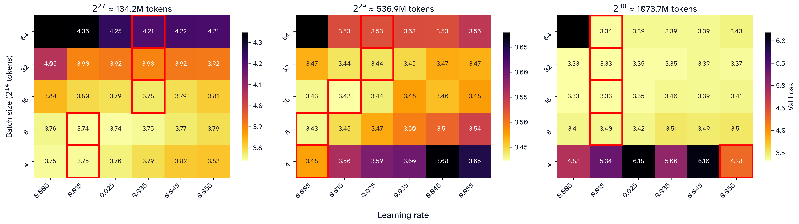
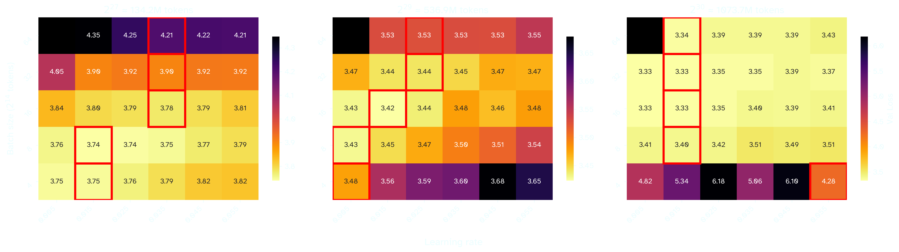
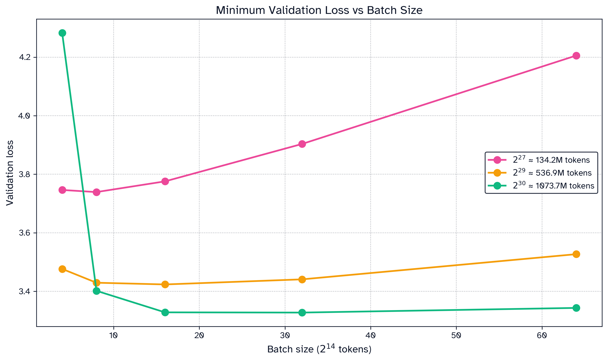
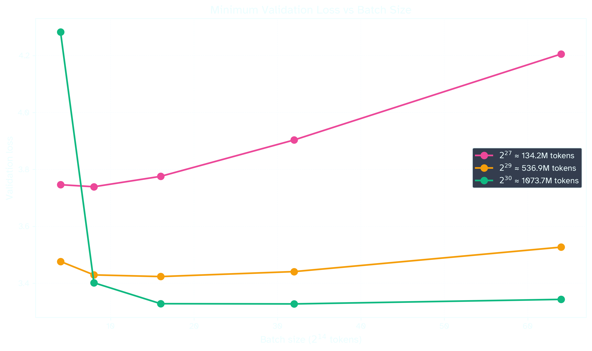
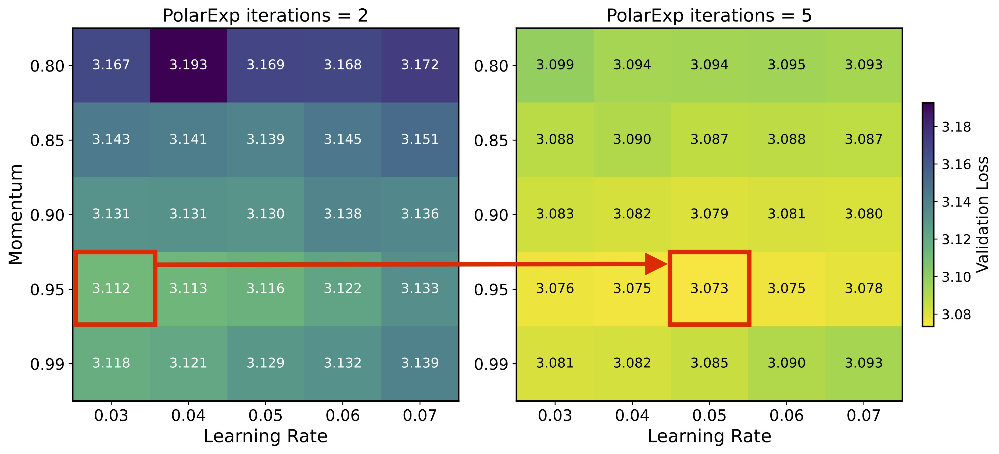
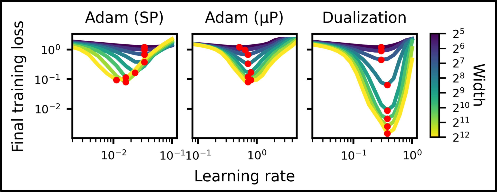

The Muon optimizer was developed for Modded NanoGPT speedrun, which has the expressed goal of training a GPT-style model as fast as possible [^jordan-muon] [^moddednanogpt]. Since last summer, the Muon optimizer has seen widespread adoption. Over the same period, the Modded NanoGPT record has decreased from 45 minutes to just over 2 minutes, in part thanks to many changes to Muon's original formulation. In this blog post, I'll walk through some of the modifications used in recent record runs and connect them to the surrounding literature.

[^jordan-muon]: [Keller Jordan et al 2024b](https://kellerjordan.github.io/posts/muon/) *Muon: An optimizer for hidden layers in neural networks*

[^moddednanogpt]: [Keller Jordan et al 2024a](https://github.com/KellerJordan/modded-nanogpt) *Modded NanoGPT*. The competition is for "the fastest algorithm to use 8 NVIDIA H100 GPUs to train a language model that attains 3.28 cross-entropy loss on the FineWeb validation set."

[^larry2025a]: [Larry Dial 2025](https://www.lesswrong.com/posts/j3gp8tebQiFJqzBgg/how-the-nanogpt-speedrun-wr-dropped-by-20-in-3-months) *How the NanoGPT Speedrun WR dropped by 20% in 3 months*

---

## (1) Adaptive Muon
The Modded NanoGPT speedrun uses an adaptive variant of Muon called NorMuon [^normuon]. Several recent papers have proposed similar adaptive extensions [^adamuon] [^adago] [^frans]. In this section, I want to explain what "adaptive Muon" means and why it helps.

[^frans]: [Frans et al 2025](https://arxiv.org/abs/2510.25000) *What Really Matters in Matrix-Whitening Optimizers?*
[^adago]: [Zhang et al 2025](https://arxiv.org/abs/2509.02981) *AdaGrad Meets Muon*
[^normuon]: [Li et al 2025](https://arxiv.org/abs/2510.05491) *NorMuon*
[^adamuon]:[Si et al 2025](https://arxiv.org/abs/2507.11005) *AdaMuon*

I like to view Muon a variant of a much simpler optimizer, Stochastic Gradient Descent with Momentum (SGDM). SGDM udpates parameters using an exponential moving average (EMA) of gradients. Muon (MomentUm Orthogonalized by Newton-Schulz) modifies this by *orthogonalizing* the gradient EMA via a matrix-sign function. Orthogonalization is a rich concept; for now, you can think of it as a special form of normalization that keeps the gradient's directions but not their magnitude [^spectral].

Adam (ADaptive Moment Estimation) also builds on SGDM, but in a different way: it tracks the EMA of squared gradients per parameter. The gradient EMA is divided by the squared-gradient EMA to produce a variance-corrected update.

%% performs steps by computing the exponential moving average (EMA) of gradients. Adam (ADaptive Moment Estimation) additionally tracks the EMA of the norm of each parameter. Dividing by this second EMA gives us a variance-corrected update.  %%

Variance correction is hypothesized to be useful in two distinct ways:
1) Stochastic noise: At a fixed batch size, some features may be very noisy while other features will have high signal. Adaptivity allows noisier gradient estimates to get dampened, effectively giving each parameter its own adaptive learning rate.
2) Curvature: how the gradient changes as we move through parameter space. Various papers examine how second order statistics approximate the hessian (the second derivative) of the loss landscape—that is, the per-parameter curvature [^cohen] [^kustner].  Normalizing by this estimate makes the optimizer take smaller steps into high-curvature regions, preventing overshooting and descent into "sharp" minima.

[^kustner]: [Kustner et al 2024](https://arxiv.org/abs/2402.19449) *Heavy-Tailed Class Imbalance and Why Adam Outperforms Gradient Descent on Language Models*
[^cohen]: [Cohen et al 2024](https://arxiv.org/abs/2410.24206) *Understanding Optimization in Deep Learning with Central Flows*, with a shorter accompanying blogpost [here](https://centralflows.github.io/part3/).

%% as well. This "variance EMA" is an estimate of the noise we expect from sampling the gradient of each parameter. At each step, divide the update by variance so that high-variance terms update slowly and low-variance terms update quickly.

Muon tracks the EMA gradient of full parameters and normalizes the EMA through a method known as *orthogonalization* which you can variously read about elsewhere [^jordan24-muon] [^mahdid] [^bernstein]. Notably, this normalization is with respect to the matrix itself, not with respect to the estimated variance of the distribution. That is, Muon's normalization method does not increase our certainty about the gradient. This provides motivation for adding an adaptive estimator on top of Muon: %%


Despite not being a variance-adaptive method, Muon is "curvature-aware" [^kovalev][^anonymous26][^su25], which addresses point (2). Intuitively, this comes from orthogonalization: after orthogonalization, Muon's update is "well-rounded" in parameter space, avoiding directions of steep change [^spectral]. Formally, each update is perfectly-conditioned (all spectral values are $1$), which keeps the weights themselves well-conditioned (their singular values remain small and near each other)[^Boreiko]. Muon is effectively performing gradient descent down a restricted submanifold of the full parameter space. Along these lines, Jeremy Bernstein has proposed *Manifold Muon*, which tweaks Muon such that the weights remain perfectly-conditioned  [^bernstein25].


[^spectral]: The spectral directions of a matrix corresponds to how its transformation stretches the input/output space. Formally, spectral directions they are the left and right singular vectors in the Singular Value Decomposition (SVD) of a matrix. The amount each direction is stretched corresponds to *singular values* in the SVD. Orthogonalization finds a matrix with identical spectral directions but with all the singular value equal to $1$. The resulting matrix has a transformation that has the same directions but is *isometric* between the input and output spaces: distances, lengths, and angles are preserved.


[^anonymous26]: [Anonymous ICLR Conference Submission 2025](https://openreview.net/forum?id=go388T3QjQ) *Long-tailed Learning with Muon Optimizer*
[^su25]: [Su 2025](https://arxiv.org/abs/2511.00674) *Isotropic Curvature Model for Understanding Deep Learning Optimization*
[^kovalev]: [Kovalev 2025](https://arxiv.org/abs/2503.12645) *Understanding Gradient Orthogonalization for Deep Learning via Non-Euclidean Trust-Region Optimization*

[^bernstein25]: [Jeremy Bernstein 2025](https://thinkingmachines.ai/blog/modular-manifolds/) *Modular Manifolds*

To the best of my knowledge, there is no argument that Muon solves (1)—e.g. that orthogonalization corrects for noise in the gradient estimation. To account for this, we want to estimate the noise along each spectral direction and correct for it. After orthogonalization, the columns of the update matrix correspond to the spectral directions, so we can estimate spectral variance by calculating column-wise RMS. For this reason, variance adaptation methods for Muon only require variance estimates along a single dimension[^frans].

```python {5-6}
def adaptive_muon_update(grad, momentum1, momentum2, beta1, beta2):
	momentum1.lerp_(grad, 1 - beta1)
	update = grad.lerp_(momentum1, beta1)
	update = orthogonalize(update)
	momentum2.lerp_((update ** 2).mean(dim=-1, keepdim=True), 1 - beta2)
	update /= momentum2.sqrt()
	update *= max(1, grad.size(-2) / grad.size(-1)) ** 0.5
	return update
```

**Algorithm 1: Typical-ish Adaptive Muon update (differences from standard Muon highlighted).**

Note that the above technique estimates variance for the $i$th strongest spectral component, but the corresponding direction can drift over subsequent steps. Future work might account for this fluctuation, or find alternative ways to estimate spectral noise.

The specific adaptive Muon variant used in Modded NanoGPT, *NorMuon*, maintains the Frobenius norm of the update after dividing by variance [^normuon]. Whether variance is tracked columnwise or rowwise is determined by which of the parameter's dimensions is larger. This method yields a $\approx 2\%$ decrease in training time, when combined with learning rate tuning.


## (2) Batch size scheduling
Choosing a batch size involves a tradeoff:
1) Token efficiency. Smaller batch sizes are more token-efficient. For a fixed token budget, once the batch size is above some threshold, increasing it furtheer tends to hurt final model performance. Beyond this point, the gradient signal from a single batch is saturated, so larger batches just waste tokens.
2) Token speed: Training at higher batch sizes is faster *per-token* than training with a lower batch size for many steps. This is because GPUs parallelize over the batch dimension, DDP is easy, and every step incurs overhead (optimizers, comms, etc).

A *critical batch size* $B_{\text{critical}}$  balances both of these considerations: low enough to be token-efficient, but high enough to be speed-efficient.


**Figure 1: Critical batch sizes for Adam at various token budgets [^ai2]. $B_{\text{critical}}$, chosen as the greatest batch size exceeding below 1% of the lowest loss, is marked in red. Batch size here is in units of 4096 Tokens.**

Batch size can often be safely increased over the course of training [^ai2]. Conceptually, this may be because early training focuses on common patterns, so even small batches provide strong gradient signals. Later training involves learning rarer patterns. These sparse signals remain noisy even at high batch sizes, so the batch size can be increased without saturating the gradient.

Two strong models trained with Muon, Kimi K2 and GLM 4.5, both increase batch size mid-training [^kimi] [^glm].

[^glm]: [Zeng et al](https://arxiv.org/abs/2508.06471) *GLM-4.5*
[^kimi]: [Moonshot AI, Liu et al 2025](https://arxiv.org/abs/2502.16982) *Muon is Scalable for LLM Training*

To accurately determine the critical batch size, we need the optimal learning rate at each batch size. Larger batches average over more samples, which reduces gradient variance. For SGD, we can directly model the relationship between the optimal learning rate $\eta$ and batch size $B$ [^Mccandlish]:

$$
\eta \propto 1 - \frac{1}{1 + B \cdot \text{SNR}(G)}
$$

where $\text{SNR}(G)$ is the signal-to-noise ratio of the gradient estimate [^snr]. When $B \cdot SNR(G) << 1$, this is approximately $B \cdot SNR(G)$, which is why the "linear scaling law" $\eta \propto B$ is a good heuristic.

[^snr]: I'm being somewhat imprecise with how we define the signal to noise ratio. McCandlish et al [^mccandlish] defines a critical batch size $B_{\text{noise}} =  \text{Cov}(G) / \mathbb{E}(G)^2$ for their analysis of SGD. I'm using its inverse as the SNR.

Adam dampens update variance, so its optimal scaling is closer to $\eta \sim \sqrt{B}$[^mccandlish] [^granziol] before also becoming asymptotic[^li]:

$$
\eta \propto \frac{\sqrt{B \cdot \text{SNR}(G)}}{1+ {B \cdot \text{SNR}(G)}} \qquad \text{for} \; B \cdot SNR(G) << 1
$$


A power-law relationship ($\eta \propto B^p$) is often assumed to hold for Muon as well[^sato][^ryu], though in practice it will asymptote quickly:

[^sato]: [Sato et al 2025](https://arxiv.org/abs/2507.01598) *Convergence Bound and Critical Batch Size of Muon Optimizer*.
[^ryu]: [Simo Ryu 2025](https://x.com/cloneofsimo/status/1907731069878825400) *Adam vs Shampoo vs Muon on MNIST. all follow the lr ~ sqrt(BS) law.*





**Figure 2: Sweeping Adaptive Muon at a learning rate x log(batch size) grid at three different token budgets. The lowest loss per batch size is selected in red.**

At token budgets of $\approx 134M$, $536M$, $1073M$ tokens, the optimal learning rate seems to converge around $\eta \approx 0.035$, $0.025$, and $0.015$, respectively. Note that $B = 4 \times 2^{14}$ does not appear to converge at the highest token budget for any of the swept learning rates.

Below the asymptote/saturated batch size, we can approximate the value $p$ in $\eta \propto B^p$ via the log-slope of the red boxes. At this granularity, $p \approx 0.6-1.0$ seems approximately correct. Convergence to the optimal learning rate appears to be very fast for this variant of Muon.





**Figure 3: Results from the previous sweep (Fig1) while choosing the optimal learning rate for each batch size. For a fixed token budget, increasing batch size will tend to decrease final validation loss. $B_{\text{critical}}$ is the highest acceptable batch size given some tolerance for loss.**

The above graphs demonstrate an incredible stability in the critical batch size, especially at higher token budget. Consider the flatness in the curve for the highest token budget ($\approx 1T$ parameters): $1024$ steps at a A batch size of $2^{20}$ tokens converges to nearly the same loss at $1024$ steps as a batch size of $2^{18}$ tokens in $4096$ steps. Muon's high critical batch size has been noted elsewhere [^ai2], so this is not just a feature of our adaptive variant of Muon.

## (3) Faster orthogonalization: Polar Express and beyond
The Newton-Schulz iterative algorithm approximates orthogonalization via a quintic polynomial iteration. This iterative approach is agnostic to the conditioning of the underlying matrix. However, if we notice that the conditioning of the matrix improves in each iteration, we can find an optimal polynomial for that iteration. Ansel et al provide optimal coefficients at each iteration step via their algorithm Polar Express [^ansel].

Last month, a paper from Shulgin et al demonstrated that a more precise orthogonalization improves Muon convergence, especially when accompanied with appropriate learning rate tuning [^shulgin]:



**Figure 4: Validation Loss at two levels of convergence for orthogonalization. Caption from Shulgin: "the optimal learning rate couples with approximation quality \[...\] higher precision → higher optimal LR + wider stability,"**

[^shulgin]: [Shulgin et al 2025](https://arxiv.org/abs/2510.19933) *Beyond the Ideal: Analyzing the Inexact Muon Update*. Corresponding tweet thread [here](https://x.com/egor_shulg/status/1982802516665373038).

It follows that using Polar Express over Newton Schulz represents an improvement in convergence, and using it led to a new record in Modded NanoGPT.

On ongoing effort in the Modded NanoGPT speedrun is being made for even faster orthogonalization via *Almost-Orthogonal Layers*, though this has not been incorporated yet [^Boission].

[^Boission]: [Thibaut Boissin 2025](https://github.com/KellerJordan/modded-nanogpt/pull/155) *Modded NanoGPT PR#155*
[^ansel]: [Ansel et al 2025](https://arxiv.org/abs/2505.16932) *The Polar Express*

## (4) Cautious weight decay
Decoupled weight decay has been noted as a crucial technique for training with Muon. The Kimi team writes: "While vanilla Muon initially converges faster, we observed that some model weights grew too large over time, potentially limiting the model’s long-term performances. Adding weight decay addressed this issue - the results demonstrate that Muon with weight decay outperforms both vanilla Muon and AdamW" [^kimi].

Inside Modded NanoGPT, weight decay on Muon was doing more harm than good. In October, a variant of decoupled weight decay known as *Cautious Weight Decay* was discovered [^chen25], which only decays parameters that increase in magnitude in the update step:

```python {2}
def apply_update(param, update, learning_rate, weight_decay):
	param *= (update * param) >= 0
	update += weight_decay * param
	return param - learning_rate * update
```
**Algorithm 2: Cautious weight decay (difference from decoupled weight decay highlighted).**

This technique proved highly effective in Modded NanoGPT when paired with a schedule that decreases weight decay to $0$ by the end of training.

[^chen25]: [Chen et al 2025](https://arxiv.org/abs/2510.12402) *Cautious Weight Decay*
## (5) Distributed and batched computation
The implementation of Muon has been optimized in order to distribute the implementation over 8 devices. While some of these engineering tricks are interesting (e.g. batched orthogonalization), they do not represent algorithmic differences from the original form of Muon. For additional information I direct you to Larry Dial's blog post [^larry2025a] and the Modded NanoGPT repo [^moddednanogpt].


## (6) Implementation Notes

> "I only trust speedruns." —Keller Jordan [^jordan24a]

[^jordan24a]: [Keller Jordan 2025](https://x.com/kellerjordan0/status/1890178773586489716) *The reason I didn't write a proper arxiv paper for Muon is because I simply don't think there's any relationship between the ability to publish a paper with lots of good-looking results about a new optimizer, and whether that optimizer actually works. I only trust speedruns.*


I hope this post is broadly useful for pretraining with Muon. I want to highlight some important considerations for the Modded NanoGPT recipe:
- The model is very small (<124M active params) and has a unique architecture.
- Adam is used instead of Muon on a few parameters: the linear output head, the embedding dimension, and a few scalar constants, though this is "standard" for Muon.
- Adam is stepped with twice the number of gradient accumulation steps as Muon. Effectively, it has a 2x batch size than Muon. In the experiment in [[#(2) Batch size scheduling|Section 2]], I've scaled the Adam learning rate according to the square-root law.
%%

In the hyperparameter sweep, batch sizes $> 64 \times 16384$ tokens seemed too large for my token budget. In particular, the number of total steps was low, which increased variability. The Modded NanoGPT speedrun uses a batch size of $16 \times 16384$ for a token budget of approx $570M$ tokens.

On September 30th, the Modded NanoGPT speedrun was optimized by decreasing Muon's batch size by 33%, shaving $\approx 1.7$ seconds off the record time. On October 24th, *Normuon*, a variant of Adaptive Muon, was added to Modded NanoGPT, which sped up convergence by approximately $\approx 0.8$ seconds. A few days later, I cut the learning rate in half and saved $\approx 1.9$ more seconds. Reviewing the relationship between learning rate and batch size can help us understand why this worked, and how we can squeeze out additional benefits.  %%
%%
## (4) Related work
The following chart has been tweeted in evidence that $\eta \propto \sqrt{B}$ holds for Muon:

On this log(batch size) x log(learning rate) chart, the interpretation is that a power law relationship $\eta \propto B^p$ will have a linear "loss valley" with slope $p$. I've cropped and annotated the chart below to demonstrate what I mean:

Since the above experiment was performed on MNIST at a low $(<10^4$ samples) batch size, it makes sense that a power law is approximately correct. In my view, however, this chart seems to hint at eventual convergence:

Sato et al (2025)[^sato] performs a hyperparameter sweep that assumes the square-root scaling law will hold for Muon. Since the maximum batch size tried in this paper was only $8192$ tokens, it is likely that the square-root law was approximately correct.

Shah et al (2025) [^essentialai] seemingly uses the same learning rate for Muon across a sweep of batch sizes (their section 2.3), though it is unclear if this was the result of tuning.

Shat et al and Sato et al take an opposite view on whether the Critical Batch Size is higher for Muon than for Adam. The former claims that Muon has a higher Critical Batch Size than Adam (and is therefore more token-efficient). I believe they are likely to be correct, since their experiments were performed on larger models ($500M$ parameters) and larger batch sizes (up to $16M$).

Boreiko et al (2025)[^Boreiko] performs a hyperparameter sweep on variations of Muon in of NanoGPT in which they find that "optimal learning rate is the same for the smallest and the largest models". Unfortunately, they do not seem to have any explicit results about the relationship of learning rate and batch size.  %%
%%
```
Jeremy Bernstein proves that Muon's optimal learning rate is stable across various model sizes [^bernstein]:


**Figure 7: From Bernstein's *Deriving Muon*. This experiment was conducted on various sizes of MLPs being trained on CIFAR. "Dualization" here refers to orthogonalizing the gradient.**
```


Li et al 2024 [^Li] has a great overview on learning rate scaling for adaptive optimizers. They propose that $\eta$  is asymptotic for Adam as well. They attribute this convergence due to the second moment's effect on the gradient, which normalizes the update in such a way that the variance of the update will also saturate at sufficiently high batch size. Practically, I believe Muon's learning rate saturates much earlier than Adam's, though this argument requires future work.
 %%

This post summarizes the work of many people on the Modded NanoGPT speedrun. Section 1 primarily corresponds to the work of an author of *NorMuon*, Zichong Li. Sections 2, 3, and 4 correspond to records added by myself. Section 5 is the result of many people over many iterations, though in the last few months Larry Dial especially.

---

<br>
Thank you to Prime Intellect, who sponsors my research. If this blog post was useful for you, you can cite:

```
@misc{
	srivastava2025,
	author = {Varun Srivastava},
	title = {Muon in Modded NanoGPT},
	year = {2025},
	url = {https://varunneal.github.io/essays/muon}
}
```

[^McCandlish]: [McCandlish et al 2018](https://arxiv.org/pdf/1812.06162) *An Empirical Model of Large-Batch Training*
[^granziol]: [Granziol et al 2020](https://arxiv.org/pdf/2006.09092) *Learning Rates as a Function of Batch Size* contains a proof.
[^Li]: [Li et al 2024](https://arxiv.org/abs/2405.14578) *Surge Phenomenon in Optimal Learning Rate and Batch Size Scaling*

[^Boreiko]: [Boreiko et al 2025](https://openreview.net/forum?id=ppmyFtr9EW)  *Towards Understanding Orthogonalization in Muon*
[^ai2]: [Ai2, Merrill et al 2025](https://arxiv.org/abs/2505.23971) *Critical Batch Size Revisited*
[^Bernstein]: [Bernstein 2025](https://jeremybernste.in/writing/deriving-muon) *Deriving Muon*.
[^essentialAI]: [Essential AI, Shah 2025](https://arxiv.org/abs/2505.02222) *Practical Efficiency of Muon for Pretraining*.

[^muonp]: I did not conduct my experiments in high enough resolution to establish what $p$ should be, though I suspect $p > 0.5$, as per Fig5.


[^su]: [Su 2025](https://kexue.fm/archives/11416) *Muon Optimizer Guide* has a comprehensive overview on different per-shape learning rate strategies.
[^larry]: [Larry 2025](https://github.com/KellerJordan/modded-nanogpt/pull/136#issuecomment-3536835289)
[^wen]: [Wen et al 2025](https://arxiv.org/pdf/2509.02046) *Fantastic Optimizers and Where to Find Them* performs a hyperparameter sweep on various optimizers including Muon. The optimal configs from their sweep can be found [here](https://github.com/WhenWen/marin/tree/kaiyue/optimizers/experiments/optimizer_sweep/Analysis/Results/).
[^jordan-warmup]: [Jordan 2024](https://x.com/kellerjordan0/status/1845867151946899852) "Removed learning rate warmup, since the optimizer (Muon) doesn't need it"

[^mahdid]: [Mahdid 2025](https://www.yacinemahdid.com/p/muon-optimizer-explained-to-a-toddler) *muon optimizer explained to a toddler*
