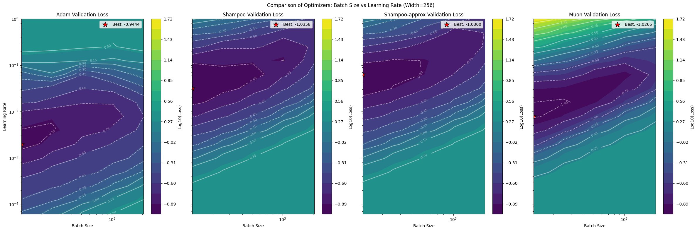
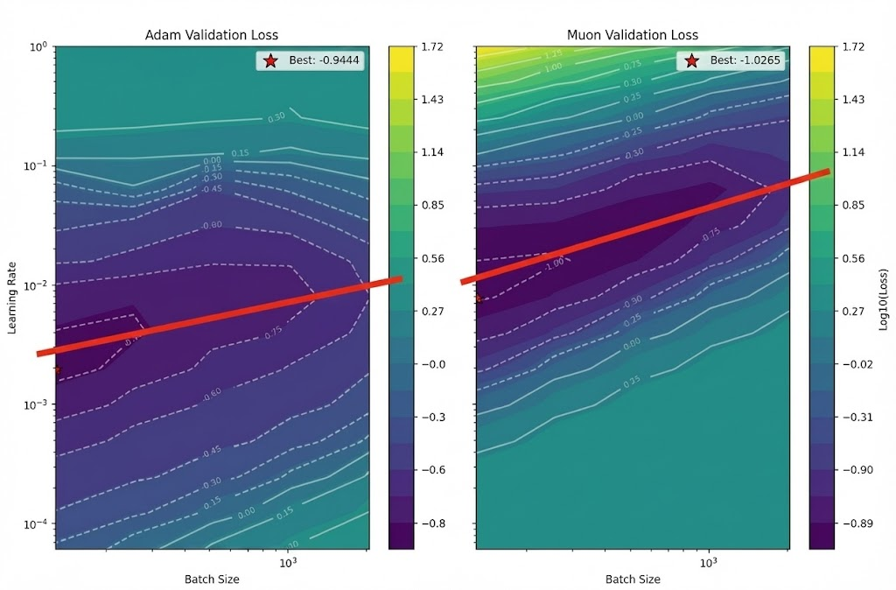
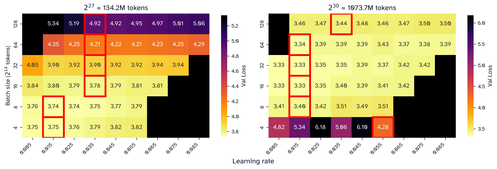
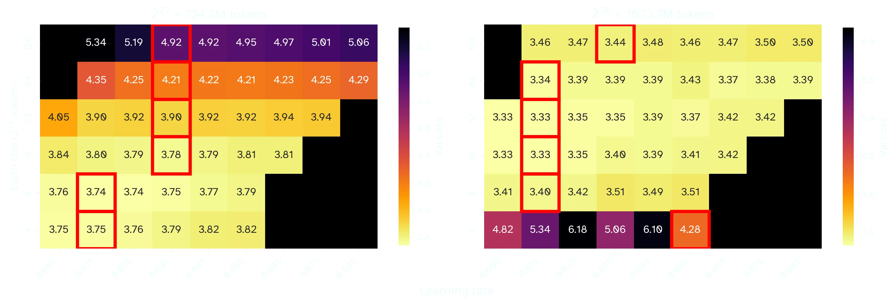
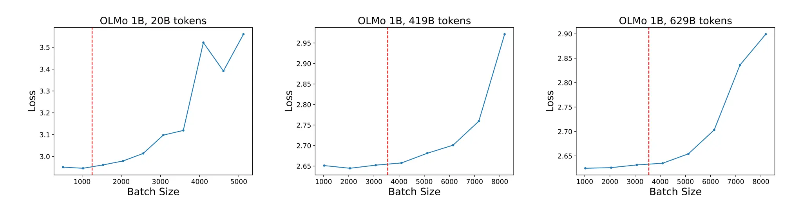
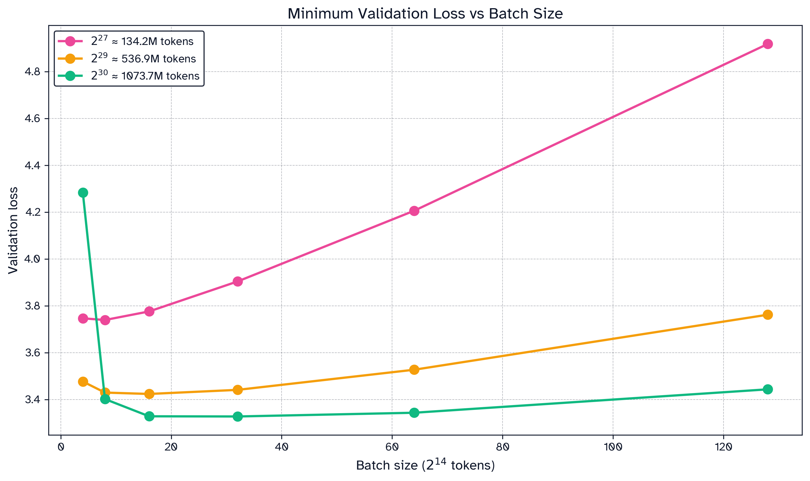
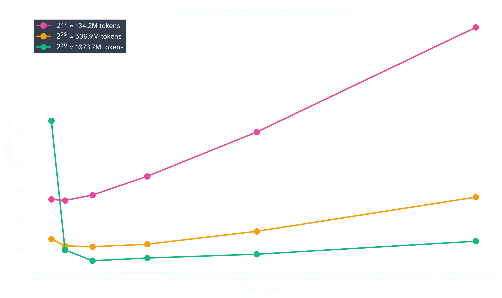

Muon has fairly different learning rate properties than Adam. In this blog I propose that the relationship between its optimal learning rate $\eta$ and batch size $B$ is quickly asymptotic, as opposed to Adam's square-root law $\eta \propto \sqrt{B}$, and also survey how this impacts Critical Batch Size for Muon. 

## (1) Optimal Learning Rate
Increasing the batch size decreases the amount of variance in each gradient. If we want each step to have a fixed variance budget, we should choose a learning rate $\eta$ that is inverse to the expected variance of the gradient. Correspondingly, stochastic gradient descent finds that optimal increases linearly with batch size. In contrast, Adam dampens update variance, so the optimal scaling law is closer to $\eta \approx \sqrt{B}$[^sqrtadam].

This relationship has been claimed to hold for Muon as well. For example, the following chart has been tweeted in evidence that $\eta \propto \sqrt{B}$ holds for Muon:

Figure 1: Original caption: *Adam vs Shampoo vs Muon on MNIST. all follow the lr ~ sqrt(BS) law*.[^ryu]

On this log(batch size) x log(learning rate) chart, the interpretation is that a power law relationship between $\eta$ and $B$ will have a linear "loss valley". I've cropped and annotated the chart below to demonstrate what I mean: 

Figure 2: Earlier image cropped to just include Adam and Muon. I've drawn a red line indicating the valley of minima losses as we increase batch size. 

It is clear in this chart that Muon's loss valley has a steeper slope than Adam, which implies that the power law is not the same as Adam's $B^{0.5}$. In fact, it is not even obvious that Muon's loss valley is linear:

Figure 3: I've redrawn the Muon red line to be concave, which I believe has a slightly better fit.

Theoretically, we should suspect that there *is* a difference between Muon and Adam's optimal learning rate. When we scale the step size for Adam by $\sqrt{B}$, it is because we expect the update's variance to be proportional to $B^{-0.5}$. In Muon, however, we orthogonalize (i.e. spectrally normalize) the update before taking a step. As Jeremy Bernstein points out, after orthogonalization, the global variance should be constant w.r.t the input shape—the batch size will have no impact on update variance.[^Bernstein]

Due to this, I propose that above a certain batch size $B_{\text{saturated}}$, the optimal learning rate should be *constant*. We can test this hypothesis by trying excessively large batch sizes relative to our training budget.

Figure 4: Sweeping Modded NanoGPT on a learning rate x batch size grid. See section 4 for more details. 

At a token budget of $\approx 134$ M tokens, optimal learning rate seems to converge around $\eta \approx 0.035.$ For a token budget of $\approx 1T$ tokens, optimal learning rate stabilizes at  $\eta \approx 0.015$. At the larger training budget, $B = 128 \times 2^{14}$ is an exception to convergence, though this may be attributable to noise. In any case, the square-root law certainly does not appear to hold. 
## (2) Relationship to Critical Batch Size
When choosing a batch size, we keep in mind that
1) For a fixed token budget over training, lower batch sizes are more token-efficient: they will achieve lower final losses.
2) Training at higher batch sizes is desirable for various reasons: GPUs parallelize over the batch dimension, DDP is easy, every step incurs overhead (optimizers, comms, etc.)

A *critical batch size*  $B_{\text{critical}}$  balances both of these considerations: low enough to be token-efficient, and high enough to be speed-efficient.

Figure 5: Loss curves for Adam from *Critical Batch Size Revisited* [^ai2]. $B_{\text{critical}}$, chosen as the greatest batch size exceeding below 1% of the lowest loss, is marked in red.

Figure 6: Results from the previous sweep (Fig4) while choosing the optimal learning rate for each batch size. For a fixed token budget, increasing batch size will tend to decrease final validation loss. $B_{\text{critical}}$ is the highest acceptable batch size given some tolerance for loss. Similar curves are given in Sato et al[^sato]. 

For small token budgets, $B_{\text{critical}}$ will be quite low, so it is possible $B_{\text{saturated}} > B_{\text{critical}}$. In this regime, Muon's optimal learning rate may be well approximated via a power-law $\eta \propto B^p$ [^muonp]. At a larger scale, however, we expect both $B_{\text{saturated}}$ to decrease (Fig4) and $B_{\text{critical}}$ to increase (Fig6), so we will quickly have $B_{\text{saturated}} < B_{\text{critical}}$. Practically, this implies 
1) You should not increase learning rate when increasing your batch size for large scale training. Notably, Kimi K2's Moonlight technical report[^kimi] implies they do not increase Muon's learning rate when they increase the batch size. 
2) Your hyperparameter sweeps on Muon should not assume the square-root law holds. 

## (3) Implications for Muon's learning rate schedule
Unlike the above experiments, real training is done with a learning rate schedule rather than a constant learning rate. Muon differs from Adam in that it does not benefit from a learning rate warmup[^jordan], though it still requires a cooldown.

Learning rate cooldowns are extremely effective at rapidly decreasing loss. One reason for this is that higher token budgets prefer lower learning rates. As we cross various loss thresholds, it will naturally be beneficial to lower the learning rate. However, this does not explain why lowering the learning rate tends to rapidly lower loss. One perspective is that it allows the model to overfit on a small amount of training data. Larry Dial has the following to say[^larry]: 

>  I have a mental image of the model during training moving down the side of a snowy mountain, and the final low lr regime is the model committing to a local crevasse. 

The optimal learning rate can therefore can be interpreted in a stochastic way: a lowered learning rate permits the model to descend through "narrow" crevasses. At sufficiently high token budgets (and correspondingly, sufficiently low desired loss targets), it is necessary to go down many such precarious paths that a higher learning rate would step over. Going through too many precarious paths, however, will lead you to some dark and local minima. The optimal learning rate, through stochastic luck, goes down a good number of precarious paths on average, and perhaps maintains enough speed to leave fruitless minima.  

TODO: Insert Modded NanoGPT PR here 

## (4) Implementation Notes 

I hope this post is broadly applicable to pretraining with Muon, but my experimentation was conducted on Modded NanoGPT speedrun, which uses a optimized variant of Muon. I want to highlight some important considerations:
- The model is very small (<2B active params) and has a unique architecture (skip connections, SWA, no MOE) 
- Adam is used instead of Muon on a few parameters: the linear output head, the embedding dimension, and a few scalar constants. Additionally, Adam is stepped over twice the number of gradient accumulation steps than Muon. Effectively, it has a 2x batch size than Muon. In the above experiments, I've scaled the Adam learning rate according to the square-root law. 
- Modded NanoGPT uses a specialized version of Muon:
	- *Normuon*: A 1d momentum buffer tracks variance along one dimension of each parameter. This adds an adafactor like adaptivity to stepsizes.
	- *Cautious weight decay*: A masked version of decoupled weight decay
	- *Polar express*: A faster-converging sign-iteration function than Newton-Schultz
	- *Shape transformations*: The orthogonalization step is dependent on the shape of the input parameters. Each attention weight Q, K, and V are treated separately, however, they are not split by head. 
	- Also related to shape, learning rate is scaled by $\max(1, \sqrt{d_{out} / d_{in}})$ per parameter. This is motivated by keeping the the variance of the orthogonalized update independent of parameter shape [^bernstein][^su]. 

The current Modded NanoGPT speedrun has the Muon learning rate on a schedule beginning at $0.03$, and then descending to $0.003$ over the course of the second half of training. The average learning rate over training is therefore $\eta \approx 0.023$. Training is done at a batch size $B = 16 \times 16384$ with a token budget of $\approx 583B$ tokens.

TODO: include repro script

---
Thank you to Prime Intellect, who sponsors my research. If this blog post was useful for you, you can cite `Varun Srivastava` (me). 

[^sqrtadam]: [Granziol et al 2020](https://arxiv.org/pdf/2006.09092) *Learning Rates as a Function of Batch Size* is probably the earliest proof of this law.[Tencent, Li et al 2024](https://openreview.net/pdf?id=hD9TUV4xdz) *Surge Phenomenon in Optimal Learning Rate and Batch Size Scaling* has a great overview on this topic. Additionally, they propose that batch size is also asymptotic for Adam for sufficiently high batch size. They attribute this convergence due to the second moment of Adam, which normalizes the update in such a way that the variance of the update will also saturate at sufficiently high batch size. Note that even Granziol et al point out that this relationship only holds up to a certain batch size. 
[^ryu]: [Ryu 2025](https://x.com/cloneofsimo/status/1907731069878825400) I do not mean to pick on Simo Ryu, whose chart I found quite useful. Every paper I've read has claimed that Muon should follow the square-root scaling law, and will often perform hyperparameter sweeps assuming it will hold. 
[^ai2]: [Ai2, Merrill et al 2025](https://arxiv.org/pdf/2505.23971) *Critical Batch Size Revisited* 
[^Bernstein]: [Bernstein 2025](https://jeremybernste.in/writing/deriving-muon) *Deriving Muon*
[^sato]: [Sato et al 2025](https://arxiv.org/pdf/2507.01598) *Convergence Bound and Critical Batch Size of Muon Optimizer* shows that Adam permits a fairly high Critical Batch Size. That is, it remains token-efficient as we increase the batch size (up to a certain point). This paper shows Muon has a much lower Critical Batch Size than Adam. I believe the adaptive variant of Muon used in my experiment (Normuon) may be allowing for larger $B_{\text{critical}}$. 
[^muonp]: I did not conduct my experiments in high enough resolution to establish what $p$ should be, though I suspect $p > 0.5$. 
[^kimi]: [Moonshot AI, Liu et al 2025](https://arxiv.org/pdf/2502.16982) *Muon is Scalable for LLM Training*
[^jordan]: [Jordan 2025](https://x.com/kellerjordan0/status/1845867151946899852) "Removed learning rate warmup, since the optimizer (Muon) doesn't need it"
[^su]: [Su 2025](https://kexue.fm/archives/11416) *Muon Optimizer Guide* has a comprehensive overview on different per-shape learning rate strategies. 
[^larry]: [Larry 2025](https://github.com/KellerJordan/modded-nanogpt/pull/136#issuecomment-3536835289) 