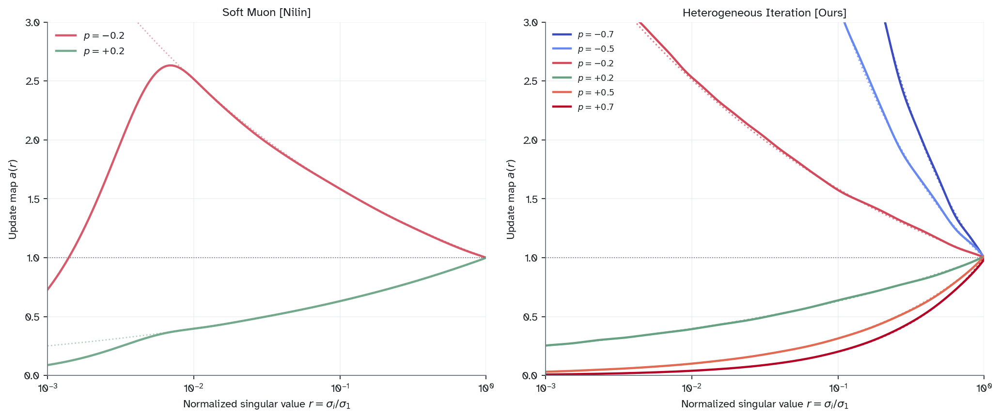
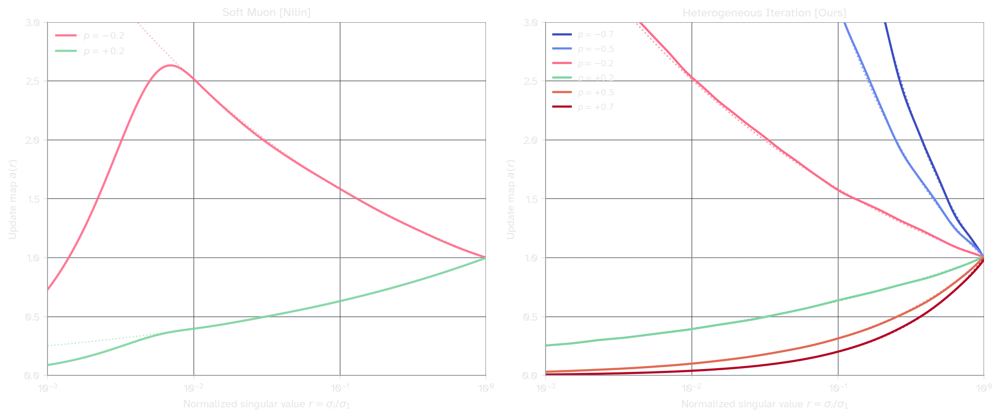
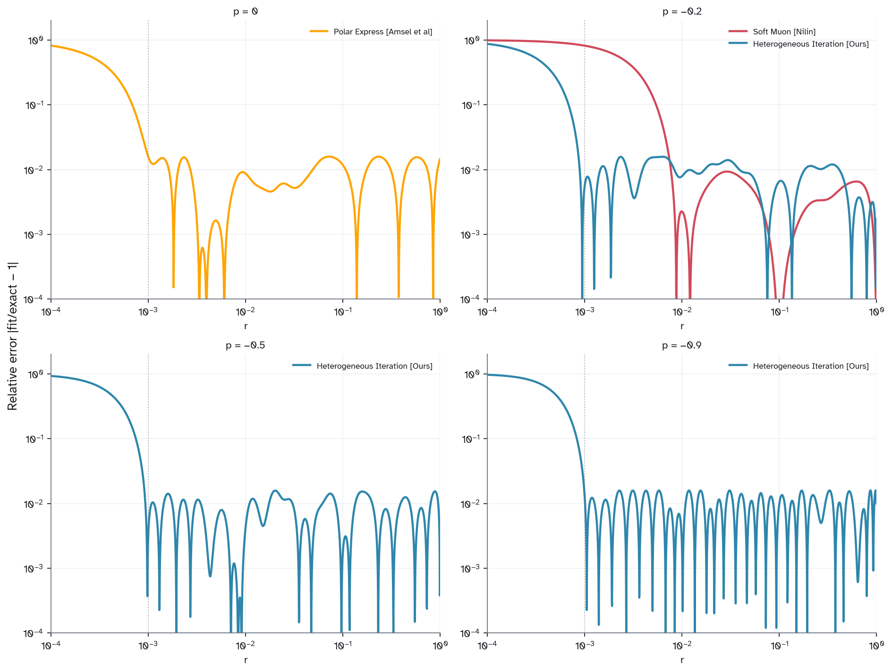
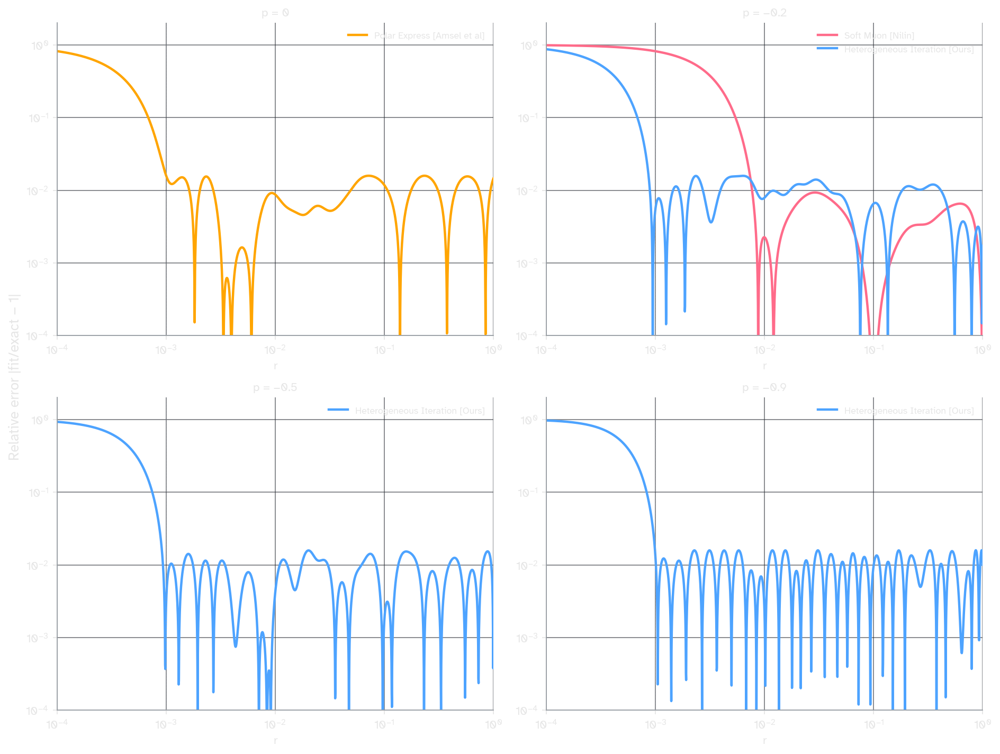

**Overview:** [Soft Muon](https://nilin.github.io/contra-muon-and-soft-muon/)[^nilin] uses weighted sums of Newton-Schulz iterates to approximate $U\Sigma^p V^\top$ for $p=\pm 0.2.$ I extend this approximation to $p \in (-0.9, 0.9)$ by optimizing a heterogeneous polynomial basis and computing weights via Chebyshev interpolation.




**Figure 1: For any singular value $\sigma \in [0.001, 1]$ we achieve error no worse than $1.65\%$.** 

Let's consider a matrix $M = U \Sigma V^\top$. The [[Muon in Modded NanoGPT|Muon]] optimizer uses several polynomial iterations of $M$ in order to approximate $UV^\top.$ Recent research[^nilin][^dynmuon][^htmuon][^qdwh] has shown interest in $U\Sigma^pV^\top$ for $p \neq 0.$ As shown in Soft Muon, the iterates of a polynomial sequence can be used as a linear basis for this approximation, which has the advantage of requiring only as many matmuls as the original Newton-Schulz method. Soft Muon uses a single polynomial $q(X) = 2X - \tfrac{3}{2}X(X^\top X) + \tfrac{1}{2}X(X^\top X)^2$ with iterates $X_{k+1} = q(X_k)$ as a basis for the approximations $U\Sigma^{0.2}V^\top$ and $U\Sigma^{-0.2}V^\top$. 

Unlike in Soft Muon, we define 9 distinct odd quintic polynomials $q_k$ and weights $w_k(p)$ such that

$$U\Sigma^p V^\top \approx \sigma_{\max}^p \sum_{k=0}^{8} w_k(p)\, X_k$$

is very good on $p \in [-0.9, 0.9]$ for matrices $M$ with $\sigma_{\max} / \sigma_{\min} \leq 1000$. 

Weights $w_k (p)$ are fast to generate for any $p \in [-0.9, 0.9]$, requiring only a single matmul:

$$\mathbf{w}(p) = A \cdot {T}(p/0.9)$$

where $A$ is a fixed ${9 \times 11}$ matrix and $T = [T_0, \dots, T_{10}]$ is a vector with $T_\ell(\tau) = \cos(\ell \arccos \tau).$ 

For additional details and the method used to search for the optimal polynomial coefficients see the code artifact in the appendix.

Input matrices must be normalized so that singular values are all $< 1$. Soft Muon normalizes by the Schatten-4 norm; I recommend using the Schatten-$\infty$ (spectral norm) instead, which places the largest singular value at exactly 1 and gives the polynomial basis maximum resolution over the spectrum. The spectral norm can be computed cheaply via power iteration, and the final result can be rescaled by $\sigma_{\max}^p$ to recover the normalization-free magnitudes.

This approximation is accurate on singular values $\sigma \in [10^{-3}, 1]$. Therefore, it works well for any initial matrix with condition number $\kappa = \sigma_{\max} / \sigma_{\min} \leq 1000.$ Beyond this, small $\sigma$ get sent toward 0 rather than blowing up. This closely matches the behavior of Polar Express[^amsel] at 8 iterations, which uses an optimal heterogenous polynomial basis for $p=0$. 





**Figure 2: Approximation error of our method for $p=-0.2, -0.5, -0.9$, alongside comparisons to Polar express ($p=0$) and Soft Muon ($p=-0.2$).**

## Code

```python
import torch
import numpy as np

POLYNOMIAL_COEFFS = [
    (3.059785, -3.569183, 1.466139),
    (2.483037, -2.035164, 0.593904),
    (2.587005, -2.273627, 0.704639),
    (2.532325, -2.285401, 0.721930),
    (2.814393, -2.718119, 0.918760),
    (2.574423, -2.244986, 0.670563),
    (2.420254, -2.053210, 0.632956),
    (3.096905, -3.325603, 1.228698),
]

ALPHA = np.array([
    [  -0.342922,    1.596394,   -0.351650,    0.035747,    0.010101,    0.013627,    0.011582,   -0.006495,    0.003221,   -0.005116,   -0.010389],
    [  -0.922227,    1.685416,   -0.956170,    0.295072,   -0.055173,   -0.012259,    0.002832,   -0.002589,   -0.002554,   -0.006862,    0.012596],
    [  -2.066104,    3.685898,   -2.420166,    1.082506,   -0.344673,    0.092675,   -0.032001,    0.008406,    0.013576,    0.004359,   -0.009345],
    [  -4.661157,    8.342554,   -5.843200,    3.137332,   -1.305372,    0.423156,   -0.095726,    0.014060,   -0.017478,    0.012561,   -0.000413],
    [ -10.383074,   18.875298,  -14.077936,    8.559896,   -4.276353,    1.786916,   -0.637048,    0.187610,   -0.030537,   -0.010511,    0.005912],
    [ -22.714826,   41.762294,  -32.381749,   21.153520,  -11.691129,    5.512954,   -2.238141,    0.790077,   -0.244064,    0.063162,   -0.009966],
    [ -44.136919,   81.881166,  -65.290701,   44.713397,  -26.345783,   13.425638,   -5.956984,    2.302977,   -0.755408,    0.189607,   -0.026751],
    [   6.535768,  -11.015945,    6.364808,   -2.004427,   -0.416101,    1.052051,   -0.804394,    0.387948,   -0.112107,    0.009609,    0.003072],
    [  79.795883, -146.994699,  115.107893,  -77.081238,   44.497143,  -22.325210,    9.771873,   -3.689135,    1.144857,   -0.258366,    0.031091],
])

P_MAX = 0.9

def compute_weights(p):
    tau = np.clip(p / P_MAX, -1.0, 1.0)
    T = np.array([np.cos(l * np.arccos(tau)) for l in range(ALPHA.shape[1])])
    return ALPHA @ T

def apply(X, coeffs, weights):
    transposed = X.size(-2) > X.size(-1)
    if transposed: X = X.mT
    iterates = [X]
    for a, b, c in coeffs:
        Xk = iterates[-1]
        XtX = Xk.mT @ Xk
        iterates.append(a * Xk + b * (Xk @ XtX) + c * (Xk @ (XtX @ XtX)))
    result = sum(w * Xi for w, Xi in zip(weights, iterates))
    return result.mT if transposed else result

def power_express(G, p):
    sigma_max = torch.linalg.norm(G, ord=2)  # can use power iter
    X = G / (sigma_max + 1e-6)
    w = torch.tensor(compute_weights(p))
    return apply(X, POLYNOMIAL_COEFFS, w) * (sigma_max ** p)
```

## Related work
**Soft Muon**[^nilin] is the primary inspiration. It uses the iterates of a single polynomial as a basis, and gives distinct weights for $p = 0.2$ and $p=-0.2$. The key innovation in this post is to optimize a *heterogenous* basis—i.e. uses a new polynomial per iterate.

**DynMuon**[^dynmuon] decomposes $U\Sigma^p V^\top = (X_n X_n^\top)^{p/2} \cdot UV^\top$ and approximates $(X_n X_n^\top)^{p/2}$ via an order-2 Taylor expansion. Though simple and cheap, the approximation quality is limited:

| κ | p=-0.2 | p=0.1 | p=0.2 | p=0.5 |
|---|---|---|---|---|
| 2 | 25% | 15% | 31% | 90% |
| 100 | 49% | 31% | 63% | 157% |
| 1000 | 63% | 43% | 87% | 194% |

**HTMuon**[^htmuon] uses the same decomposition as DynMuon but computes $(G^\top G)^{p/2}$ via coupled Denman-Beavers iteration (cubic convergence). Their approach is scale-free and achieves arbitrary precision, but operates on $G^\top G$ (condition $\kappa^2$), requiring many iterations to converge for ill-conditioned matrices. The available values of $p$ are restricted to dyadic fractions $\pm 1/2^k$; in practice they only use $p = 0.125 = 1/2^3$.

**Streaming exponential iteration**[^su] as articulated by Jianlin Su approximates SVD via a streaming power iteration ($V_t = \text{QR}(M_t^\top M_t V_{t-1})$, $U_t = \text{ColNorm}(M_t V_t)$, $\Sigma_t = \text{diag}(U_t^\top M_t V_t)$), and allows us to manipulate $\Sigma$ directly. This allows arbitrary spectral transformations and is extremely powerful, but requires stateful streaming and a QR solve per step.

**Freon**[^qdwh] uses rational approximations $x R(x^{2b})$ with Remez-optimal coefficients instead of polynomial iterations, avoiding the condition-squaring problem via block-QR. This converges quickly and can handle $p$ equal to any rational power $a/b$. Instead of polynomial matmuls per iterate, this method requires a rational function evaluation and QR factorization per step.

In **future work** I would like to characterize how many polynomial iterates are needed to expand the range beyond $|p| < 0.9$ or below $\sigma = 10^{-3}$; as well as compare the method in this blog to the well-known coupled iterative matrix-root algorithms for $p=\pm 0.5.$ 

[^nilin]: [Abrahamsen 2026](https://nilin.github.io/contra-muon-and-soft-muon/) *Contra-Muon and Soft-Muon*
[^amsel]: [Amsel et al. 2025](https://arxiv.org/abs/2505.16932) *The Polar Express*
[^dynmuon]: [Li et al. 2025](https://arxiv.org/abs/2605.17109) *DynMuon*
[^htmuon]: [Pang et al. 2026](https://arxiv.org/abs/2603.10067) *HTMuon: Improving Muon via Heavy-Tailed Spectral Correction*
[^su]: [Su 2026](https://spaces.ac.cn/archives/11654) *A Muon implementation based on streaming exponential iteration*
[^qdwh]: [Huang et al. 2025](https://arxiv.org/abs/2605.11181) *Muon is Not That Special: Random or Inverted Spectra Work Just as Well*


## Appendix 

**Reproduction** for finding polynomial coefficients + the Chebyshev approx for the weights. Rough idea: try to maximize the span of the basis $\{X_0, X_1, \dots X_8\}$ for $X_{k+1} = q_k (X_k), \, X_0 = M,$ and quintic degree-$5$ polynomials $q_1, \dots q_8$. To do this, use CMA-ES with an optimization target of the max relative error across 10 values of $p$ on $[10^{-3}, 1]$. 

The target function ($x^p$) is analytic in $p$. Linear maps preserve analyticity so it turns out that the weights for our basis can be fitted via low-degree polynomials. I found approximation quality plateaus by degree-10 using Chebyshev polynomials. There are 9 iterates in total, giving $(10 + 1) \times 9 = 99$ weight parameters. 

```python
import numpy as np
from scipy.optimize import linprog
import cma
import time

EPS = 1e-3
P_MAX = 0.9
N_GRID = 2000
K = 8
L_CHEB = 10

R_GRID = np.geomspace(EPS, 1.0, N_GRID)
P_EVAL = np.array([-0.9, -0.7, -0.5, -0.3, -0.1, 0.1, 0.3, 0.5, 0.7, 0.9])
TARGETS = np.column_stack([R_GRID ** p for p in P_EVAL])


def build_basis(coeffs, r_grid):
    psi = np.zeros((K + 1, len(r_grid)))
    psi[0] = r_grid
    for k in range(K):
        a, b, c = coeffs[k]
        x = psi[k]
        psi[k + 1] = a * x + b * x**3 + c * x**5
    return psi


def params_to_coeffs(params):
    coeffs = []
    idx = 0
    # layers 0-4
    for k in range(5):  
        a, b, d = params[idx], params[idx+1], params[idx+2]
        coeffs.append((a, b, d - a - b))
        idx += 3
	# layers 5-7: q(1) = 1, same constraint as Newton-Schulz/Polar Express
    for k in range(5, 8):  
        a, b = params[idx], params[idx+1]
        coeffs.append((a, b, 1.0 - a - b))
        idx += 2
    return coeffs


def objective(params):
    coeffs = params_to_coeffs(params)
    psi = build_basis(coeffs, R_GRID)
    if not np.all(np.isfinite(psi)):
        return 10.0
    A = psi.T
    W, _, _, _ = np.linalg.lstsq(A, TARGETS, rcond=None)
    max_err = np.abs((A @ W) / TARGETS - 1.0).max()
    if not np.isfinite(max_err):
        return 10.0
    penalty = 0.0
    for k in range(K):
        penalty += 50.0 * max(0, psi[k+1].max() - 1.2)
        penalty += 50.0 * max(0, -psi[k+1].min() - 0.01)
    col_norms = np.linalg.norm(A, axis=0)
    col_norms[col_norms == 0] = 1.0
    sv = np.linalg.svd(A / col_norms, compute_uv=False)
    return max_err + 1e-3 * np.log(sv[0] / max(sv[-1], 1e-15)) + penalty


def solve_joint_lp(coeffs):
    r_grid = np.geomspace(EPS, 1.0, 500)
    p_grid = np.linspace(-P_MAX, P_MAX, 50)
    p_grid = p_grid[np.abs(p_grid) > 0.01]
    psi = build_basis(coeffs, r_grid)
    n_r, n_p = len(r_grid), len(p_grid)
    L1 = L_CHEB + 1
    n_alpha = (K + 1) * L1

    tau = p_grid / P_MAX
    T_vals = np.cos(np.outer(np.arange(L1), np.arccos(tau)))

    A_coeff = np.zeros((n_r * n_p, n_alpha))
    for j in range(n_p):
        target_j = r_grid ** p_grid[j]
        for k in range(K + 1):
            for l in range(L1):
                A_coeff[j*n_r:(j+1)*n_r, k*L1 + l] = T_vals[l, j] * psi[k] / target_j

    n_vars = n_alpha + 1
    c_obj = np.zeros(n_vars)
    c_obj[-1] = 1.0
    nc = n_r * n_p
    A_ub = np.zeros((2 * nc, n_vars))
    b_ub = np.zeros(2 * nc)
    A_ub[:nc, :n_alpha] = A_coeff
    A_ub[:nc, -1] = -1.0
    b_ub[:nc] = 1.0
    A_ub[nc:, :n_alpha] = -A_coeff
    A_ub[nc:, -1] = -1.0
    b_ub[nc:] = -1.0
    bounds = [(None, None)] * n_alpha + [(0, None)]

    res = linprog(c_obj, A_ub=A_ub, b_ub=b_ub, bounds=bounds, method='highs')
    assert res.success, res.message
    return res.x[:n_alpha].reshape(K + 1, L1), res.x[-1]


if __name__ == '__main__':
    # Step 1: CMA-ES
    print("Step 1: CMA-ES (21 params, ~90s)")
    x0 = np.array([
        3.0, -3.5, 0.96, 2.5, -2.0, 1.04, 2.6, -2.3, 1.02,
        2.5, -2.3, 0.97, 2.8, -2.7, 1.01, 2.6, -2.2, 2.4, -2.1, 3.1, -3.3,
    ])
    opts = {'maxiter': 1500, 'popsize': 96, 'verbose': -9, 'seed': 42,
            'bounds': [[1.0, -8.0, 0.95]*5 + [1.0, -8.0]*3,
                       [5.0, 2.0, 1.05]*5 + [5.0, 2.0]*3]}

    t0 = time.time()
    es = cma.CMAEvolutionStrategy(x0.tolist(), 0.05, opts)
    best_val, best_params = np.inf, x0
    while not es.stop():
        sols = es.ask()
        vals = [objective(np.array(s)) for s in sols]
        es.tell(sols, vals)
        i = np.argmin(vals)
        if vals[i] < best_val:
            best_val, best_params = vals[i], np.array(sols[i])
    coeffs = params_to_coeffs(best_params)
    print(f"  {time.time()-t0:.0f}s, objective={best_val:.6f}")

    print("\nPOLYNOMIAL_COEFFS = [")
    for a, b, c in coeffs:
        print(f"    ({a:.6f}, {b:.6f}, {c:.6f}),")
    print("]")

    # Step 2: Joint LP 
    print("\nStep 2: Joint LP (99 unknowns)")
    t0 = time.time()
    alpha, t_opt = solve_joint_lp(coeffs)
    print(f"  {time.time()-t0:.0f}s, max error={t_opt:.6f}")

    print("\nALPHA = np.array([")
    for row in alpha:
        print(f"    [{', '.join(f'{v:>11.6f}' for v in row)}],")
    print("])")

    # Verify
    print("\nVerification:")
    psi = build_basis(coeffs, R_GRID)
    for p in [-0.9, -0.5, 0.0, 0.5, 0.9]:
        tau = np.clip(p / P_MAX, -1, 1)
        T = np.cos(np.arange(L_CHEB + 1) * np.arccos(tau))
        w = alpha @ T
        err = np.max(np.abs((psi.T @ w) / (R_GRID ** p) - 1))
        print(f"  p={p:+.1f}: {err:.4f}")

```

```
@misc{
	srivastava2026,
	author = {Varun Srivastava},
	title = {Heterogeneous Iteration for Spectral Powers},
	year = {2026},
	url = {https://varunneal.github.io/essays/spectral-powers}
}
```
